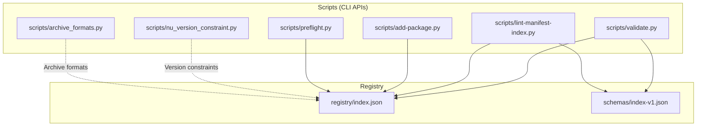
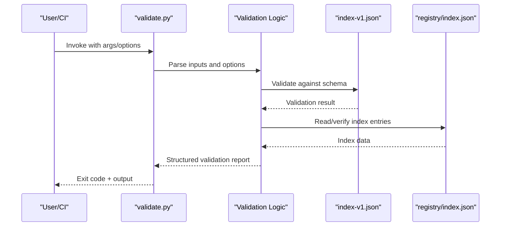
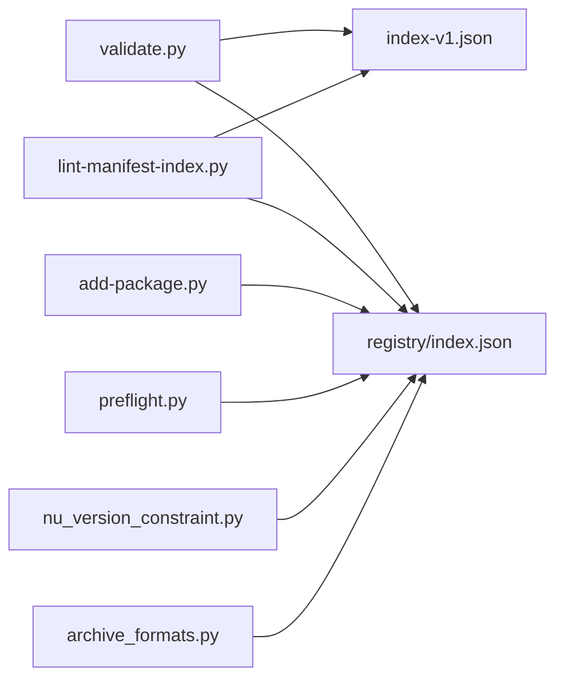

# API Reference

<cite>
**Referenced Files in This Document**
- [validate.py](file://scripts/validate.py)
- [nu_version_constraint.py](file://scripts/nu_version_constraint.py)
- [archive_formats.py](file://scripts/archive_formats.py)
- [add-package.py](file://scripts/add-package.py)
- [lint-manifest-index.py](file://scripts/lint-manifest-index.py)
- [preflight.py](file://scripts/preflight.py)
- [index.json](file://registry/index.json)
- [index-v1.json](file://schemas/index-v1.json)
- [README.md](file://README.md)
</cite>

## Table of Contents
1. [Introduction](#introduction)
2. [Project Structure](#project-structure)
3. [Core Components](#core-components)
4. [Architecture Overview](#architecture-overview)
5. [Detailed Component Analysis](#detailed-component-analysis)
6. [Dependency Analysis](#dependency-analysis)
7. [Performance Considerations](#performance-considerations)
8. [Troubleshooting Guide](#troubleshooting-guide)
9. [Conclusion](#conclusion)
10. [Appendices](#appendices)

## Introduction
This document provides comprehensive API documentation for the Numan Registry’s programmatic interfaces exposed by Python scripts. It covers command-line usage, parameters, options, return codes, error handling patterns, and integration guidance with external tools such as Nushell. It also documents input validation rules, supported package formats, archive compression methods, version constraint checking, JSON schemas used for configuration and data exchange, and best practices for extending the API with custom validators and formatters.

## Project Structure
The Numan Registry exposes a set of CLI-oriented Python scripts under the scripts directory. These scripts implement core registry operations including validation, version constraint checking, archive format handling, manifest linting, preflight checks, and package addition workflows. The registry index is stored as JSON, and schema definitions are provided to ensure consistency across tooling.

**Diagram sources**
- [index.json](file://registry/index.json)
- [index-v1.json](file://schemas/index-v1.json)
- [validate.py](file://scripts/validate.py)
- [nu_version_constraint.py](file://scripts/nu_version_constraint.py)
- [archive_formats.py](file://scripts/archive_formats.py)
- [add-package.py](file://scripts/add-package.py)
- [lint-manifest-index.py](file://scripts/lint-manifest-index.py)
- [preflight.py](file://scripts/preflight.py)

**Section sources**
- [README.md](file://README.md)

## Core Components
- validate: Validates packages against registry requirements and schema constraints; supports multiple input formats and produces structured output suitable for automation.
- nu_version_constraint: Checks version constraints compatible with Nushell version management; integrates with semantic versioning and constraint expressions.
- archive_formats: Handles archive creation and inspection; supports common compression methods and validates integrity.
- add-package: Adds new packages to the registry index; enforces naming conventions and metadata completeness.
- lint-manifest-index: Lints the registry index and manifests; ensures structural correctness and compliance with schema.
- preflight: Performs pre-deployment or pre-publish checks; validates environment readiness and dependencies.

These components are designed to be invoked from CI pipelines, shell scripts, or interactive sessions. They follow consistent exit code semantics and produce machine-readable outputs where applicable.

**Section sources**
- [validate.py](file://scripts/validate.py)
- [nu_version_constraint.py](file://scripts/nu_version_constraint.py)
- [archive_formats.py](file://scripts/archive_formats.py)
- [add-package.py](file://scripts/add-package.py)
- [lint-manifest-index.py](file://scripts/lint-manifest-index.py)
- [preflight.py](file://scripts/preflight.py)

## Architecture Overview
The CLI scripts operate as thin orchestration layers over shared logic modules. Inputs are validated early, processed through domain-specific handlers, and outputs are emitted in structured formats. The registry index serves as the canonical data store, while schemas enforce structure and compatibility.

**Diagram sources**
- [validate.py](file://scripts/validate.py)
- [index-v1.json](file://schemas/index-v1.json)
- [index.json](file://registry/index.json)

## Detailed Component Analysis

### validate.py
Purpose:
- Validates package artifacts and metadata against registry requirements.
- Supports multiple input formats and produces structured output for downstream consumption.

Command-line interface:
- Arguments typically include paths to package files or directories, flags for strictness, and output format selectors.
- Options may control verbosity, schema enforcement level, and inclusion/exclusion of specific checks.

Input validation rules:
- Package metadata must conform to schema-defined fields and types.
- Required fields include identifiers, versions, and artifact references.
- Optional fields may include descriptions, licenses, and dependency lists.

Supported package formats:
- Common archive formats are accepted; compression methods are enumerated by the archive handler.

Output schema:
- Returns a structured report containing validation results per package, including pass/fail status, warnings, and detailed error messages.

Return codes:
- Zero indicates success; non-zero indicates failure with specific codes for different error categories.

Error handling:
- Errors are categorized (e.g., schema violation, missing artifact, unsupported format).
- Messages are human-readable and machine-parseable.

Integration examples:
- Use in CI pipelines to gate releases based on validation outcomes.
- Pipe output to JSON processors for automated reporting.

Best practices:
- Always specify strict mode in CI to fail fast on issues.
- Capture structured output for audit trails.

**Section sources**
- [validate.py](file://scripts/validate.py)

### nu_version_constraint.py
Purpose:
- Evaluates version constraints compatible with Nushell version management.
- Integrates with semantic versioning and constraint expressions.

Command-line interface:
- Accepts version strings and constraint expressions.
- Flags may enable verbose output or test-only modes.

Constraint checking:
- Supports ranges, exact versions, and operators defined by Nushell’s version policy.
- Validates constraint syntax before evaluation.

Return codes:
- Success when constraints are satisfied; failure otherwise.

Error handling:
- Reports malformed constraints and unsatisfied conditions with actionable messages.

Integration examples:
- Use in release gating to ensure compatibility with target Nushell versions.
- Combine with package metadata to auto-validate dependencies.

Best practices:
- Pin constraint expressions in manifests for reproducibility.
- Test constraints locally before publishing.

**Section sources**
- [nu_version_constraint.py](file://scripts/nu_version_constraint.py)

### archive_formats.py
Purpose:
- Manages archive creation and inspection for package artifacts.
- Enumerates supported compression methods and validates integrity.

Command-line interface:
- Subcommands for create, inspect, and verify operations.
- Options for specifying compression levels and output paths.

Supported compression methods:
- Common algorithms such as gzip, zip, and tar variants are supported.

Integrity checks:
- Computes checksums and verifies archives against expected values.

Return codes:
- Success for valid operations; failure for unsupported formats or corrupted archives.

Error handling:
- Clear messages indicate unsupported methods or invalid inputs.

Integration examples:
- Automate archive generation in build pipelines.
- Verify archives before upload to registry.

Best practices:
- Prefer deterministic compression settings for reproducible builds.
- Store checksums alongside archives for verification.

**Section sources**
- [archive_formats.py](file://scripts/archive_formats.py)

### add-package.py
Purpose:
- Adds new packages to the registry index with enforced metadata completeness.

Command-line interface:
- Requires package metadata file or arguments describing the package.
- Flags for dry-run and validation-only modes.

Validation:
- Ensures naming conventions, required fields, and schema compliance.
- Cross-checks against existing index entries to prevent duplicates.

Return codes:
- Success upon successful addition; failure for validation errors or conflicts.

Error handling:
- Reports specific reasons for rejection (e.g., duplicate name, missing fields).

Integration examples:
- Use in automated publishing workflows after validation passes.
- Combine with linting to ensure index consistency.

Best practices:
- Run preflight checks before adding packages.
- Maintain consistent metadata templates.

**Section sources**
- [add-package.py](file://scripts/add-package.py)

### lint-manifest-index.py
Purpose:
- Lints the registry index and manifests for structural correctness and schema compliance.

Command-line interface:
- Targets index files and manifests; supports recursive scanning.
- Options for severity levels and output formats.

Checks:
- Validates field presence, types, and relationships.
- Detects inconsistencies and deprecated patterns.

Return codes:
- Zero if no issues; non-zero with details on violations.

Error handling:
- Categorizes issues by severity and provides remediation hints.

Integration examples:
- Integrate into CI to prevent broken manifests from being merged.
- Generate reports for maintainers.

Best practices:
- Enforce linting as a pre-commit hook.
- Keep schema definitions up-to-date.

**Section sources**
- [lint-manifest-index.py](file://scripts/lint-manifest-index.py)

### preflight.py
Purpose:
- Performs pre-deployment or pre-publish checks to ensure environment readiness.

Command-line interface:
- Configurable checks via flags or config files.
- Supports custom check plugins.

Checks:
- Validates dependencies, permissions, and network access.
- Verifies toolchain availability and versions.

Return codes:
- Success if all checks pass; failure otherwise.

Error handling:
- Provides actionable diagnostics for failed checks.

Integration examples:
- Run before critical operations like signing or publishing.
- Fail fast to avoid partial states.

Best practices:
- Centralize environment configuration.
- Log detailed context for debugging.

**Section sources**
- [preflight.py](file://scripts/preflight.py)

## Dependency Analysis
The scripts depend on shared modules for validation, parsing, and I/O. The registry index and schema files act as central contracts. External integrations include Nushell version management and standard archive libraries.

**Diagram sources**
- [validate.py](file://scripts/validate.py)
- [lint-manifest-index.py](file://scripts/lint-manifest-index.py)
- [add-package.py](file://scripts/add-package.py)
- [preflight.py](file://scripts/preflight.py)
- [nu_version_constraint.py](file://scripts/nu_version_constraint.py)
- [archive_formats.py](file://scripts/archive_formats.py)
- [index-v1.json](file://schemas/index-v1.json)
- [index.json](file://registry/index.json)

**Section sources**
- [index.json](file://registry/index.json)
- [index-v1.json](file://schemas/index-v1.json)

## Performance Considerations
- Batch processing: Process multiple packages in parallel where safe to reduce latency.
- Caching: Cache schema validations and index reads to avoid repeated I/O.
- Streaming: Stream large archives during inspection to minimize memory usage.
- Early exits: Fail fast on critical validation errors to avoid unnecessary work.
- Compression tuning: Use optimal compression levels balancing speed and size.

[No sources needed since this section provides general guidance]

## Troubleshooting Guide
Common issues and resolutions:
- Schema validation failures: Ensure metadata conforms to the latest schema definition.
- Unsupported archive formats: Check supported methods and convert artifacts accordingly.
- Version constraint errors: Verify constraint syntax and compatibility with Nushell policies.
- Duplicate package names: Resolve naming conflicts before adding to the index.
- Environment readiness: Run preflight checks to identify missing dependencies or permissions.

Diagnostic steps:
- Enable verbose logging to capture detailed error messages.
- Inspect structured output for machine-readable diagnostics.
- Cross-reference schema definitions and index entries for discrepancies.

**Section sources**
- [validate.py](file://scripts/validate.py)
- [nu_version_constraint.py](file://scripts/nu_version_constraint.py)
- [archive_formats.py](file://scripts/archive_formats.py)
- [add-package.py](file://scripts/add-package.py)
- [lint-manifest-index.py](file://scripts/lint-manifest-index.py)
- [preflight.py](file://scripts/preflight.py)

## Conclusion
The Numan Registry’s CLI scripts provide robust programmatic interfaces for validation, version constraint checking, archive handling, and registry maintenance. By following the documented usage patterns, error handling strategies, and best practices, teams can integrate these tools effectively into automated workflows and maintain high-quality registry content.

[No sources needed since this section summarizes without analyzing specific files]

## Appendices

### JSON Schemas
- index-v1.json defines the structure for registry index entries, including required fields, types, and constraints.
- Use this schema to validate manifests and index updates programmatically.

**Section sources**
- [index-v1.json](file://schemas/index-v1.json)

### Extending the API
- Custom validators: Implement validation functions that adhere to the expected interface and register them with the validator pipeline.
- Custom formatters: Add output formatters by implementing the formatter contract and selecting via CLI options.
- Plugin architecture: Extend preflight checks by writing plugin modules discoverable at runtime.

[No sources needed since this section provides general guidance]

### Examples of Programmatic Usage
- Validate a package: Invoke the validate script with package path and strict mode enabled.
- Check version constraints: Pass version string and constraint expression to the constraint checker.
- Create an archive: Use the archive handler to generate a compressed artifact with specified method.
- Add a package: Provide metadata and run the add script in dry-run mode first.
- Lint the index: Point the linter at the index file and review reported issues.
- Preflight checks: Execute preflight with environment configuration to ensure readiness.

[No sources needed since this section provides general guidance]