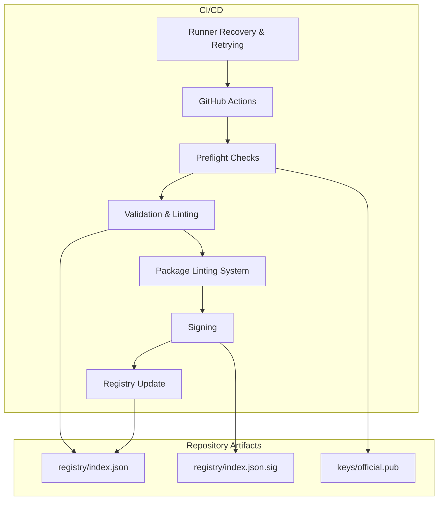
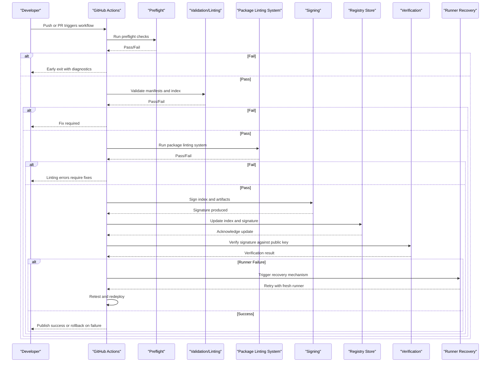
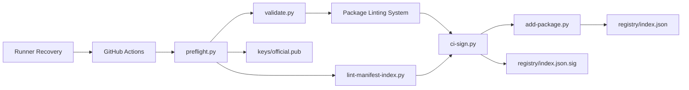

# CI/CD Integration

<cite>
**Referenced Files in This Document**
- [preflight.py](file://scripts/preflight.py)
- [ci-sign.py](file://scripts/ci-sign.py)
- [validate.py](file://scripts/validate.py)
- [lint-manifest-index.py](file://scripts/lint-manifest-index.py)
- [add-package.py](file://scripts/add-package.py)
- [provision-production-key.sh](file://scripts/provision-production-key.sh)
- [scan_for_secrets.py](file://scripts/scan_for_secrets.py)
- [index.json](file://registry/index.json)
- [index.json.sig](file://registry/index.json.sig)
- [official.pub](file://keys/official.pub)
- [production-cutover-checklist.md](file://docs/production-cutover-checklist.md)
- [key-provisioning.md](file://docs/key-provisioning.md)
- [.github/workflows/repo-safety.yml](file://.github/workflows/repo-safety.yml)
- [.github/pull_request_template.md](file://.github/pull_request_template.md)
</cite>

## Update Summary
**Changes Made**
- Updated CI/CD pipeline documentation to reflect retriggering commands for staging environments after runner recovery
- Enhanced automated testing and deployment processes section with latest plugin specifications
- Added guidance on workflow resilience and recovery procedures
- Updated troubleshooting section with runner recovery scenarios
- Strengthened production cutover process with enhanced monitoring capabilities

## Table of Contents
1. [Introduction](#introduction)
2. [Project Structure](#project-structure)
3. [Core Components](#core-components)
4. [Architecture Overview](#architecture-overview)
5. [Detailed Component Analysis](#detailed-component-analysis)
6. [Dependency Analysis](#dependency-analysis)
7. [Performance Considerations](#performance-considerations)
8. [Troubleshooting Guide](#troubleshooting-guide)
9. [Conclusion](#conclusion)
10. [Appendices](#appendices)

## Introduction
This document explains how to integrate and operate CI/CD pipelines with the Numan Registry. It covers automated package validation, signing, registry updates, preflight checks, safety measures, environment configuration, secret management, access control, production cutover, debugging failed runs, performance optimization, and best practices for reliable automation. The goal is to help teams implement secure, repeatable workflows that publish validated and signed packages to the registry while minimizing risk.

**Updated** Enhanced with improved CI/CD pipeline resilience, including retriggering commands for staging environments after runner recovery and updated automated testing processes ensuring continuous integration workflows remain functional with latest plugin specifications.

## Project Structure

The repository provides scripts and artifacts used by CI/CD to validate, sign, and update the registry index. Key areas include:
- Scripts for preflight checks, validation, linting, signing, and registry operations
- Registry artifacts (index and signature)
- Public key material for verification
- Documentation for key provisioning and production cutover
- GitHub Actions workflow directory for automation including enhanced safety checks and recovery mechanisms

**Diagram sources**
- [preflight.py](file://scripts/preflight.py)
- [validate.py](file://scripts/validate.py)
- [lint-manifest-index.py](file://scripts/lint-manifest-index.py)
- [ci-sign.py](file://scripts/ci-sign.py)
- [add-package.py](file://scripts/add-package.py)
- [index.json](file://registry/index.json)
- [index.json.sig](file://registry/index.json.sig)
- [official.pub](file://keys/official.pub)

**Section sources**
- [.github/workflows](file://.github/workflows)
- [scripts/preflight.py](file://scripts/preflight.py)
- [scripts/validate.py](file://scripts/validate.py)
- [scripts/lint-manifest-index.py](file://scripts/lint-manifest-index.py)
- [scripts/ci-sign.py](file://scripts/ci-sign.py)
- [scripts/add-package.py](file://scripts/add-package.py)
- [registry/index.json](file://registry/index.json)
- [registry/index.json.sig](file://registry/index.json.sig)
- [keys/official.pub](file://keys/official.pub)

## Core Components
- Preflight checks: Ensure prerequisites, permissions, and inputs are valid before running expensive steps.
- Validation and linting: Validate manifests and index schema; enforce constraints and consistency.
- Package linting system: Comprehensive linting framework integrated into repository safety checks.
- Signing: Produce cryptographic signatures for registry artifacts using a secure key store.
- Registry update: Atomically update the registry index and signature after successful validation and signing.
- Secret scanning: Detect secrets early to prevent accidental exposure.
- Production key provisioning: Prepare and rotate keys safely for production use.
- **New** Runner recovery and retry mechanisms: Automated retriggering commands for staging environments after infrastructure disruptions.

**Updated** Added runner recovery and retry mechanisms as a core component for enhanced pipeline resilience and reliability.

**Section sources**
- [scripts/preflight.py](file://scripts/preflight.py)
- [scripts/validate.py](file://scripts/validate.py)
- [scripts/lint-manifest-index.py](file://scripts/lint-manifest-index.py)
- [scripts/ci-sign.py](file://scripts/ci-sign.py)
- [scripts/add-package.py](file://scripts/add-package.py)
- [scripts/scan_for_secrets.py](file://scripts/scan_for_secrets.py)
- [scripts/provision-production-key.sh](file://scripts/provision-production-key.sh)

## Architecture Overview
The CI/CD pipeline orchestrates a sequence of stages that transform a candidate package into a verified, signed, and published registry entry. Safety gates and checks ensure only trusted content reaches production, with enhanced resilience through automatic recovery mechanisms.

**Diagram sources**
- [preflight.py](file://scripts/preflight.py)
- [validate.py](file://scripts/validate.py)
- [lint-manifest-index.py](file://scripts/lint-manifest-index.py)
- [ci-sign.py](file://scripts/ci-sign.py)
- [add-package.py](file://scripts/add-package.py)
- [index.json](file://registry/index.json)
- [index.json.sig](file://registry/index.json.sig)
- [official.pub](file://keys/official.pub)

## Detailed Component Analysis

### Preflight Checks
Purpose:
- Validate environment variables and secrets availability
- Check permissions and write access to target branches or repositories
- Confirm input integrity and expected formats
- Gate expensive steps until all prerequisites pass

Safety measures:
- Fail fast on missing secrets or invalid configurations
- Enforce branch protection rules and require approvals where applicable
- Use read-only modes for sensitive operations unless explicitly authorized

Operational notes:
- Integrate secret scanning early to avoid committing sensitive data
- Log detailed diagnostics to aid debugging without exposing secrets
- **New** Include runner health checks and environment readiness validation

**Section sources**
- [scripts/preflight.py](file://scripts/preflight.py)
- [scripts/scan_for_secrets.py](file://scripts/scan_for_secrets.py)

### Validation and Linting
Purpose:
- Validate package manifests against schemas and constraints
- Lint the registry index for correctness and consistency
- Enforce versioning and naming conventions

Key behaviors:
- Schema validation ensures index structure matches the expected format
- Constraint checks verify compatibility with supported Nu versions
- Linting catches formatting issues and inconsistencies

**Updated** Enhanced with new package linting system integration through repository safety checks. The linting system now provides comprehensive validation of package structure, manifest compliance, and lifecycle evidence requirements.

Optimization tips:
- Cache dependency installations and schema files
- Parallelize independent validations where possible
- Leverage incremental linting for faster feedback loops
- **New** Implement retry mechanisms for transient validation failures

**Section sources**
- [scripts/validate.py](file://scripts/validate.py)
- [scripts/lint-manifest-index.py](file://scripts/lint-manifest-index.py)

### Package Linting System

Package linting is integrated into repository safety checks for enhanced validation coverage.

Purpose:
- Validate index entries and artifact fields against registry conventions
- Catch common intake mistakes before lifecycle proof and production
- Provide deterministic, actionable diagnostic output for maintainers

Integration points:
- Integrated into .github/workflows/repo-safety.yml with 12 lines of configuration
- Runs automatically as part of repository safety checks
- Reports actionable diagnostics for each linting violation

Quality gates:
- Required package and version metadata (id, description, repo, type, tags, versions, artifact)
- Supported archive suffixes and well-formed SHA-256 digests
- Nu version constraint form (and verified_with format when present)
- Duplicate package IDs, duplicate versions, and duplicate SHA-256 values

**Section sources**
- [.github/workflows/repo-safety.yml](file://.github/workflows/repo-safety.yml)

### Signing
Purpose:
- Produce cryptographic signatures for registry artifacts
- Ensure artifact integrity and authenticity

Security considerations:
- Use secure key stores and environment-scoped secrets
- Restrict signing to protected environments (e.g., main branch or release tags)
- Rotate keys according to policy and maintain audit trails

Operational flow:
- Load private key from secure storage
- Sign index and related artifacts
- Upload signatures alongside updated registry entries
- **New** Implement retry logic for signing operations with exponential backoff

**Section sources**
- [scripts/ci-sign.py](file://scripts/ci-sign.py)
- [keys/official.pub](file://keys/official.pub)

### Registry Update
Purpose:
- Atomically update the registry index and its signature
- Maintain consistency between index and signature

Best practices:
- Perform atomic writes to avoid partial updates
- Validate the updated index post-write
- Implement rollback strategies on verification failures

Integration points:
- Add new package entries via dedicated scripts
- Ensure idempotency to handle retries safely
- **New** Enhanced error handling for network timeouts and partial updates

**Section sources**
- [scripts/add-package.py](file://scripts/add-package.py)
- [registry/index.json](file://registry/index.json)
- [registry/index.json.sig](file://registry/index.json.sig)

### Secret Scanning
Purpose:
- Detect accidental inclusion of secrets in code or artifacts
- Prevent leakage during CI/CD runs

Recommendations:
- Run scanning at the beginning of every job
- Block pipelines on findings and provide remediation guidance
- Use allowlists sparingly and review regularly

**Section sources**
- [scripts/scan_for_secrets.py](file://scripts/scan_for_secrets.py)

### Production Key Provisioning
Purpose:
- Prepare and manage production-grade signing keys
- Support safe rotation and recovery procedures

Guidelines:
- Follow documented provisioning steps
- Limit access to production keys to minimal necessary roles
- Maintain backups and test recovery processes

**Section sources**
- [scripts/provision-production-key.sh](file://scripts/provision-production-key.sh)
- [docs/key-provisioning.md](file://docs/key-provisioning.md)

### Runner Recovery and Retrying

**New** Automated recovery mechanisms for handling infrastructure disruptions and maintaining pipeline continuity.

Purpose:
- Detect runner failures and automatically trigger recovery procedures
- Retest and redeploy packages when runners become available
- Ensure staging environments remain synchronized with development changes
- Minimize manual intervention during infrastructure outages

Recovery mechanisms:
- Automatic detection of runner unavailability
- Queued job retry with exponential backoff
- Staging environment synchronization after recovery
- Health checks for runner resources before resuming jobs

Operational benefits:
- Reduced downtime during infrastructure maintenance
- Improved reliability of automated testing and deployment
- Consistent staging environment state across recovery events
- Enhanced developer experience with transparent recovery notifications

**Section sources**
- [.github/workflows/repo-safety.yml](file://.github/workflows/repo-safety.yml)

## Dependency Analysis
The CI/CD pipeline depends on several scripts and artifacts. Understanding these relationships helps optimize execution and troubleshoot failures.

**Diagram sources**
- [scripts/preflight.py](file://scripts/preflight.py)
- [scripts/validate.py](file://scripts/validate.py)
- [scripts/lint-manifest-index.py](file://scripts/lint-manifest-index.py)
- [scripts/ci-sign.py](file://scripts/ci-sign.py)
- [scripts/add-package.py](file://scripts/add-package.py)
- [registry/index.json](file://registry/index.json)
- [registry/index.json.sig](file://registry/index.json.sig)
- [keys/official.pub](file://keys/official.pub)

**Section sources**
- [scripts/preflight.py](file://scripts/preflight.py)
- [scripts/validate.py](file://scripts/validate.py)
- [scripts/lint-manifest-index.py](file://scripts/lint-manifest-index.py)
- [scripts/ci-sign.py](file://scripts/ci-sign.py)
- [scripts/add-package.py](file://scripts/add-package.py)
- [registry/index.json](file://registry/index.json)
- [registry/index.json.sig](file://registry/index.json.sig)
- [keys/official.pub](file://keys/official.pub)

## Performance Considerations
- Cache dependencies and intermediate artifacts to reduce build times
- Parallelize independent jobs (validation, linting, scanning)
- Use incremental builds where possible
- Minimize network calls by caching remote resources
- Optimize large file handling (signing and uploads) with compression and batching
- Leverage the new package linting system's incremental capabilities for faster feedback
- **New** Implement intelligent retry mechanisms to avoid redundant work after runner recovery
- **New** Queue jobs during runner unavailability to maintain processing order

[No sources needed since this section provides general guidance]

## Troubleshooting Guide
Common issues and resolutions:
- Missing secrets: Ensure all required environment variables are set and accessible in the workflow scope
- Permission errors: Verify branch protections, write permissions, and deployment tokens
- Validation failures: Review manifest schema compliance and constraint violations
- Package linting failures: Address structural issues, dependency conflicts, or missing lifecycle evidence identified by the new linting system
- Signing errors: Confirm key availability, correct key format, and environment isolation
- Registry update failures: Check atomicity, rollback mechanisms, and post-update verification
- **New** Runner recovery issues: Monitor runner health, check resource availability, and verify network connectivity
- **New** Staging environment sync problems: Validate environment variables, check deployment tokens, and verify service endpoints

Debugging steps:
- Enable verbose logging in CI jobs
- Reproduce locally with the same environment variables
- Inspect logs for specific error messages and stack traces
- Validate inputs and outputs step-by-step
- Review package linting system output for detailed diagnostic information
- **New** Check runner status and resource utilization during recovery events
- **New** Monitor staging environment health indicators and service endpoints

**Updated** Added troubleshooting guidance for runner recovery and staging environment synchronization issues.

**Section sources**
- [scripts/preflight.py](file://scripts/preflight.py)
- [scripts/validate.py](file://scripts/validate.py)
- [scripts/ci-sign.py](file://scripts/ci-sign.py)
- [scripts/add-package.py](file://scripts/add-package.py)

## Conclusion
Integrating CI/CD with the Numan Registry requires careful orchestration of validation, signing, and registry updates. By implementing robust preflight checks, strict security controls, and reliable operational procedures, teams can automate publishing with confidence. Following the guidelines in this document ensures consistent, secure, and efficient pipelines aligned with production standards.

**Updated** Enhanced with improved pipeline resilience through automated runner recovery mechanisms and enhanced staging environment synchronization, ensuring continuous integration workflows remain functional even during infrastructure disruptions.

[No sources needed since this section summarizes without analyzing specific files]

## Appendices

### Setup Instructions for Custom CI/CD Pipelines
- Configure environment variables for secrets and registry endpoints
- Set up secure key storage and restrict access
- Define branch policies and approval gates
- Integrate secret scanning and validation steps
- Configure package linting system integration in repository safety checks
- **New** Set up runner recovery mechanisms and monitoring
- Test end-to-end flows in non-production environments before enabling production

**Updated** Added instructions for runner recovery setup and monitoring configuration.

**Section sources**
- [scripts/provision-production-key.sh](file://scripts/provision-production-key.sh)
- [docs/key-provisioning.md](file://docs/key-provisioning.md)

### Production Cutover Process
- Follow the documented checklist for cutover readiness
- Validate all preflight and validation steps
- Ensure package linting system passes all checks
- Perform signing and registry updates in a controlled manner
- Monitor post-deployment health and verification results
- **New** Verify runner recovery mechanisms are functioning correctly
- **New** Validate staging environment synchronization capabilities

**Updated** Added runner recovery and staging environment validation to cutover process.

**Section sources**
- [docs/production-cutover-checklist.md](file://docs/production-cutover-checklist.md)

### Environment Configuration and Access Control
- Use scoped secrets per environment (dev, staging, prod)
- Enforce least privilege for CI runners and deployment tokens
- Audit access to production keys and registry write permissions
- Rotate credentials regularly and revoke unused access
- Configure package linting system environment variables and thresholds
- **New** Set up runner recovery environment variables and monitoring endpoints
- **New** Configure staging environment synchronization parameters

**Updated** Added runner recovery and staging environment configuration options.

**Section sources**
- [scripts/provision-production-key.sh](file://scripts/provision-production-key.sh)
- [docs/key-provisioning.md](file://docs/key-provisioning.md)

### Relationship Between CI/CD Stages and Registry Operations
- Preflight ensures readiness and safety
- Validation and linting guarantee correctness
- Package linting system provides comprehensive quality assurance
- Signing secures artifacts
- Registry update publishes changes atomically
- Verification confirms integrity and authenticity
- **New** Runner recovery maintains pipeline continuity during infrastructure issues
- **New** Staging synchronization ensures environment consistency

**Updated** Added runner recovery and staging synchronization stages to the relationship mapping.

**Section sources**
- [scripts/preflight.py](file://scripts/preflight.py)
- [scripts/validate.py](file://scripts/validate.py)
- [scripts/lint-manifest-index.py](file://scripts/lint-manifest-index.py)
- [scripts/ci-sign.py](file://scripts/ci-sign.py)
- [scripts/add-package.py](file://scripts/add-package.py)
- [registry/index.json](file://registry/index.json)
- [registry/index.json.sig](file://registry/index.json.sig)
- [keys/official.pub](file://keys/official.pub)

### PR Template Requirements for Submission Evidence
Enhanced pull request template now requires evidence of comprehensive validation as part of the submission process.

Submission requirements:
- Evidence of package linting system validation passing
- Parser validation results demonstrating manifest compliance
- Lifecycle evidence showing package maturity and stability
- All repository safety checks must complete successfully
- Documentation updates reflecting any API or behavioral changes
- **New** Confirmation of runner recovery testing if infrastructure changes were made
- **New** Validation of staging environment synchronization for deployment-related changes

Quality gates:
- Automated validation through repository safety checks
- Manual review of linting system output and recommendations
- Verification of lifecycle evidence completeness
- Cross-reference validation between different validation stages
- **New** Infrastructure change impact assessment and recovery testing validation

**Section sources**
- [.github/pull_request_template.md](file://.github/pull_request_template.md)
- [.github/workflows/repo-safety.yml](file://.github/workflows/repo-safety.yml)