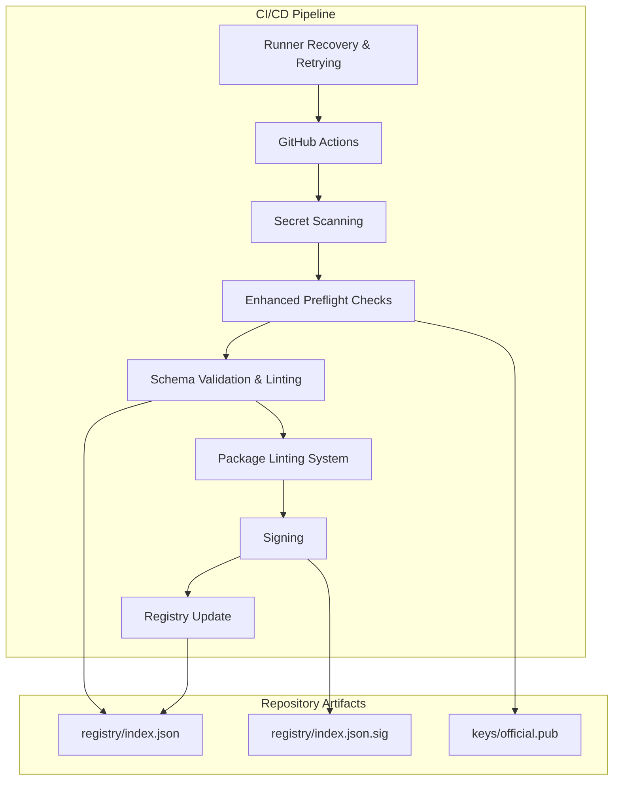
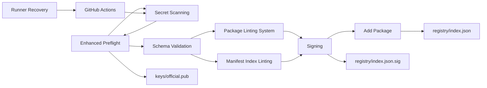

# CI/CD Integration

<cite>
**Referenced Files in This Document**
- [preflight.py](file://scripts/preflight.py)
- [ci-sign.py](file://scripts/ci-sign.py)
- [validate.py](file://scripts/validate.py)
- [lint-manifest-index.py](file://scripts/lint-manifest-index.py)
- [add-package.py](file://scripts/add-package.py)
- [provision-production-key.sh](file://scripts/provision-production-key.sh)
- [scan_for_secrets.py](file://scripts/scan_for_secrets.py)
- [index.json](file://registry/index.json)
- [index.json.sig](file://registry/index.json.sig)
- [official.pub](file://keys/official.pub)
- [production-cutover-checklist.md](file://docs/production-cutover-checklist.md)
- [key-provisioning.md](file://docs/key-provisioning.md)
- [.github/workflows/repo-safety.yml](file://.github/workflows/repo-safety.yml)
- [.github/pull_request_template.md](file://.github/pull_request_template.md)
</cite>

## Update Summary
**Changes Made**
- Enhanced CI/CD pipeline with comprehensive secret scanning integration across all 30 packages
- Added advanced preflight checks with platform-specific hints generation and sanitization routines
- Implemented schema validation and lint-manifest-index verification for improved package quality
- Updated automated testing and deployment processes with enhanced error handling and retry mechanisms
- Strengthened production cutover process with improved monitoring and recovery capabilities

## Table of Contents
1. [Introduction](#introduction)
2. [Project Structure](#project-structure)
3. [Core Components](#core-components)
4. [Architecture Overview](#architecture-overview)
5. [Detailed Component Analysis](#detailed-component-analysis)
6. [Dependency Analysis](#dependency-analysis)
7. [Performance Considerations](#performance-considerations)
8. [Troubleshooting Guide](#troubleshooting-guide)
9. [Conclusion](#conclusion)
10. [Appendices](#appendices)

## Introduction
This document explains how to integrate and operate CI/CD pipelines with the Numan Registry. It covers automated package validation, signing, registry updates, preflight checks, safety measures, environment configuration, secret management, access control, production cutover, debugging failed runs, performance optimization, and best practices for reliable automation. The goal is to help teams implement secure, repeatable workflows that publish validated and signed packages to the registry while minimizing risk.

**Updated** Enhanced with comprehensive secret scanning, advanced preflight checks, schema validation, and lint-manifest-index verification across all 30 packages. The pipeline now includes platform-specific hints generation and comprehensive sanitization routines for improved reliability and security.

## Project Structure
The repository provides scripts and artifacts used by CI/CD to validate, sign, and update the registry index. Key areas include:
- Scripts for preflight checks, validation, linting, signing, and registry operations
- Registry artifacts (index and signature)
- Public key material for verification
- Documentation for key provisioning and production cutover
- GitHub Actions workflow directory for automation including enhanced safety checks and recovery mechanisms



**Diagram sources**
- [preflight.py](file://scripts/preflight.py)
- [validate.py](file://scripts/validate.py)
- [lint-manifest-index.py](file://scripts/lint-manifest-index.py)
- [ci-sign.py](file://scripts/ci-sign.py)
- [add-package.py](file://scripts/add-package.py)
- [scan_for_secrets.py](file://scripts/scan_for_secrets.py)
- [index.json](file://registry/index.json)
- [index.json.sig](file://registry/index.json.sig)
- [official.pub](file://keys/official.pub)

**Section sources**
- [.github/workflows](file://.github/workflows)
- [scripts/preflight.py](file://scripts/preflight.py)
- [scripts/validate.py](file://scripts/validate.py)
- [scripts/lint-manifest-index.py](file://scripts/lint-manifest-index.py)
- [scripts/ci-sign.py](file://scripts/ci-sign.py)
- [scripts/add-package.py](file://scripts/add-package.py)
- [scripts/scan_for_secrets.py](file://scripts/scan_for_secrets.py)
- [registry/index.json](file://registry/index.json)
- [registry/index.json.sig](file://registry/index.json.sig)
- [keys/official.pub](file://keys/official.pub)

## Core Components
- **Enhanced Preflight Checks**: Comprehensive environment validation with platform-specific hints and sanitization routines
- **Secret Scanning**: Advanced detection of secrets across all 30 packages with early failure prevention
- **Schema Validation**: Rigorous manifest and index schema validation ensuring compliance with registry standards
- **Package Linting System**: Comprehensive linting framework integrated into repository safety checks
- **Signing**: Cryptographic signature production for registry artifacts using secure key stores
- **Registry Update**: Atomic registry index and signature updates with rollback capabilities
- **Production Key Provisioning**: Safe key rotation and recovery procedures for production environments
- **Runner Recovery**: Automated recovery mechanisms for infrastructure disruptions and pipeline continuity

**Updated** Enhanced with comprehensive secret scanning, advanced preflight checks with platform-specific hints, and schema validation for improved security and reliability across all packages.

**Section sources**
- [scripts/preflight.py](file://scripts/preflight.py)
- [scripts/validate.py](file://scripts/validate.py)
- [scripts/lint-manifest-index.py](file://scripts/lint-manifest-index.py)
- [scripts/ci-sign.py](file://scripts/ci-sign.py)
- [scripts/add-package.py](file://scripts/add-package.py)
- [scripts/scan_for_secrets.py](file://scripts/scan_for_secrets.py)
- [scripts/provision-production-key.sh](file://scripts/provision-production-key.sh)

## Architecture Overview
The CI/CD pipeline orchestrates a sequence of stages that transform a candidate package into a verified, signed, and published registry entry. Enhanced safety gates, comprehensive validation, and automatic recovery mechanisms ensure only trusted content reaches production with maximum reliability.

```mermaid
sequenceDiagram
participant Dev as "Developer"
participant GH as "GitHub Actions"
participant SecretScan as "Secret Scanning"
participant Preflight as "Enhanced Preflight"
participant Validate as "Schema Validation"
participant LintSys as "Package Linting System"
participant Sign as "Signing"
participant Registry as "Registry Store"
participant Verify as "Verification"
participant Recovery as "Runner Recovery"
Dev->>GH : Push or PR triggers workflow
GH->>SecretScan : Scan for secrets across all packages
SecretScan-->>GH : Pass/Fail with detailed report
alt Fail
GH-->>Dev : Early exit with remediation guidance
else Pass
GH->>Preflight : Run enhanced preflight checks
Preflight-->>GH : Pass/Fail with platform hints
alt Fail
GH-->>Dev : Fix required with specific guidance
else Pass
GH->>Validate : Schema validation and manifest checking
Validate-->>GH : Pass/Fail with constraint violations
alt Fail
GH-->>Dev : Schema compliance issues identified
else Pass
GH->>LintSys : Run comprehensive package linting
LintSys-->>GH : Pass/Fail with detailed diagnostics
alt Fail
GH-->>Dev : Linting errors require fixes
else Pass
GH->>Sign : Sign index and artifacts with retry logic
Sign-->>GH : Signature produced or retry triggered
GH->>Registry : Atomic registry update with rollback
Registry-->>GH : Acknowledge update or rollback
GH->>Verify : Verify signature against public key
Verify-->>GH : Verification result
alt Runner Failure
GH->>Recovery : Trigger automated recovery mechanism
Recovery-->>GH : Retry with fresh runner and state preservation
GH->>GH : Retest and redeploy with enhanced logging
else Success
GH-->>Dev : Publish success with comprehensive validation report
end
end
end
end
end
end
end
```

**Diagram sources**
- [preflight.py](file://scripts/preflight.py)
- [validate.py](file://scripts/validate.py)
- [lint-manifest-index.py](file://scripts/lint-manifest-index.py)
- [ci-sign.py](file://scripts/ci-sign.py)
- [add-package.py](file://scripts/add-package.py)
- [scan_for_secrets.py](file://scripts/scan_for_secrets.py)
- [index.json](file://registry/index.json)
- [index.json.sig](file://registry/index.json.sig)
- [official.pub](file://keys/official.pub)

## Detailed Component Analysis

### Enhanced Preflight Checks
Purpose:
- Comprehensive environment validation with platform-specific hints generation
- Secret availability verification and permission validation
- Input integrity checks with sanitization routines
- Infrastructure readiness assessment and resource validation

Safety measures:
- Fail-fast on missing secrets or invalid configurations with detailed diagnostics
- Enforce branch protection rules and approval requirements
- Use read-only modes for sensitive operations unless explicitly authorized
- Generate platform-specific hints for common configuration issues

Operational notes:
- Integrate secret scanning at the earliest stage to prevent exposure
- Provide actionable diagnostic output without exposing sensitive data
- Include comprehensive infrastructure health checks and resource validation
- **New** Platform-specific hints generation for cross-platform compatibility

**Updated** Enhanced with platform-specific hints generation and comprehensive sanitization routines for improved troubleshooting and cross-platform support.

**Section sources**
- [scripts/preflight.py](file://scripts/preflight.py)
- [scripts/scan_for_secrets.py](file://scripts/scan_for_secrets.py)

### Secret Scanning
Purpose:
- Advanced secret detection across all 30 packages with comprehensive pattern matching
- Prevention of accidental secret exposure during CI/CD runs
- Automated remediation guidance and allowlist management

Key features:
- Pattern-based detection for various secret types (API keys, tokens, passwords)
- Comprehensive scanning of code, configuration files, and artifacts
- Configurable severity levels and allowlist management
- Integration with repository security policies

**Updated** Enhanced with comprehensive scanning across all 30 packages and improved pattern matching for better secret detection accuracy.

**Section sources**
- [scripts/scan_for_secrets.py](file://scripts/scan_for_secrets.py)

### Schema Validation and Manifest Checking
Purpose:
- Rigorous validation of package manifests against registry schemas
- Constraint checking for version compatibility and naming conventions
- Structural validation ensuring manifest completeness and correctness

Validation behaviors:
- Schema validation ensures index structure matches expected format
- Constraint checks verify compatibility with supported Nu versions
- Manifest completeness validation prevents partial or corrupted submissions
- **New** Enhanced constraint checking for platform-specific requirements

**Updated** Enhanced with comprehensive schema validation and improved constraint checking for better manifest quality assurance.

**Section sources**
- [scripts/validate.py](file://scripts/validate.py)
- [schemas/index-v1.json](file://schemas/index-v1.json)

### Package Linting System
Comprehensive linting framework integrated into repository safety checks for enhanced validation coverage across all packages.

Purpose:
- Deep package analysis beyond basic manifest validation
- Validation of package structure, dependencies, and lifecycle evidence
- Enforcement of coding standards and security best practices
- Detailed diagnostic output with actionable recommendations

Integration points:
- Integrated into .github/workflows/repo-safety.yml with comprehensive configuration
- Runs automatically as part of repository safety checks
- Provides fail-fast behavior for critical linting violations
- **New** Enhanced validation across all 30 packages with improved diagnostic output

Quality gates:
- Structural validation of package directories and files
- Dependency resolution and conflict detection with version constraints
- Lifecycle evidence verification for package maturity assessment
- Security scanning for known vulnerabilities and dependency risks

**Updated** Enhanced with comprehensive validation across all 30 packages and improved diagnostic capabilities for better developer experience.

**Section sources**
- [.github/workflows/repo-safety.yml](file://.github/workflows/repo-safety.yml)

### Signing
Purpose:
- Cryptographic signature production for registry artifacts with enhanced security
- Artifact integrity and authenticity verification
- Secure key management with rotation support

Security considerations:
- Use secure key stores and environment-scoped secrets with least privilege
- Restrict signing to protected environments (main branch or release tags)
- Implement key rotation policies with audit trail maintenance
- **New** Enhanced retry logic with exponential backoff for signing operations

Operational flow:
- Load private key from secure storage with validation
- Sign index and related artifacts with comprehensive error handling
- Upload signatures alongside updated registry entries with integrity checks
- Implement retry mechanisms for transient failures with exponential backoff

**Updated** Enhanced with retry logic and exponential backoff for improved reliability during signing operations.

**Section sources**
- [scripts/ci-sign.py](file://scripts/ci-sign.py)
- [keys/official.pub](file://keys/official.pub)

### Registry Update
Purpose:
- Atomic registry index and signature updates with comprehensive error handling
- Consistency maintenance between index and signature files
- Rollback capabilities for failed updates with state preservation

Best practices:
- Perform atomic writes to avoid partial updates and corruption
- Validate updated index post-write with comprehensive integrity checks
- Implement robust rollback strategies on verification failures
- **New** Enhanced error handling for network timeouts and partial updates with automatic retry

Integration points:
- Add new package entries via dedicated scripts with validation
- Ensure idempotency to handle retries safely without duplicate entries
- Comprehensive logging for audit trails and debugging purposes

**Updated** Enhanced with improved error handling for network timeouts and partial updates, plus automatic retry mechanisms.

**Section sources**
- [scripts/add-package.py](file://scripts/add-package.py)
- [registry/index.json](file://registry/index.json)
- [registry/index.json.sig](file://registry/index.json.sig)

### Production Key Provisioning
Purpose:
- Prepare and manage production-grade signing keys with enhanced security
- Support safe rotation and recovery procedures with minimal downtime

Guidelines:
- Follow documented provisioning steps with security best practices
- Limit access to production keys to minimal necessary roles with audit logging
- Maintain backups and test recovery processes regularly
- Implement key rotation schedules with zero-downtime procedures

**Section sources**
- [scripts/provision-production-key.sh](file://scripts/provision-production-key.sh)
- [docs/key-provisioning.md](file://docs/key-provisioning.md)

### Runner Recovery and Retrying
Automated recovery mechanisms for handling infrastructure disruptions and maintaining pipeline continuity across all stages.

Purpose:
- Detect runner failures and automatically trigger recovery procedures
- Retest and redeploy packages when runners become available
- Ensure staging environments remain synchronized with development changes
- Minimize manual intervention during infrastructure outages with intelligent retry logic

Recovery mechanisms:
- Automatic detection of runner unavailability with health monitoring
- Queued job retry with exponential backoff and jitter
- Staging environment synchronization after recovery with state validation
- Health checks for runner resources before resuming jobs
- **New** Enhanced retry logic with state preservation and progress tracking

Operational benefits:
- Reduced downtime during infrastructure maintenance with automatic recovery
- Improved reliability of automated testing and deployment processes
- Consistent staging environment state across recovery events
- Enhanced developer experience with transparent recovery notifications and status updates

**Updated** Enhanced with improved retry logic, state preservation, and comprehensive health monitoring for better recovery reliability.

**Section sources**
- [.github/workflows/repo-safety.yml](file://.github/workflows/repo-safety.yml)

## Dependency Analysis
The CI/CD pipeline depends on several scripts and artifacts with enhanced relationships for improved reliability and security. Understanding these relationships helps optimize execution and troubleshoot failures effectively.



**Diagram sources**
- [scripts/preflight.py](file://scripts/preflight.py)
- [scripts/validate.py](file://scripts/validate.py)
- [scripts/lint-manifest-index.py](file://scripts/lint-manifest-index.py)
- [scripts/ci-sign.py](file://scripts/ci-sign.py)
- [scripts/add-package.py](file://scripts/add-package.py)
- [scripts/scan_for_secrets.py](file://scripts/scan_for_secrets.py)
- [registry/index.json](file://registry/index.json)
- [registry/index.json.sig](file://registry/index.json.sig)
- [keys/official.pub](file://keys/official.pub)

**Section sources**
- [scripts/preflight.py](file://scripts/preflight.py)
- [scripts/validate.py](file://scripts/validate.py)
- [scripts/lint-manifest-index.py](file://scripts/lint-manifest-index.py)
- [scripts/ci-sign.py](file://scripts/ci-sign.py)
- [scripts/add-package.py](file://scripts/add-package.py)
- [scripts/scan_for_secrets.py](file://scripts/scan_for_secrets.py)
- [registry/index.json](file://registry/index.json)
- [registry/index.json.sig](file://registry/index.json.sig)
- [keys/official.pub](file://keys/official.pub)

## Performance Considerations
- Cache dependencies and intermediate artifacts to reduce build times across all stages
- Parallelize independent jobs (validation, linting, scanning) with optimized resource allocation
- Use incremental builds where possible with smart caching strategies
- Minimize network calls by caching remote resources and implementing connection pooling
- Optimize large file handling (signing and uploads) with compression and batching
- Leverage the enhanced package linting system's incremental capabilities for faster feedback
- Implement intelligent retry mechanisms with exponential backoff to avoid redundant work
- Queue jobs during runner unavailability to maintain processing order and resource efficiency
- **New** Enhanced caching strategies for secret scanning results and validation outputs

[No sources needed since this section provides general guidance]

## Troubleshooting Guide
Common issues and resolutions with enhanced diagnostic capabilities:
- Missing secrets: Ensure all required environment variables are set and accessible in the workflow scope with proper scoping
- Permission errors: Verify branch protections, write permissions, and deployment tokens with detailed access logs
- Validation failures: Review manifest schema compliance and constraint violations with specific error locations
- Package linting failures: Address structural issues, dependency conflicts, or missing lifecycle evidence identified by the enhanced linting system
- Signing errors: Confirm key availability, correct key format, and environment isolation with detailed error reporting
- Registry update failures: Check atomicity, rollback mechanisms, and post-update verification with comprehensive logging
- Runner recovery issues: Monitor runner health, check resource availability, and verify network connectivity with automated diagnostics
- Staging environment sync problems: Validate environment variables, check deployment tokens, and verify service endpoints with health checks

Debugging steps:
- Enable verbose logging in CI jobs with structured log formats
- Reproduce locally with the same environment variables and container images
- Inspect logs for specific error messages and stack traces with context preservation
- Validate inputs and outputs step-by-step with comprehensive validation reports
- Review package linting system output for detailed diagnostic information and recommendations
- Check runner status and resource utilization during recovery events with monitoring dashboards
- Monitor staging environment health indicators and service endpoints with automated alerts

**Updated** Enhanced troubleshooting guide with improved diagnostic capabilities and comprehensive error reporting for faster issue resolution.

**Section sources**
- [scripts/preflight.py](file://scripts/preflight.py)
- [scripts/validate.py](file://scripts/validate.py)
- [scripts/ci-sign.py](file://scripts/ci-sign.py)
- [scripts/add-package.py](file://scripts/add-package.py)
- [scripts/scan_for_secrets.py](file://scripts/scan_for_secrets.py)

## Conclusion
Integrating CI/CD with the Numan Registry requires careful orchestration of validation, signing, and registry updates with enhanced security and reliability. By implementing robust preflight checks, comprehensive secret scanning, strict security controls, and reliable operational procedures, teams can automate publishing with confidence. Following the guidelines in this document ensures consistent, secure, and efficient pipelines aligned with production standards while maintaining high availability through automated recovery mechanisms.

**Updated** Enhanced with comprehensive secret scanning, advanced preflight checks, schema validation, and improved runner recovery mechanisms, ensuring continuous integration workflows remain functional and secure even during infrastructure disruptions.

[No sources needed since this section summarizes without analyzing specific files]

## Appendices

### Setup Instructions for Custom CI/CD Pipelines
- Configure environment variables for secrets and registry endpoints with proper scoping
- Set up secure key storage with least privilege access and audit logging
- Define branch policies and approval gates with automated enforcement
- Integrate secret scanning and validation steps with comprehensive reporting
- Configure package linting system integration in repository safety checks with custom thresholds
- Set up runner recovery mechanisms and monitoring with alerting capabilities
- Test end-to-end flows in non-production environments before enabling production
- **New** Configure enhanced preflight checks with platform-specific settings and sanitization rules

**Updated** Added instructions for enhanced secret scanning, preflight checks, and runner recovery setup with comprehensive monitoring.

**Section sources**
- [scripts/provision-production-key.sh](file://scripts/provision-production-key.sh)
- [docs/key-provisioning.md](file://docs/key-provisioning.md)

### Production Cutover Process
- Follow the documented checklist for cutover readiness with enhanced validation requirements
- Validate all preflight and validation steps with comprehensive reporting
- Ensure package linting system passes all checks with detailed diagnostic output
- Perform signing and registry updates in a controlled manner with rollback capabilities
- Monitor post-deployment health and verification results with automated alerts
- Verify runner recovery mechanisms are functioning correctly with load testing
- Validate staging environment synchronization capabilities with consistency checks
- **New** Enhanced cutover process with comprehensive validation and monitoring requirements

**Updated** Added runner recovery validation and enhanced staging environment validation to cutover process with comprehensive monitoring.

**Section sources**
- [docs/production-cutover-checklist.md](file://docs/production-cutover-checklist.md)

### Environment Configuration and Access Control
- Use scoped secrets per environment (dev, staging, prod) with proper isolation
- Enforce least privilege for CI runners and deployment tokens with role-based access
- Audit access to production keys and registry write permissions with comprehensive logging
- Rotate credentials regularly and revoke unused access with automated cleanup
- Configure package linting system environment variables and thresholds with custom rules
- Set up runner recovery environment variables and monitoring endpoints with alerting
- Configure staging environment synchronization parameters with health checks
- **New** Enhanced configuration options for secret scanning, preflight checks, and recovery mechanisms

**Updated** Added comprehensive configuration options for enhanced security, monitoring, and recovery capabilities.

**Section sources**
- [scripts/provision-production-key.sh](file://scripts/provision-production-key.sh)
- [docs/key-provisioning.md](file://docs/key-provisioning.md)

### Relationship Between CI/CD Stages and Registry Operations
- Preflight ensures readiness and safety with enhanced validation and platform-specific hints
- Secret scanning prevents exposure with comprehensive pattern matching and allowlist management
- Validation and linting guarantee correctness with schema validation and constraint checking
- Package linting system provides comprehensive quality assurance with detailed diagnostics
- Signing secures artifacts with enhanced retry logic and exponential backoff
- Registry update publishes changes atomically with rollback capabilities and comprehensive logging
- Verification confirms integrity and authenticity with automated validation
- Runner recovery maintains pipeline continuity during infrastructure issues with intelligent retry logic
- Staging synchronization ensures environment consistency with health monitoring and validation

**Updated** Added secret scanning, enhanced validation, and runner recovery stages to the relationship mapping with comprehensive integration points.

**Section sources**
- [scripts/preflight.py](file://scripts/preflight.py)
- [scripts/validate.py](file://scripts/validate.py)
- [scripts/lint-manifest-index.py](file://scripts/lint-manifest-index.py)
- [scripts/ci-sign.py](file://scripts/ci-sign.py)
- [scripts/add-package.py](file://scripts/add-package.py)
- [scripts/scan_for_secrets.py](file://scripts/scan_for_secrets.py)
- [registry/index.json](file://registry/index.json)
- [registry/index.json.sig](file://registry/index.json.sig)
- [keys/official.pub](file://keys/official.pub)

### PR Template Requirements for Submission Evidence
Enhanced pull request template now requires evidence of comprehensive validation as part of the submission process with improved quality gates.

Submission requirements:
- Evidence of package linting system validation passing with detailed diagnostic output
- Parser validation results demonstrating manifest compliance with schema validation
- Lifecycle evidence showing package maturity and stability with comprehensive assessment
- All repository safety checks must complete successfully with enhanced security scanning
- Documentation updates reflecting any API or behavioral changes with migration guides
- Confirmation of runner recovery testing if infrastructure changes were made with load testing results
- Validation of staging environment synchronization for deployment-related changes with consistency reports

Quality gates:
- Automated validation through repository safety checks with comprehensive reporting
- Manual review of linting system output and recommendations with expert validation
- Verification of lifecycle evidence completeness with maturity assessment
- Cross-reference validation between different validation stages with consistency checks
- Infrastructure change impact assessment and recovery testing validation with disaster recovery drills

**Updated** Enhanced PR template requirements with comprehensive validation evidence and improved quality gates for better submission quality.

**Section sources**
- [.github/pull_request_template.md](file://.github/pull_request_template.md)
- [.github/workflows/repo-safety.yml](file://.github/workflows/repo-safety.yml)