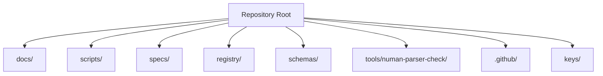
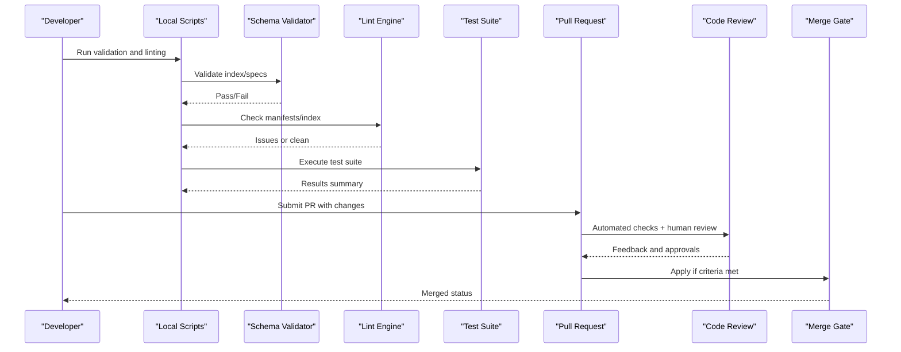
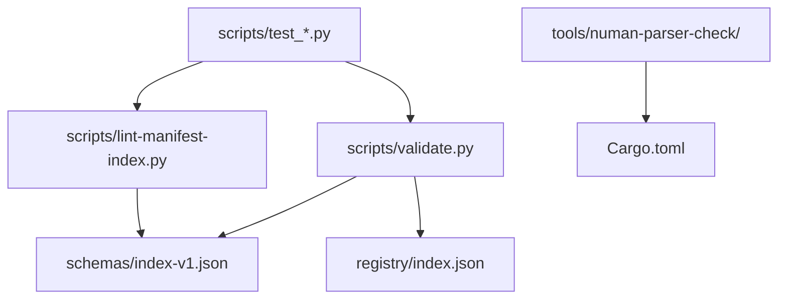

# Contributing

<cite>
**Referenced Files in This Document**
- [README.md](file://README.md)
- [SECURITY.md](file://SECURITY.md)
- [AGENTS.md](file://AGENTS.md)
- [.github/pull_request_template.md](file://.github/pull_request_template.md)
- [scripts/validate.py](file://scripts/validate.py)
- [scripts/lint-manifest-index.py](file://scripts/lint-manifest-index.py)
- [scripts/test_lint_manifest_index.py](file://scripts/test_lint_manifest_index.py)
- [scripts/test_add_package_archives.py](file://scripts/test_add_package_archives.py)
- [scripts/test_build_version_entry_source.py](file://scripts/test_build_version_entry_source.py)
- [scripts/test_lifecycle_evidence.py](file://scripts/test_lifecycle_evidence.py)
- [scripts/test_lifecycle_prove.py](file://scripts/test_lifecycle_prove.py)
- [scripts/test_workflow_safety.py](file://scripts/test_workflow_safety.py)
- [schemas/index-v1.json](file://schemas/index-v1.json)
- [registry/index.json](file://registry/index.json)
- [specs/FMotalleb-nu_plugin_desktop_notifications-0.114.1.json](file://specs/FMotalleb-nu_plugin_desktop_notifications-0.114.1.json)
- [tools/numan-parser-check/Cargo.toml](file://tools/numan-parser-check/Cargo.toml)
- [tools/numan-parser-check/src/main.rs](file://tools/numan-parser-check/src/main.rs)
</cite>

## Table of Contents
1. [Introduction](#introduction)
2. [Project Structure](#project-structure)
3. [Core Components](#core-components)
4. [Architecture Overview](#architecture-overview)
5. [Detailed Component Analysis](#detailed-component-analysis)
6. [Dependency Analysis](#dependency-analysis)
7. [Performance Considerations](#performance-considerations)
8. [Troubleshooting Guide](#troubleshooting-guide)
9. [Conclusion](#conclusion)
10. [Appendices](#appendices)

## Introduction
This document provides comprehensive guidance for contributing to the Numan Registry project. It covers development environment setup, coding standards, testing procedures, pull request workflow, code review and merge criteria, release and versioning strategy, documentation standards, bug reporting, feature requests, community guidelines, communication channels, testing framework usage, and security considerations including responsible disclosure.

## Project Structure
The repository is organized into logical areas:
- Root configuration and policies (e.g., README, SECURITY, AGENTS)
- GitHub workflows and PR template
- Documentation (including outreach issues, incident response, key provisioning, lifecycle, roadmap)
- Registry data and signatures
- JSON schemas for validation
- Scripts for linting, validation, lifecycle proofs, signing, and tests
- Spec files representing package entries
- A Rust tool for parser checks

[No sources needed since this diagram shows conceptual structure]

## Core Components
- Validation and linting scripts ensure registry integrity and schema compliance.
- Test scripts validate behavior of linting, lifecycle evidence, and workflow safety.
- Schemas define the expected structure of registry index and spec files.
- The Rust tool validates parser compatibility for Nushell-related artifacts.

Key responsibilities:
- Validate registry index against schema and enforce constraints.
- Lint manifest/index entries for correctness and consistency.
- Provide lifecycle proof utilities and tests.
- Enforce workflow safety checks.

**Section sources**
- [scripts/validate.py](file://scripts/validate.py)
- [scripts/lint-manifest-index.py](file://scripts/lint-manifest-index.py)
- [scripts/test_lint_manifest_index.py](file://scripts/test_lint_manifest_index.py)
- [scripts/test_add_package_archives.py](file://scripts/test_add_package_archives.py)
- [scripts/test_build_version_entry_source.py](file://scripts/test_build_version_entry_source.py)
- [scripts/test_lifecycle_evidence.py](file://scripts/test_lifecycle_evidence.py)
- [scripts/test_lifecycle_prove.py](file://scripts/test_lifecycle_prove.py)
- [scripts/test_workflow_safety.py](file://scripts/test_workflow_safety.py)
- [schemas/index-v1.json](file://schemas/index-v1.json)
- [tools/numan-parser-check/Cargo.toml](file://tools/numan-parser-check/Cargo.toml)
- [tools/numan-parser-check/src/main.rs](file://tools/numan-parser-check/src/main.rs)

## Architecture Overview
The contribution and CI pipeline revolves around validation and linting of registry data, with tests ensuring correctness and safety.

[No sources needed since this diagram shows conceptual workflow]

## Detailed Component Analysis

### Development Environment Setup
- Ensure Python is available to run validation and linting scripts.
- Install Rust toolchain for the parser check utility.
- Use a modern shell compatible with Nushell ecosystem where applicable.
- Keep dependencies minimal; rely on standard libraries unless explicitly required by scripts.

Practical steps:
- Verify Python interpreter availability and version compatibility.
- Build and run the Rust parser check tool from its directory.
- Confirm access to registry and schema files for local validation.

**Section sources**
- [tools/numan-parser-check/Cargo.toml](file://tools/numan-parser-check/Cargo.toml)
- [tools/numan-parser-check/src/main.rs](file://tools/numan-parser-check/src/main.rs)

### Coding Standards
- Follow consistent naming conventions for scripts and modules.
- Keep scripts focused and modular; avoid monolithic functions.
- Prefer explicit error handling and clear exit codes.
- Maintain backward compatibility when modifying shared schemas or interfaces.
- Document script usage via help text or comments.

Guidelines:
- Use descriptive variable names and function names.
- Avoid hardcoding paths; use parameters or configuration where appropriate.
- Keep imports organized and minimal.
- Add inline comments for complex logic.

**Section sources**
- [scripts/validate.py](file://scripts/validate.py)
- [scripts/lint-manifest-index.py](file://scripts/lint-manifest-index.py)

### Testing Procedures
- Run all test scripts to ensure changes do not break existing functionality.
- Focus on tests for linting, lifecycle evidence, and workflow safety.
- Use isolated fixtures and deterministic inputs for reliable results.

How to run tests:
- Execute each test script individually to isolate failures.
- Aggregate results by running the full suite locally before submitting PRs.

**Section sources**
- [scripts/test_lint_manifest_index.py](file://scripts/test_lint_manifest_index.py)
- [scripts/test_add_package_archives.py](file://scripts/test_add_package_archives.py)
- [scripts/test_build_version_entry_source.py](file://scripts/test_build_version_entry_source.py)
- [scripts/test_lifecycle_evidence.py](file://scripts/test_lifecycle_evidence.py)
- [scripts/test_lifecycle_prove.py](file://scripts/test_lifecycle_prove.py)
- [scripts/test_workflow_safety.py](file://scripts/test_workflow_safety.py)

### Pull Request Workflow
- Create a branch for your change and commit small, focused updates.
- Include a clear description of changes and rationale.
- Update relevant documentation and tests alongside code changes.
- Ensure all local validations and tests pass before opening a PR.

PR template usage:
- Fill out fields in the PR template to provide context for reviewers.

**Section sources**
- [.github/pull_request_template.md](file://.github/pull_request_template.md)

### Code Review Process
- Reviews focus on correctness, maintainability, and adherence to standards.
- Address feedback promptly and iterate until approvals are granted.
- Ensure automated checks pass and tests remain green.

Merge criteria:
- All checks must pass.
- At least one maintainer approval.
- No outstanding blocking feedback.

**Section sources**
- [AGENTS.md](file://AGENTS.md)

### Writing Tests for Validation and Linting
- Cover both positive and negative cases for schema validation.
- Validate edge conditions such as missing fields, invalid types, and malformed entries.
- Ensure tests are deterministic and independent of external state.

Best practices:
- Use fixtures for common inputs.
- Assert specific error messages or exit codes where meaningful.
- Keep test data minimal and representative.

**Section sources**
- [scripts/test_lint_manifest_index.py](file://scripts/test_lint_manifest_index.py)
- [scripts/test_add_package_archives.py](file://scripts/test_add_package_archives.py)
- [scripts/test_build_version_entry_source.py](file://scripts/test_build_version_entry_source.py)

### Release Process and Versioning Strategy
- Coordinate releases through documented checklists and processes.
- Bump versions consistently across manifests and registry index.
- Sign artifacts as per production procedures.

Versioning guidelines:
- Use semantic versioning for packages and tools.
- Ensure changelog entries reflect breaking changes and important fixes.

**Section sources**
- [docs/production-cutover-checklist.md](file://docs/production-cutover-checklist.md)
- [docs/key-rotation-checklist.md](file://docs/key-rotation-checklist.md)

### Documentation Standards
- Keep documentation up-to-date with code changes.
- Use clear headings, concise descriptions, and actionable steps.
- Place new docs under docs/ with descriptive filenames.

Updating existing docs:
- Edit relevant markdown files and verify links and references.
- Cross-reference related documents for completeness.

**Section sources**
- [docs/intake-candidates.md](file://docs/intake-candidates.md)
- [docs/key-provisioning.md](file://docs/key-provisioning.md)
- [docs/lifecycle-prove.md](file://docs/lifecycle-prove.md)

### Reporting Bugs and Requesting Features
- Open issues with clear reproduction steps and expected behavior.
- Include environment details and logs where applicable.
- For features, describe the problem, proposed solution, and benefits.

Communication channels:
- Use repository issues for tracking and discussions.
- Engage with maintainers for clarification and guidance.

**Section sources**
- [SECURITY.md](file://SECURITY.md)

### Community Guidelines and Communication Channels
- Be respectful and collaborative in discussions.
- Follow established processes for contributions and reviews.
- Seek consensus and document decisions.

**Section sources**
- [AGENTS.md](file://AGENTS.md)

### Testing Framework Usage
- The project uses Python-based scripts for validation and tests.
- Run individual test scripts to diagnose failures quickly.
- Integrate local runs into pre-commit or CI pipelines for automation.

Running the suite:
- Execute each test script sequentially or aggregate via a wrapper.
- Inspect output for pass/fail summaries and detailed logs.

**Section sources**
- [scripts/test_lint_manifest_index.py](file://scripts/test_lint_manifest_index.py)
- [scripts/test_workflow_safety.py](file://scripts/test_workflow_safety.py)

### Security Considerations and Responsible Disclosure
- Do not commit secrets or sensitive keys.
- Use secure channels for sharing vulnerabilities privately.
- Follow responsible disclosure procedures outlined in security policy.

Responsible disclosure:
- Report vulnerabilities privately to maintainers.
- Allow time for mitigation before public disclosure.

**Section sources**
- [SECURITY.md](file://SECURITY.md)

## Dependency Analysis
The scripts depend on Python standard libraries and may interact with JSON schemas and registry files. The Rust tool depends on Cargo and Rust crates defined in its manifest.

**Diagram sources**
- [scripts/validate.py](file://scripts/validate.py)
- [scripts/lint-manifest-index.py](file://scripts/lint-manifest-index.py)
- [scripts/test_lint_manifest_index.py](file://scripts/test_lint_manifest_index.py)
- [scripts/test_add_package_archives.py](file://scripts/test_add_package_archives.py)
- [scripts/test_build_version_entry_source.py](file://scripts/test_build_version_entry_source.py)
- [scripts/test_lifecycle_evidence.py](file://scripts/test_lifecycle_evidence.py)
- [scripts/test_lifecycle_prove.py](file://scripts/test_lifecycle_prove.py)
- [scripts/test_workflow_safety.py](file://scripts/test_workflow_safety.py)
- [schemas/index-v1.json](file://schemas/index-v1.json)
- [registry/index.json](file://registry/index.json)
- [tools/numan-parser-check/Cargo.toml](file://tools/numan-parser-check/Cargo.toml)

**Section sources**
- [schemas/index-v1.json](file://schemas/index-v1.json)
- [registry/index.json](file://registry/index.json)
- [tools/numan-parser-check/Cargo.toml](file://tools/numan-parser-check/Cargo.toml)

## Performance Considerations
- Keep validation and linting scripts efficient by avoiding unnecessary I/O.
- Cache intermediate results where feasible.
- Profile tests to identify bottlenecks and optimize accordingly.

[No sources needed since this section provides general guidance]

## Troubleshooting Guide
Common issues and resolutions:
- Schema validation failures: Check field types and required properties in the schema.
- Linting errors: Review manifest/index entries for consistency and correctness.
- Test failures: Inspect test outputs and fix input fixtures or assertions.

Debugging steps:
- Run validation and linting scripts independently to isolate problems.
- Use verbose logging in scripts to trace execution paths.
- Compare failing inputs against known-good examples in specs.

**Section sources**
- [scripts/validate.py](file://scripts/validate.py)
- [scripts/lint-manifest-index.py](file://scripts/lint-manifest-index.py)
- [specs/FMotalleb-nu_plugin_desktop_notifications-0.114.1.json](file://specs/FMotalleb-nu_plugin_desktop_notifications-0.114.1.json)

## Conclusion
Contributing to the Numan Registry involves adhering to established standards, running comprehensive tests, and following the PR and review process. By maintaining high-quality validation, linting, and documentation, contributors help ensure the registry remains reliable and secure. Engage with the community, follow security guidelines, and collaborate effectively to advance the project.

[No sources needed since this section summarizes without analyzing specific files]

## Appendices

### Quick Start Checklist
- Set up Python and Rust environments.
- Run validation and linting scripts locally.
- Execute the full test suite.
- Update documentation as needed.
- Submit a PR with clear descriptions and updated tests.

[No sources needed since this section provides general guidance]