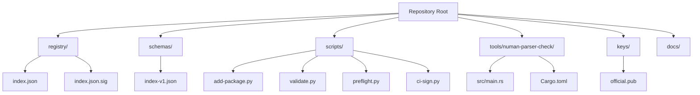
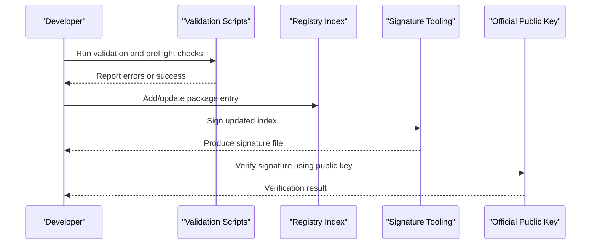
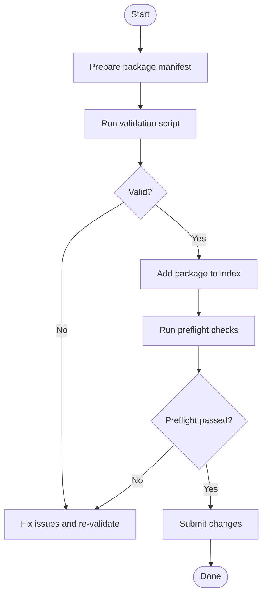
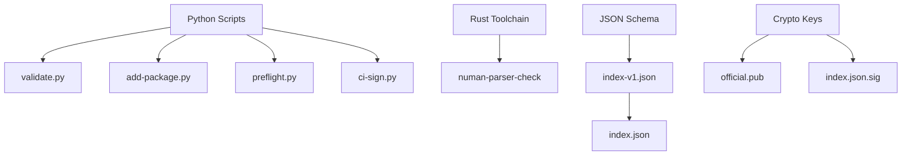

# Getting Started

<cite>
**Referenced Files in This Document**
- [README.md](file://README.md)
- [AGENTS.md](file://AGENTS.md)
- [index.json](file://registry/index.json)
- [index.json.sig](file://registry/index.json.sig)
- [official.pub](file://keys/official.pub)
- [index-v1.json](file://schemas/index-v1.json)
- [add-package.py](file://scripts/add-package.py)
- [validate.py](file://scripts/validate.py)
- [preflight.py](file://scripts/preflight.py)
- [ci-sign.py](file://scripts/ci-sign.py)
- [main.rs](file://tools/numan-parser-check/src/main.rs)
- [Cargo.toml](file://tools/numan-parser-check/Cargo.toml)
</cite>

## Table of Contents
1. [Introduction](#introduction)
2. [Project Structure](#project-structure)
3. [Core Components](#core-components)
4. [Architecture Overview](#architecture-overview)
5. [Detailed Component Analysis](#detailed-component-analysis)
6. [Dependency Analysis](#dependency-analysis)
7. [Performance Considerations](#performance-considerations)
8. [Troubleshooting Guide](#troubleshooting-guide)
9. [Conclusion](#conclusion)
10. [Appendices](#appendices)

## Introduction
This guide helps you set up the Numan Registry development environment, add your first package, and perform common workflows such as validation, signature verification, and registry updates. It is designed for beginners while covering all necessary technical details.

## Project Structure
The repository contains:
- Registry index and signature files under registry/
- Schema definitions under schemas/
- Operational scripts under scripts/
- A Rust-based parser checker tool under tools/numan-parser-check/
- Keys used for signing under keys/
- Documentation and process guides under docs/

**Diagram sources**
- [index.json](file://registry/index.json)
- [index.json.sig](file://registry/index.json.sig)
- [index-v1.json](file://schemas/index-v1.json)
- [add-package.py](file://scripts/add-package.py)
- [validate.py](file://scripts/validate.py)
- [preflight.py](file://scripts/preflight.py)
- [ci-sign.py](file://scripts/ci-sign.py)
- [main.rs](file://tools/numan-parser-check/src/main.rs)
- [Cargo.toml](file://tools/numan-parser-check/Cargo.toml)
- [official.pub](file://keys/official.pub)

**Section sources**
- [README.md](file://README.md)
- [AGENTS.md](file://AGENTS.md)

## Core Components
- Registry index: The canonical list of packages and versions is stored in a JSON file. Its schema is defined by a JSON Schema file.
- Signature: The index is signed to ensure integrity and authenticity.
- Scripts: Python utilities support adding packages, validating manifests/index entries, running preflight checks, and signing artifacts.
- Parser checker: A Rust tool validates package metadata against expected formats.

Key responsibilities:
- Validation ensures manifests and index entries conform to the schema and constraints.
- Signing guarantees that the published index has not been tampered with.
- Adding packages integrates new entries into the index following established processes.

**Section sources**
- [index.json](file://registry/index.json)
- [index-v1.json](file://schemas/index-v1.json)
- [index.json.sig](file://registry/index.json.sig)
- [add-package.py](file://scripts/add-package.py)
- [validate.py](file://scripts/validate.py)
- [preflight.py](file://scripts/preflight.py)
- [ci-sign.py](file://scripts/ci-sign.py)
- [main.rs](file://tools/numan-parser-check/src/main.rs)
- [Cargo.toml](file://tools/numan-parser-check/Cargo.toml)
- [official.pub](file://keys/official.pub)

## Architecture Overview
At a high level, contributors create or update package manifests, validate them using provided scripts, and then submit changes. The registry index is maintained centrally and signed to protect consumers.

**Diagram sources**
- [validate.py](file://scripts/validate.py)
- [preflight.py](file://scripts/preflight.py)
- [add-package.py](file://scripts/add-package.py)
- [ci-sign.py](file://scripts/ci-sign.py)
- [index.json](file://registry/index.json)
- [index.json.sig](file://registry/index.json.sig)
- [official.pub](file://keys/official.pub)

## Detailed Component Analysis

### Installation and Environment Setup
- Install Python (version compatible with the repository’s scripts).
- Install the Rust toolchain to build the parser checker tool if needed.
- Ensure you have access to the repository root and can run Python scripts from the command line.

Prerequisites checklist:
- Python installed and available on PATH
- Rust toolchain installed (for building tools/numan-parser-check)
- Git configured for version control operations

**Section sources**
- [README.md](file://README.md)
- [AGENTS.md](file://AGENTS.md)
- [Cargo.toml](file://tools/numan-parser-check/Cargo.toml)

### Initial Configuration
- Familiarize yourself with the registry index structure and its schema.
- Keep the official public key accessible for signature verification.
- Configure your local environment to run the provided scripts without additional dependencies beyond what is specified in the repository.

Configuration tips:
- Use the schema file to understand required fields and constraints for index entries.
- Keep the public key file synchronized with the current official key used for signing.

**Section sources**
- [index-v1.json](file://schemas/index-v1.json)
- [official.pub](file://keys/official.pub)

### Adding Your First Package
Follow these steps to add a new package to the registry:

1. Prepare your package manifest according to the schema.
2. Validate the manifest using the validation script.
3. Use the add-package script to integrate the package into the index.
4. Run preflight checks to catch issues early.
5. Commit and push changes following the repository’s contribution workflow.

**Diagram sources**
- [validate.py](file://scripts/validate.py)
- [add-package.py](file://scripts/add-package.py)
- [preflight.py](file://scripts/preflight.py)

**Section sources**
- [add-package.py](file://scripts/add-package.py)
- [validate.py](file://scripts/validate.py)
- [preflight.py](file://scripts/preflight.py)

### Validation Checks
Use the validation script to ensure your package manifest and index entries conform to the schema and constraints. If validation fails, correct the reported issues and re-run until it passes.

Common validation tasks:
- Check field presence and types
- Enforce naming conventions
- Validate version constraints and archive references

**Section sources**
- [validate.py](file://scripts/validate.py)
- [index-v1.json](file://schemas/index-v1.json)

### Signature Verification
After updating the index, sign it using the signing script and verify the signature with the official public key. Consumers rely on this signature to trust the registry contents.

Verification steps:
- Generate the signature file for the updated index
- Verify the signature using the public key
- Confirm successful verification before publishing

**Section sources**
- [ci-sign.py](file://scripts/ci-sign.py)
- [index.json.sig](file://registry/index.json.sig)
- [official.pub](file://keys/official.pub)

### Registry Updates
When integrating changes:
- Ensure all validations pass
- Update the index consistently
- Re-sign the index after modifications
- Push changes via the standard contribution process

Best practices:
- Keep changes atomic and well-documented
- Re-run preflight checks before submission
- Maintain alignment with the schema and constraints

**Section sources**
- [add-package.py](file://scripts/add-package.py)
- [preflight.py](file://scripts/preflight.py)
- [ci-sign.py](file://scripts/ci-sign.py)
- [index.json](file://registry/index.json)

### Using the Parser Checker Tool
Build and use the Rust-based parser checker to validate package metadata formats. This tool complements the Python validation scripts by enforcing structural correctness at the parser level.

Usage outline:
- Build the tool using the Rust toolchain
- Run the binary against package metadata files
- Address any parsing errors reported

**Section sources**
- [main.rs](file://tools/numan-parser-check/src/main.rs)
- [Cargo.toml](file://tools/numan-parser-check/Cargo.toml)

## Dependency Analysis
The project relies on:
- Python scripts for validation, packaging, and signing workflows
- Rust toolchain for building the parser checker utility
- JSON Schema for defining index structure and constraints
- Cryptographic signatures for ensuring index integrity

**Diagram sources**
- [validate.py](file://scripts/validate.py)
- [add-package.py](file://scripts/add-package.py)
- [preflight.py](file://scripts/preflight.py)
- [ci-sign.py](file://scripts/ci-sign.py)
- [index-v1.json](file://schemas/index-v1.json)
- [official.pub](file://keys/official.pub)
- [index.json.sig](file://registry/index.json.sig)
- [index.json](file://registry/index.json)
- [main.rs](file://tools/numan-parser-check/src/main.rs)
- [Cargo.toml](file://tools/numan-parser-check/Cargo.toml)

**Section sources**
- [validate.py](file://scripts/validate.py)
- [add-package.py](file://scripts/add-package.py)
- [preflight.py](file://scripts/preflight.py)
- [ci-sign.py](file://scripts/ci-sign.py)
- [index-v1.json](file://schemas/index-v1.json)
- [official.pub](file://keys/official.pub)
- [index.json.sig](file://registry/index.json.sig)
- [index.json](file://registry/index.json)
- [main.rs](file://tools/numan-parser-check/src/main.rs)
- [Cargo.toml](file://tools/numan-parser-check/Cargo.toml)

## Performance Considerations
- Prefer running validation and preflight checks locally before pushing to avoid CI failures.
- Keep manifests minimal and accurate to reduce validation overhead.
- Cache repeated operations where possible during iterative development.

[No sources needed since this section provides general guidance]

## Troubleshooting Guide
Common setup issues and resolutions:
- Python not found: Ensure Python is installed and added to PATH; confirm version compatibility with repository scripts.
- Rust build failures: Verify the Rust toolchain is installed and up-to-date; rebuild the parser checker tool if needed.
- Validation errors: Review error messages from the validation script; cross-check fields against the schema definition.
- Signature verification failures: Confirm the correct public key is used and the signature file matches the current index.

Tips:
- Re-run preflight checks after each change to catch issues early.
- Keep the schema and public key files synchronized with the latest official versions.

**Section sources**
- [validate.py](file://scripts/validate.py)
- [preflight.py](file://scripts/preflight.py)
- [index-v1.json](file://schemas/index-v1.json)
- [official.pub](file://keys/official.pub)
- [index.json.sig](file://registry/index.json.sig)

## Conclusion
You now have the essentials to set up the Numan Registry environment, add your first package, validate manifests, verify signatures, and update the registry safely. Follow the outlined steps and best practices to maintain integrity and consistency across contributions.

[No sources needed since this section summarizes without analyzing specific files]

## Appendices

### Minimum Requirements and Prerequisites
- Python installed and available on PATH
- Rust toolchain installed (for building tools/numan-parser-check)
- Access to the repository and ability to run scripts locally

**Section sources**
- [README.md](file://README.md)
- [AGENTS.md](file://AGENTS.md)
- [Cargo.toml](file://tools/numan-parser-check/Cargo.toml)

### Quick Reference: Common Workflows
- Validate a package manifest: Use the validation script to check schema compliance.
- Add a package to the registry: Use the add-package script after validation.
- Verify the registry index signature: Use the signing script and public key to ensure integrity.
- Run preflight checks: Execute preflight to catch integration issues before submission.

**Section sources**
- [validate.py](file://scripts/validate.py)
- [add-package.py](file://scripts/add-package.py)
- [ci-sign.py](file://scripts/ci-sign.py)
- [preflight.py](file://scripts/preflight.py)
- [official.pub](file://keys/official.pub)