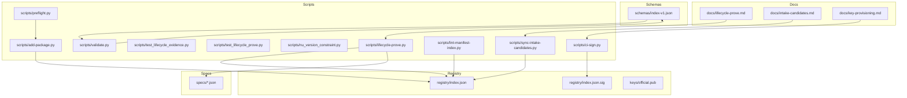
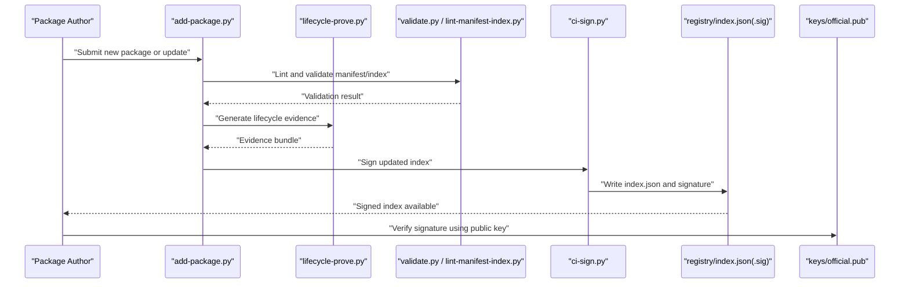
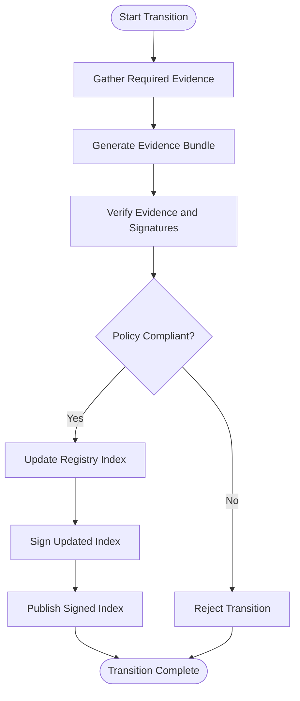
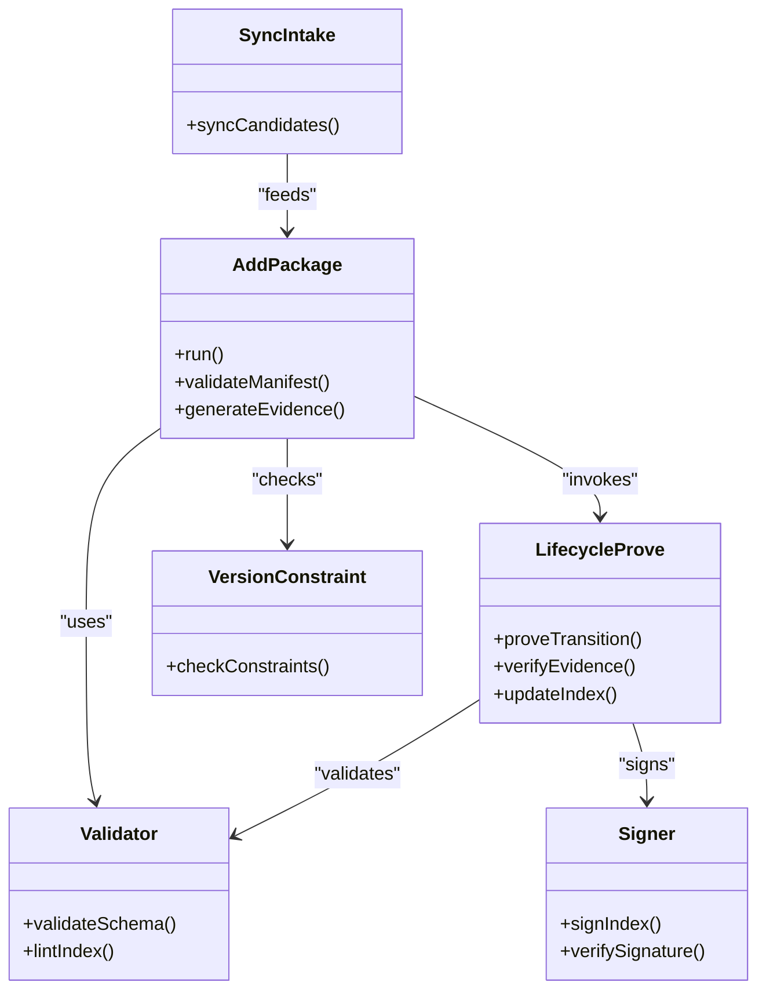
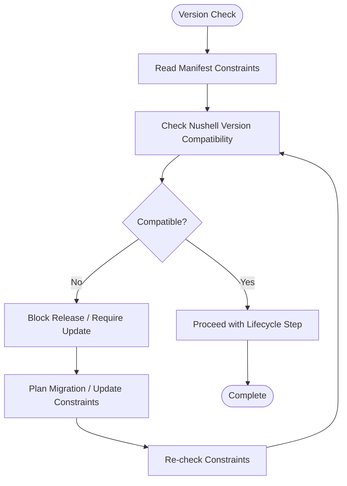
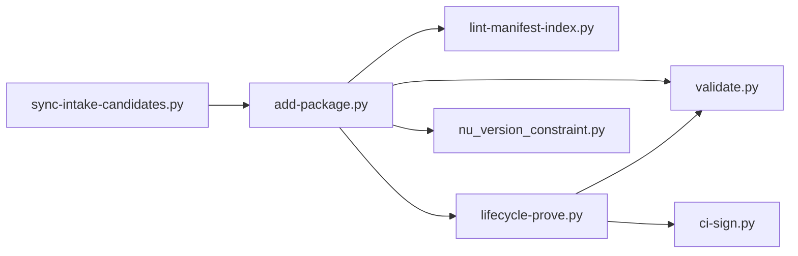

# Lifecycle Management

<cite>
**Referenced Files in This Document**
- [README.md](file://README.md)
- [lifecycle-prove.md](file://docs/lifecycle-prove.md)
- [intake-candidates.md](file://docs/intake-candidates.md)
- [key-provisioning.md](file://docs/key-provisioning.md)
- [index-v1.json](file://schemas/index-v1.json)
- [index.json](file://registry/index.json)
- [index.json.sig](file://registry/index.json.sig)
- [official.pub](file://keys/official.pub)
- [add-package.py](file://scripts/add-package.py)
- [lifecycle-prove.py](file://scripts/lifecycle-prove.py)
- [test_lifecycle_evidence.py](file://scripts/test_lifecycle_evidence.py)
- [test_lifecycle_prove.py](file://scripts/test_lifecycle_prove.py)
- [nu_version_constraint.py](file://scripts/nu_version_constraint.py)
- [validate.py](file://scripts/validate.py)
- [lint-manifest-index.py](file://scripts/lint-manifest-index.py)
- [preflight.py](file://scripts/preflight.py)
- [ci-sign.py](file://scripts/ci-sign.py)
- [sync-intake-candidates.py](file://scripts/sync-intake-candidates.py)
</cite>

## Table of Contents
1. [Introduction](#introduction)
2. [Project Structure](#project-structure)
3. [Core Components](#core-components)
4. [Architecture Overview](#architecture-overview)
5. [Detailed Component Analysis](#detailed-component-analysis)
6. [Dependency Analysis](#dependency-analysis)
7. [Performance Considerations](#performance-considerations)
8. [Troubleshooting Guide](#troubleshooting-guide)
9. [Conclusion](#conclusion)
10. [Appendices](#appendices)

## Introduction
This document explains how the Numan Registry manages package lifecycles from creation through deprecation, with a focus on evidence tracking and compliance. It describes the lifecycle proof system that ensures integrity at every stage, documents automated tools for generating and verifying evidence, and provides procedures for state transitions, exceptions, version compatibility, migration strategies, health monitoring, and visibility rules tied to lifecycle stages.

## Project Structure
The repository organizes lifecycle-related artifacts across documentation, schemas, registry metadata, keys, scripts, and specs:
- Documentation defines policies and workflows (e.g., lifecycle proving, intake).
- Schemas define the structure of registry index files.
- Registry metadata includes the signed index and public key material.
- Scripts implement automation for adding packages, proving lifecycle evidence, linting, validation, signing, and synchronization.
- Specs contain example package manifests used by tests and tooling.

**Diagram sources**
- [lifecycle-prove.md](file://docs/lifecycle-prove.md)
- [intake-candidates.md](file://docs/intake-candidates.md)
- [key-provisioning.md](file://docs/key-provisioning.md)
- [index-v1.json](file://schemas/index-v1.json)
- [index.json](file://registry/index.json)
- [index.json.sig](file://registry/index.json.sig)
- [official.pub](file://keys/official.pub)
- [add-package.py](file://scripts/add-package.py)
- [lifecycle-prove.py](file://scripts/lifecycle-prove.py)
- [test_lifecycle_evidence.py](file://scripts/test_lifecycle_evidence.py)
- [test_lifecycle_prove.py](file://scripts/test_lifecycle_prove.py)
- [nu_version_constraint.py](file://scripts/nu_version_constraint.py)
- [validate.py](file://scripts/validate.py)
- [lint-manifest-index.py](file://scripts/lint-manifest-index.py)
- [preflight.py](file://scripts/preflight.py)
- [ci-sign.py](file://scripts/ci-sign.py)
- [sync-intake-candidates.py](file://scripts/sync-intake-candidates.py)

**Section sources**
- [README.md](file://README.md)
- [lifecycle-prove.md](file://docs/lifecycle-prove.md)
- [intake-candidates.md](file://docs/intake-candidates.md)
- [key-provisioning.md](file://docs/key-provisioning.md)
- [index-v1.json](file://schemas/index-v1.json)
- [index.json](file://registry/index.json)
- [index.json.sig](file://registry/index.json.sig)
- [official.pub](file://keys/official.pub)
- [add-package.py](file://scripts/add-package.py)
- [lifecycle-prove.py](file://scripts/lifecycle-prove.py)
- [test_lifecycle_evidence.py](file://scripts/test_lifecycle_evidence.py)
- [test_lifecycle_prove.py](file://scripts/test_lifecycle_prove.py)
- [nu_version_constraint.py](file://scripts/nu_version_constraint.py)
- [validate.py](file://scripts/validate.py)
- [lint-manifest-index.py](file://scripts/lint-manifest-index.py)
- [preflight.py](file://scripts/preflight.py)
- [ci-sign.py](file://scripts/ci-sign.py)
- [sync-intake-candidates.py](file://scripts/sync-intake-candidates.py)

## Core Components
- Lifecycle Proof System: A policy-driven mechanism that requires verifiable evidence at each lifecycle transition to ensure package integrity and compliance. Evidence is generated and validated by dedicated scripts and checked against schema constraints.
- Registry Index and Signing: The registry’s index file is the authoritative source of truth for available packages and their versions. It is cryptographically signed to prevent tampering and enable trust verification.
- Automation Scripts: Provide end-to-end support for adding packages, generating proofs, validating manifests, linting, signing, and synchronizing intake candidates. Tests validate correctness and robustness.

Key responsibilities:
- Enforce lifecycle state transitions only when required evidence is present and valid.
- Maintain a signed, schema-compliant registry index.
- Provide repeatable, auditable operations via scripts and tests.

**Section sources**
- [lifecycle-prove.md](file://docs/lifecycle-prove.md)
- [index-v1.json](file://schemas/index-v1.json)
- [index.json](file://registry/index.json)
- [index.json.sig](file://registry/index.json.sig)
- [official.pub](file://keys/official.pub)
- [add-package.py](file://scripts/add-package.py)
- [lifecycle-prove.py](file://scripts/lifecycle-prove.py)
- [test_lifecycle_evidence.py](file://scripts/test_lifecycle_evidence.py)
- [test_lifecycle_prove.py](file://scripts/test_lifecycle_prove.py)

## Architecture Overview
The lifecycle architecture combines documentation-driven policies, schema-based validation, cryptographic signing, and scripted automation.

**Diagram sources**
- [add-package.py](file://scripts/add-package.py)
- [lifecycle-prove.py](file://scripts/lifecycle-prove.py)
- [validate.py](file://scripts/validate.py)
- [lint-manifest-index.py](file://scripts/lint-manifest-index.py)
- [ci-sign.py](file://scripts/ci-sign.py)
- [index.json](file://registry/index.json)
- [index.json.sig](file://registry/index.json.sig)
- [official.pub](file://keys/official.pub)

## Detailed Component Analysis

### Lifecycle Stages and Evidence Requirements
Lifecycle stages typically include:
- Intake/Candidate: Package proposal and initial checks.
- Active/Released: Package is published and available for use.
- Deprecated: Package is marked for removal; users are encouraged to migrate.
- Archived/Removed: Package is no longer served or is removed from the registry.

At each transition, evidence must be produced and verified:
- Intake to Active: Manifest validity, dependency constraints, provenance, and security scans.
- Active to Deprecated: Deprecation notice, migration guidance, and retention policy.
- Deprecated to Archived/Removed: Confirmation of replacement availability and archival steps.

Evidence types may include:
- Signed manifests and checksums.
- Dependency constraint validations.
- Security scan results.
- Compliance attestations per policy.

**Section sources**
- [lifecycle-prove.md](file://docs/lifecycle-prove.md)
- [intake-candidates.md](file://docs/intake-candidates.md)

### Lifecycle Proof System
The proof system enforces that every lifecycle transition is backed by verifiable evidence:
- Proving: Generates an evidence bundle describing the current state and changes.
- Verification: Validates signatures, schema conformance, and policy requirements.
- Auditability: Produces deterministic outputs suitable for review and archival.

**Diagram sources**
- [lifecycle-prove.py](file://scripts/lifecycle-prove.py)
- [index.json](file://registry/index.json)
- [index.json.sig](file://registry/index.json.sig)
- [official.pub](file://keys/official.pub)

**Section sources**
- [lifecycle-prove.md](file://docs/lifecycle-prove.md)
- [lifecycle-prove.py](file://scripts/lifecycle-prove.py)
- [test_lifecycle_prove.py](file://scripts/test_lifecycle_prove.py)
- [test_lifecycle_evidence.py](file://scripts/test_lifecycle_evidence.py)

### Automated Tools for Generating and Verifying Evidence
- add-package.py: Orchestrates adding or updating packages, invoking validation and proof generation.
- lifecycle-prove.py: Implements the core lifecycle proof logic, producing and validating evidence bundles.
- validate.py and lint-manifest-index.py: Enforce schema compliance and manifest integrity.
- ci-sign.py: Signs registry artifacts using the official key material.
- nu_version_constraint.py: Manages version compatibility constraints for dependencies.
- sync-intake-candidates.py: Synchronizes candidate packages into the intake pipeline.

**Diagram sources**
- [add-package.py](file://scripts/add-package.py)
- [lifecycle-prove.py](file://scripts/lifecycle-prove.py)
- [validate.py](file://scripts/validate.py)
- [lint-manifest-index.py](file://scripts/lint-manifest-index.py)
- [ci-sign.py](file://scripts/ci-sign.py)
- [nu_version_constraint.py](file://scripts/nu_version_constraint.py)
- [sync-intake-candidates.py](file://scripts/sync-intake-candidates.py)

**Section sources**
- [add-package.py](file://scripts/add-package.py)
- [lifecycle-prove.py](file://scripts/lifecycle-prove.py)
- [validate.py](file://scripts/validate.py)
- [lint-manifest-index.py](file://scripts/lint-manifest-index.py)
- [ci-sign.py](file://scripts/ci-sign.py)
- [nu_version_constraint.py](file://scripts/nu_version_constraint.py)
- [sync-intake-candidates.py](file://scripts/sync-intake-candidates.py)

### Procedures for State Transitions and Exceptions
- New Package Intake:
  - Submit via intake process; run preflight checks and linting.
  - Generate lifecycle evidence and verify compliance.
  - Update and sign the registry index; publish.
- Promote to Active:
  - Ensure all evidence passes verification and policy checks.
  - Update index entry to active status; sign and publish.
- Deprecate:
  - Attach deprecation evidence and migration guidance.
  - Update index to deprecated; maintain availability per policy.
- Archive/Remove:
  - Confirm replacement availability and archival steps.
  - Update index to archived/removed; sign and publish.

Exception handling:
- Validation failures: Re-run linters and validators; fix manifest issues before re-proving.
- Signature mismatches: Re-sign with correct key material; verify public key usage.
- Policy non-compliance: Address evidence gaps; re-generate and re-verify.

**Section sources**
- [intake-candidates.md](file://docs/intake-candidates.md)
- [lifecycle-prove.md](file://docs/lifecycle-prove.md)
- [preflight.py](file://scripts/preflight.py)
- [validate.py](file://scripts/validate.py)
- [lint-manifest-index.py](file://scripts/lint-manifest-index.py)
- [ci-sign.py](file://scripts/ci-sign.py)

### Version Compatibility Management and Migration Strategies
- Version Constraints:
  - Use dependency constraint checking to ensure compatibility with target Nushell versions.
  - Enforce minimum and maximum supported versions in manifests.
- Migration Strategies:
  - Provide deprecation notices with clear migration paths.
  - Maintain backward-compatible entries during transition periods.
  - Archive older versions after sufficient grace period.

**Diagram sources**
- [nu_version_constraint.py](file://scripts/nu_version_constraint.py)
- [add-package.py](file://scripts/add-package.py)

**Section sources**
- [nu_version_constraint.py](file://scripts/nu_version_constraint.py)
- [add-package.py](file://scripts/add-package.py)

### Monitoring Package Health and Identifying Outdated or Problematic Packages
- Health Indicators:
  - Signature validity and index consistency.
  - Constraint satisfaction and dependency resolution success.
  - Absence of known vulnerabilities or policy violations.
- Identification Methods:
  - Run linters and validators regularly to detect schema drift or manifest errors.
  - Monitor version constraint failures to flag incompatibilities.
  - Track deprecation timelines and archive readiness.

Operational practices:
- Schedule periodic runs of validation and linting scripts.
- Alert on failed signature verification or index corruption.
- Review intake candidates and pending transitions for backlog.

**Section sources**
- [validate.py](file://scripts/validate.py)
- [lint-manifest-index.py](file://scripts/lint-manifest-index.py)
- [nu_version_constraint.py](file://scripts/nu_version_constraint.py)
- [preflight.py](file://scripts/preflight.py)

### Relationship Between Lifecycle Stages and Registry Visibility
- Candidate/Intake: Not visible in the public registry until promoted.
- Active: Fully visible and downloadable.
- Deprecated: Visible with deprecation notices; may be rate-limited or flagged.
- Archived/Removed: Hidden or redirected to archival storage; not downloadable.

Visibility enforcement is achieved through index updates and signing:
- Only signed index entries reflect intended visibility.
- Consumers should verify signatures and honor deprecation/archival states.

**Section sources**
- [index.json](file://registry/index.json)
- [index.json.sig](file://registry/index.json.sig)
- [official.pub](file://keys/official.pub)

## Dependency Analysis
Lifecycle components interact through well-defined interfaces:
- add-package.py orchestrates validation, proving, and signing.
- lifecycle-prove.py depends on validators and signer to produce compliant, signed index updates.
- nu_version_constraint.py integrates with manifest processing to enforce compatibility.
- sync-intake-candidates.py feeds candidates into the pipeline.

**Diagram sources**
- [add-package.py](file://scripts/add-package.py)
- [lifecycle-prove.py](file://scripts/lifecycle-prove.py)
- [validate.py](file://scripts/validate.py)
- [lint-manifest-index.py](file://scripts/lint-manifest-index.py)
- [ci-sign.py](file://scripts/ci-sign.py)
- [nu_version_constraint.py](file://scripts/nu_version_constraint.py)
- [sync-intake-candidates.py](file://scripts/sync-intake-candidates.py)

**Section sources**
- [add-package.py](file://scripts/add-package.py)
- [lifecycle-prove.py](file://scripts/lifecycle-prove.py)
- [validate.py](file://scripts/validate.py)
- [lint-manifest-index.py](file://scripts/lint-manifest-index.py)
- [ci-sign.py](file://scripts/ci-sign.py)
- [nu_version_constraint.py](file://scripts/nu_version_constraint.py)
- [sync-intake-candidates.py](file://scripts/sync-intake-candidates.py)

## Performance Considerations
- Batch validation and linting to reduce repeated work.
- Cache intermediate results where safe (e.g., resolved constraints).
- Parallelize independent checks (schema validation, signature verification).
- Minimize network calls during CI runs; prefer local verification where possible.

[No sources needed since this section provides general guidance]

## Troubleshooting Guide
Common issues and resolutions:
- Invalid or missing signatures:
  - Re-sign the index using the official key; verify public key usage.
- Schema validation failures:
  - Fix manifest fields according to schema; rerun linters.
- Version constraint conflicts:
  - Update dependency constraints; ensure compatibility with target Nushell versions.
- Evidence generation errors:
  - Inspect logs from lifecycle-prove.py; ensure required inputs are present.
- Intake synchronization problems:
  - Re-run sync-intake-candidates.py; check upstream sources and permissions.

Diagnostic steps:
- Run preflight checks before major operations.
- Validate manifests and index consistently.
- Verify signatures using the official public key.

**Section sources**
- [preflight.py](file://scripts/preflight.py)
- [validate.py](file://scripts/validate.py)
- [lint-manifest-index.py](file://scripts/lint-manifest-index.py)
- [nu_version_constraint.py](file://scripts/nu_version_constraint.py)
- [lifecycle-prove.py](file://scripts/lifecycle-prove.py)
- [sync-intake-candidates.py](file://scripts/sync-intake-candidates.py)
- [ci-sign.py](file://scripts/ci-sign.py)
- [official.pub](file://keys/official.pub)

## Conclusion
The Numan Registry’s lifecycle management relies on a rigorous proof system, schema-driven validation, and cryptographic signing to ensure integrity and compliance throughout a package’s existence. Automated scripts streamline transitions, while tests and monitoring maintain reliability. By following the documented procedures and leveraging the provided tools, maintainers can manage lifecycles effectively, ensure visibility aligns with policy, and keep packages healthy and compatible.

[No sources needed since this section summarizes without analyzing specific files]

## Appendices
- Key Provisioning: Refer to key provisioning documentation for managing signing keys and rotation procedures.
- Registry Schema: Consult the index schema for field definitions and constraints.
- Example Specs: Review spec files to understand expected manifest structures.

**Section sources**
- [key-provisioning.md](file://docs/key-provisioning.md)
- [index-v1.json](file://schemas/index-v1.json)
- [specs/*.json](file://specs/FMotalleb-nu_plugin_desktop_notifications-0.114.1.json)
- [specs/*.json](file://specs/SuaveIV-nu_plugin_audio-0.2.8.json)
- [specs/*.json](file://specs/SuaveIV-nu_script_wttr-0.1.0-main.json)
- [specs/*.json](file://specs/Trivernis-nu-plugin-dialog-0.1.0.json)
- [specs/*.json](file://specs/alex-kattathra-johnson-nu_plugin_ws-1.0.6.json)
- [specs/*.json](file://specs/amtoine-nu-git-manager-0.8.0.json)
- [specs/*.json](file://specs/amtoine-nu-git-manager-sugar-0.7.0.json)
- [specs/*.json](file://specs/b4nst-nu_plugin_format_pcap-0.1.0.json)
- [specs/*.json](file://specs/cptpiepmatz-nu_plugin_highlight-1.4.15.json)
- [specs/*.json](file://specs/dead10ck-nu_plugin_dns-4.0.10.json)
- [specs/*.json](file://specs/fdncred-nu_plugin_file-0.25.2.json)
- [specs/*.json](file://specs/fdncred-nu_plugin_regex-0.22.0.json)
- [specs/*.json](file://specs/idanarye-nu_plugin_skim-0.29.1.json)
- [specs/*.json](file://specs/nushell-custom-completions-0.1.0-f04cb44.json)
- [specs/*.json](file://specs/nushell-git-completions-0.1.0-f04cb44.json)
- [specs/*.json](file://specs/nushell-nu-hooks-0.1.0.json)
- [specs/*.json](file://specs/nushell-prophet-dotnu-0.0.18.json)
- [specs/*.json](file://specs/nushell-prophet-numd-0.4.0.json)
- [specs/*.json](file://specs/nushell-works-nu_plugin_nw_ulid-0.2.0.json)
- [specs/*.json](file://specs/tesujimath-bash-env-nushell-0.19.0.json)
- [specs/*.json](file://specs/vyadh-nutest-1.2.0.json)