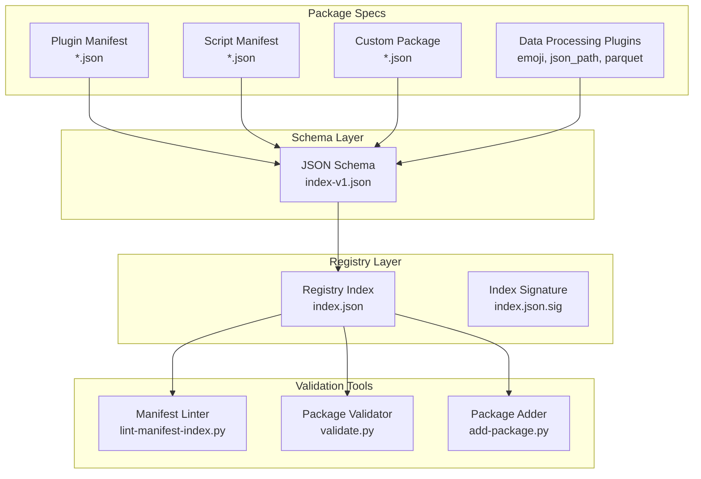
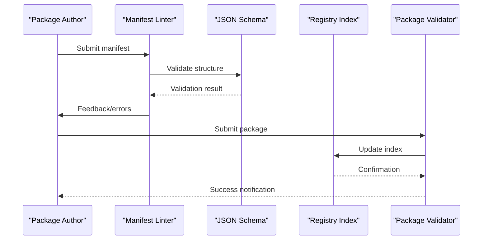
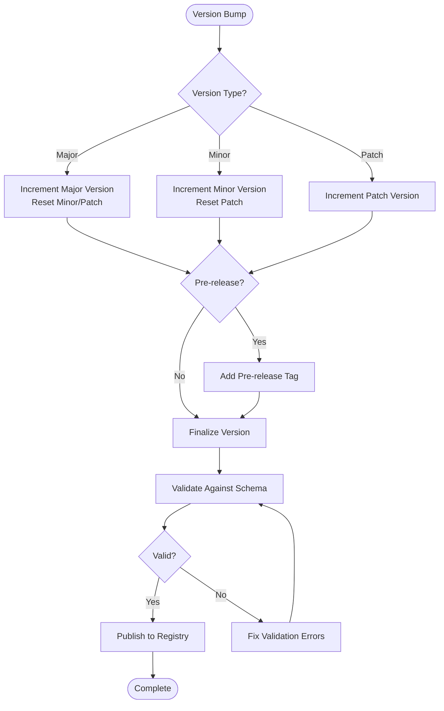
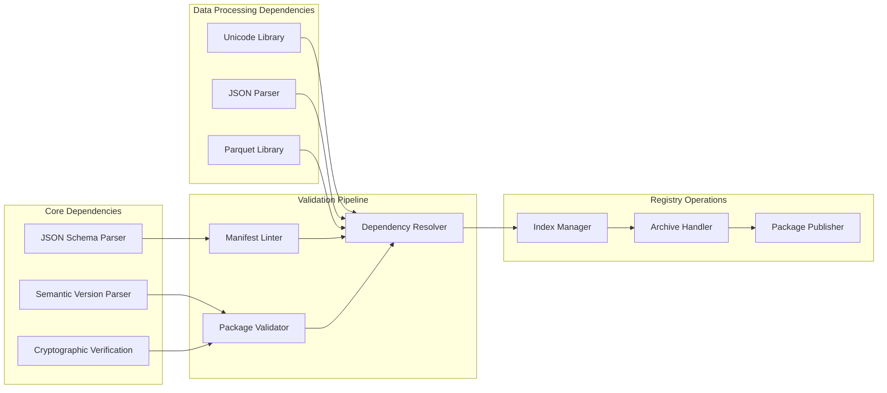

# Manifest Format Specification

<cite>
**Referenced Files in This Document**
- [index-v1.json](file://schemas/index-v1.json)
- [index.json](file://registry/index.json)
- [FMotalleb-nu_plugin_desktop_notifications-0.114.1.json](file://specs/FMotalleb-nu_plugin_desktop_notifications-0.114.1.json)
- [SuaveIV-nu_script_wttr-0.1.0-main.json](file://specs/SuaveIV-nu_script_wttr-0.1.0-main.json)
- [spec-nu_plugin_emoji.json](file://specs/spec-nu_plugin_emoji.json)
- [spec-nu_plugin_json_path.json](file://specs/spec-nu_plugin_json_path.json)
- [spec-nu_plugin_parquet.json](file://specs/spec-nu_plugin_parquet.json)
- [lint-manifest-index.py](file://scripts/lint-manifest-index.py)
- [validate.py](file://scripts/validate.py)
- [add-package.py](file://scripts/add-package.py)
</cite>

## Update Summary
**Changes Made**
- Added documentation for three new specialized Nushell plugin specifications: emoji, json_path, and parquet
- Updated package type variations section to include data processing plugins
- Enhanced manifest field specifications with examples from the new plugin types
- Expanded dependency management section with data processing plugin requirements
- Added troubleshooting guidance specific to data processing plugins

## Table of Contents
1. [Introduction](#introduction)
2. [Project Structure](#project-structure)
3. [Core Components](#core-components)
4. [Architecture Overview](#architecture-overview)
5. [Detailed Component Analysis](#detailed-component-analysis)
6. [Dependency Analysis](#dependency-analysis)
7. [Performance Considerations](#performance-considerations)
8. [Troubleshooting Guide](#troubleshooting-guide)
9. [Conclusion](#conclusion)
10. [Appendices](#appendices)

## Introduction

This document specifies the package manifest format used by the Nushell package registry system. The manifest defines metadata, dependencies, and versioning information for packages distributed through the registry. It serves as the contract between package authors and the registry infrastructure, ensuring consistency and reliability across all published packages.

The manifest format supports multiple package types including plugins, scripts, and custom configurations, each with specific field requirements and validation rules. Recent additions include specialized data processing plugins for Unicode emoji manipulation, JSON path operations, and Apache Parquet file handling capabilities.

## Project Structure

The manifest system consists of several key components:

**Diagram sources**
- [index-v1.json:1-200](file://schemas/index-v1.json#L1-L200)
- [index.json:1-100](file://registry/index.json#L1-L100)
- [lint-manifest-index.py:1-50](file://scripts/lint-manifest-index.py#L1-L50)

**Section sources**
- [index-v1.json:1-200](file://schemas/index-v1.json#L1-L200)
- [index.json:1-100](file://registry/index.json#L1-L100)

## Core Components

### Manifest Schema Definition

The manifest schema defines the structure and validation rules for package manifests. Key components include:

- **Package Identification**: Unique identifiers and naming conventions
- **Version Management**: Semantic versioning with pre-release support
- **Dependency Declaration**: External package requirements and constraints
- **Metadata Fields**: Author information, descriptions, and licensing
- **File References**: Archive locations and integrity checks

### Registry Index Structure

The registry index maintains a centralized catalog of all available packages with their versions and metadata. It provides quick lookup capabilities and ensures package availability across the distribution network.

**Section sources**
- [index-v1.json:1-200](file://schemas/index-v1.json#L1-L200)
- [index.json:1-100](file://registry/index.json#L1-L100)

## Architecture Overview

The manifest system follows a layered architecture that separates concerns between definition, validation, and distribution:

**Diagram sources**
- [lint-manifest-index.py:1-100](file://scripts/lint-manifest-index.py#L1-L100)
- [validate.py:1-100](file://scripts/validate.py#L1-L100)
- [add-package.py:1-100](file://scripts/add-package.py#L1-L100)

## Detailed Component Analysis

### Manifest Field Specifications

#### Required Fields

| Field | Type | Description | Validation Rules |
|-------|------|-------------|------------------|
| `name` | string | Unique package identifier | Must follow naming conventions, no spaces or special characters |
| `version` | string | Semantic version number | Must comply with semver specification |
| `description` | string | Human-readable package description | Non-empty string, reasonable length limits |
| `authors` | array | List of package authors | Array of strings with valid email formats |
| `license` | string | License identifier | SPDX-compliant license identifier |
| `homepage` | string | Package homepage URL | Valid HTTP/HTTPS URL |
| `repository` | string | Source code repository URL | Valid Git repository URL |
| `archive` | object | Package archive information | Contains filename and checksum fields |

#### Optional Fields

| Field | Type | Description | Default Value |
|-------|------|-------------|---------------|
| `keywords` | array | Search keywords | Empty array |
| `categories` | array | Package categories | Empty array |
| `dependencies` | object | External dependencies | Empty object |
| `nushell_version` | string | Minimum Nushell version | No minimum requirement |
| `readme` | string | Path to README file | None |
| `examples` | array | Example script paths | Empty array |

### Package Type Variations

#### Plugin Packages
Plugin manifests include additional fields for plugin-specific configuration:
- `plugin_type`: Specifies the type of Nushell plugin (external, internal)
- `entry_point`: Entry point function or executable path
- `capabilities`: Declares plugin capabilities and permissions

#### Script Packages
Script manifests focus on execution context and environment:
- `script_type`: Type of script (shell, python, etc.)
- `interpreter`: Required interpreter or runtime
- `environment`: Environment variables and settings

#### Data Processing Plugins
**Updated** New specialized data processing plugins have been added to support advanced data manipulation tasks:

##### Emoji Plugin (`spec-nu_plugin_emoji.json`)
Unicode emoji manipulation plugin providing functions for emoji detection, conversion, and text processing:
- Supports Unicode emoji ranges and categories
- Provides emoji normalization and transformation functions
- Handles emoji combining sequences and regional indicators

##### JSON Path Plugin (`spec-nu_plugin_json_path.json`)
JSON path operations plugin enabling advanced JSON data querying and manipulation:
- Implements JSONPath query language support
- Provides filtering and projection capabilities
- Supports nested JSON structure traversal

##### Parquet Plugin (`spec-nu_plugin_parquet.json`)
Apache Parquet file handling plugin for columnar data processing:
- Reads and writes Parquet file format
- Supports schema inference and validation
- Enables efficient columnar data operations

**Section sources**
- [FMotalleb-nu_plugin_desktop_notifications-0.114.1.json:1-100](file://specs/FMotalleb-nu_plugin_desktop_notifications-0.114.1.json#L1-L100)
- [SuaveIV-nu_script_wttr-0.1.0-main.json:1-100](file://specs/SuaveIV-nu_script_wttr-0.1.0-main.json#L1-L100)
- [spec-nu_plugin_emoji.json:1-100](file://specs/spec-nu_plugin_emoji.json#L1-L100)
- [spec-nu_plugin_json_path.json:1-100](file://specs/spec-nu_plugin_json_path.json#L1-L100)
- [spec-nu_plugin_parquet.json:1-100](file://specs/spec-nu_plugin_parquet.json#L1-L100)

### Versioning Strategy

The manifest system implements semantic versioning with support for pre-release and build metadata:

**Diagram sources**
- [nu_version_constraint.py:1-100](file://scripts/nu_version_constraint.py#L1-L100)

### Dependency Management

Dependencies are declared using a flexible constraint system:

- **Exact Versions**: Pin to specific versions using `=` operator
- **Version Ranges**: Specify acceptable ranges with comparison operators
- **Wildcard Support**: Use `*` for flexible matching
- **Transitive Dependencies**: Automatic resolution of nested dependencies

**Updated** Data processing plugins may require additional dependencies:
- **Emoji Plugin**: Unicode library dependencies for emoji processing
- **JSON Path Plugin**: JSON parsing and query engine dependencies
- **Parquet Plugin**: Columnar storage format libraries and compression codecs

**Section sources**
- [nu_version_constraint.py:1-100](file://scripts/nu_version_constraint.py#L1-L100)

## Dependency Analysis

The manifest system has well-defined dependency relationships:

**Diagram sources**
- [lint-manifest-index.py:1-100](file://scripts/lint-manifest-index.py#L1-L100)
- [validate.py:1-100](file://scripts/validate.py#L1-L100)
- [add-package.py:1-100](file://scripts/add-package.py#L1-L100)

**Section sources**
- [lint-manifest-index.py:1-100](file://scripts/lint-manifest-index.py#L1-L100)
- [validate.py:1-100](file://scripts/validate.py#L1-L100)

## Performance Considerations

### Schema Validation Optimization
- Implement lazy loading for large schema definitions
- Cache parsed schema objects to avoid repeated parsing
- Use streaming validation for large manifest files

### Registry Index Performance
- Implement indexing strategies for fast lookups
- Use compression for archived packages
- Optimize concurrent access patterns

### Memory Management
- Process manifests in chunks for large registries
- Implement garbage collection for temporary objects
- Monitor memory usage during batch operations

**Updated** Data processing plugin performance considerations:
- **Emoji Processing**: Efficient Unicode handling and caching strategies
- **JSON Operations**: Streaming JSON parsing for large documents
- **Parquet I/O**: Optimized columnar data access patterns

## Troubleshooting Guide

### Common Manifest Errors

#### Schema Validation Failures
- **Invalid JSON syntax**: Ensure proper JSON formatting and escaping
- **Missing required fields**: Verify all mandatory fields are present
- **Type mismatches**: Check data types match schema expectations
- **Constraint violations**: Validate values against defined constraints

#### Version Resolution Issues
- **Unresolvable dependencies**: Check version constraints and availability
- **Circular dependencies**: Identify and break dependency cycles
- **Incompatible versions**: Ensure compatibility with target Nushell version

#### Archive and Integrity Problems
- **Checksum mismatches**: Verify archive integrity matches manifest
- **Missing archives**: Ensure referenced archives exist and are accessible
- **Permission issues**: Check file permissions and access rights

### Data Processing Plugin Issues
**Updated** Specific troubleshooting for new data processing plugins:

#### Emoji Plugin Issues
- **Unicode encoding errors**: Ensure proper UTF-8 encoding throughout pipeline
- **Emoji rendering problems**: Verify terminal and font support for emoji display
- **Combining sequence issues**: Handle emoji combining sequences correctly

#### JSON Path Plugin Issues
- **Query syntax errors**: Validate JSONPath expressions before execution
- **Performance bottlenecks**: Optimize queries for large JSON documents
- **Memory consumption**: Monitor memory usage during complex operations

#### Parquet Plugin Issues
- **Schema mismatch errors**: Ensure Parquet schema compatibility
- **Compression codec problems**: Verify supported compression algorithms
- **Columnar data corruption**: Validate data integrity during read/write operations

### Debugging Techniques

1. **Enable verbose logging** during validation processes
2. **Use schema validation tools** to identify structural issues
3. **Check network connectivity** for remote resource access
4. **Verify cryptographic signatures** for security validation

**Section sources**
- [lint-manifest-index.py:1-200](file://scripts/lint-manifest-index.py#L1-L200)
- [validate.py:1-200](file://scripts/validate.py#L1-L200)

## Conclusion

The manifest format specification provides a robust foundation for package management in the Nushell ecosystem. By following these guidelines, package authors can create reliable, maintainable packages that integrate seamlessly with the registry infrastructure. The combination of strict validation, flexible dependency management, and comprehensive error handling ensures a smooth experience for both authors and consumers.

Key benefits of this specification include:
- **Consistency**: Standardized format across all package types
- **Reliability**: Comprehensive validation and error handling
- **Flexibility**: Support for various package types and use cases
- **Security**: Cryptographic verification and integrity checking
- **Extensibility**: Support for specialized data processing plugins

**Updated** The addition of specialized data processing plugins enhances the registry's capability to handle complex data manipulation tasks while maintaining the same consistent manifest format and validation approach.

## Appendices

### A. Complete Field Reference

A comprehensive reference of all manifest fields with detailed descriptions, examples, and validation rules.

### B. Migration Guide

Step-by-step instructions for migrating from older manifest formats to the current specification.

### C. Best Practices

Recommended practices for package organization, documentation, and maintenance.

### D. API Reference

Technical reference for programmatic access to manifest validation and manipulation APIs.

### E. Data Processing Plugin Examples
**New Section** Examples and usage patterns for the new data processing plugins:

#### Emoji Plugin Usage
Basic emoji detection and manipulation operations with proper Unicode handling.

#### JSON Path Query Patterns
Common JSONPath expressions for data extraction and transformation.

#### Parquet Data Operations
Efficient columnar data processing workflows with schema validation.