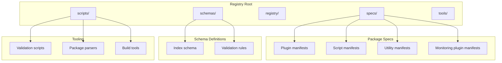
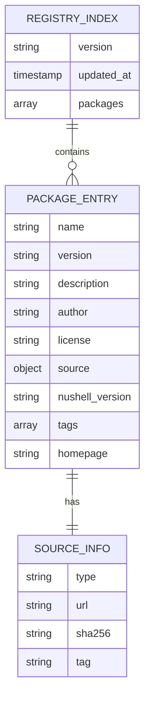

# Package Development Guide

<cite>
**Referenced Files in This Document**
- [README.md](file://README.md)
- [index-v1.json](file://schemas/index-v1.json)
- [index.json](file://registry/index.json)
- [FMotalleb-nu_plugin_desktop_notifications-0.114.1.json](file://specs/FMotalleb-nu_plugin_desktop_notifications-0.114.1.json)
- [SuaveIV-nu_script_wttr-0.1.0-main.json](file://specs/SuaveIV-nu_script_wttr-0.1.0-main.json)
- [Trivernis-nu-plugin-dialog-0.1.0.json](file://specs/Trivernis-nu-plugin-dialog-0.1.0.json)
- [amtoine-nu-git-manager-0.8.0.json](file://specs/amtoine-nu-git-manager-0.8.0.json)
- [nushell-prophet-numd-0.4.0.json](file://specs/nushell-prophet-numd-0.4.0.json)
- [spec-nu_plugin_prometheus.json](file://specs/spec-nu_plugin_prometheus.json)
- [validate.py](file://scripts/validate.py)
- [lint-manifest-index.py](file://scripts/lint-manifest-index.py)
- [add-package.py](file://scripts/add-package.py)
- [archive_formats.py](file://scripts/archive_formats.py)
- [nu_version_constraint.py](file://scripts/nu_version_constraint.py)
</cite>

## Update Summary
**Changes Made**
- Added comprehensive documentation for monitoring plugins with Prometheus integration example
- Updated supported package types section to include monitoring-specific characteristics
- Enhanced file type and archive guidelines with CI-built target examples
- Added monitoring capabilities and metrics collection patterns

## Table of Contents
1. [Introduction](#introduction)
2. [Project Structure](#project-structure)
3. [Package Manifest Format](#package-manifest-format)
4. [Supported Package Types](#supported-package-types)
5. [Registry Index Schema](#registry-index-schema)
6. [Package Organization Best Practices](#package-organization-best-practices)
7. [Versioning Strategies](#versioning-strategies)
8. [Naming Conventions](#naming-conventions)
9. [Local Testing and Validation](#local-testing-and-validation)
10. [Dependency Management](#dependency-management)
11. [File Type and Archive Guidelines](#file-type-and-archive-guidelines)
12. [Troubleshooting Guide](#troubleshooting-guide)
13. [Conclusion](#conclusion)

## Introduction

The Numan Registry ecosystem provides a comprehensive package management system for Nushell extensions, plugins, and utilities. This guide explains how to develop, structure, and publish packages that integrate seamlessly with the registry system. The registry supports various package types including plugins, scripts, utilities, and specialized monitoring tools, each with specific requirements and best practices.

The registry uses a manifest-based approach where each package includes a JSON manifest file that describes its metadata, dependencies, and distribution information. Packages are validated against strict schemas before being accepted into the registry.

## Project Structure

The Numan Registry follows a well-organized structure that separates concerns between package specifications, schema definitions, and tooling:



**Diagram sources**
- [index-v1.json](file://schemas/index-v1.json)
- [index.json](file://registry/index.json)

**Section sources**
- [README.md](file://README.md)

## Package Manifest Format

Each package in the Numan Registry requires a JSON manifest file that contains essential metadata about the package. The manifest format is strictly validated against the registry's schema definitions.

### Core Manifest Fields

Every package manifest must include the following core fields:

| Field | Type | Description | Required |
|-------|------|-------------|----------|
| name | string | Unique package identifier | Yes |
| version | string | Semantic version number | Yes |
| description | string | Brief package description | Yes |
| author | string | Package author/maintainer | Yes |
| license | string | Software license identifier | Yes |
| source | object | Package source location details | Yes |
| nushell_version | string | Compatible Nushell version constraint | Yes |

### Source Configuration

The source field defines where the package content can be downloaded from:

| Field | Type | Description |
|-------|------|-------------|
| type | string | Distribution type (git, archive, etc.) |
| url | string | Download URL or repository path |
| sha256 | string | SHA256 checksum for verification |
| tag | string | Git tag or archive filename |

### Example Manifest Structure

Package manifests follow a consistent naming convention: `{author}-{package_name}-{version}.json`. Examples include:

- Plugin packages: `FMotalleb-nu_plugin_desktop_notifications-0.114.1.json`
- Script packages: `SuaveIV-nu_script_wttr-0.1.0-main.json`
- Utility packages: `amtoine-nu-git-manager-0.8.0.json`
- Monitoring plugins: `spec-nu_plugin_prometheus.json`

**Updated** Added monitoring plugin example showing CI-built targets and Prometheus integration capabilities.

**Section sources**
- [FMotalleb-nu_plugin_desktop_notifications-0.114.1.json](file://specs/FMotalleb-nu_plugin_desktop_notifications-0.114.1.json)
- [SuaveIV-nu_script_wttr-0.1.0-main.json](file://specs/SuaveIV-nu_script_wttr-0.1.0-main.json)
- [amtoine-nu-git-manager-0.8.0.json](file://specs/amtoine-nu-git-manager-0.8.0.json)
- [spec-nu_plugin_prometheus.json](file://specs/spec-nu_plugin_prometheus.json)

## Supported Package Types

The Numan Registry supports multiple package types, each serving different use cases within the Nushell ecosystem.

### Plugin Packages

Plugin packages extend Nushell's functionality by adding new commands, data types, or system integrations. These are typically compiled binaries or Rust crates that integrate directly with the Nushell runtime.

**Characteristics:**
- Compiled binaries or native code
- Direct integration with Nushell API
- Performance-critical operations
- System-level access capabilities

**Example:** Desktop notifications plugin that integrates with system notification services.

### Script Packages

Script packages contain shell scripts, configuration files, or automation workflows that enhance the Nushell user experience. These are interpreted and don't require compilation.

**Characteristics:**
- Interpreted language files (Nushell, Bash, Python)
- Configuration and setup scripts
- Automation and workflow tools
- User-facing utilities

**Example:** Weather script that fetches and displays weather information.

### Utility Packages

Utility packages provide helper functions, libraries, or shared resources that can be used by other packages or users. These often serve as building blocks for more complex solutions.

**Characteristics:**
- Shared libraries and modules
- Helper functions and utilities
- Configuration templates
- Commonly used resources

**Example:** Git manager utilities for version control operations.

### Monitoring Plugins

Monitoring plugins provide specialized functionality for system observability, metrics collection, and performance monitoring. These plugins integrate with monitoring systems like Prometheus and provide real-time insights into system performance.

**Characteristics:**
- Metrics collection and export capabilities
- Integration with monitoring backends (Prometheus, Grafana, etc.)
- Real-time data streaming
- Performance optimization features
- CI-built multi-platform targets
- Health check endpoints

**Example:** Prometheus plugin that exposes Nushell metrics and system performance data through standard monitoring interfaces.

**Updated** Added monitoring plugins as a distinct package category with specific characteristics for observability and metrics collection.

**Section sources**
- [Trivernis-nu-plugin-dialog-0.1.0.json](file://specs/Trivernis-nu-plugin-dialog-0.1.0.json)
- [nushell-prophet-numd-0.4.0.json](file://specs/nushell-prophet-numd-0.4.0.json)
- [spec-nu_plugin_prometheus.json](file://specs/spec-nu_plugin_prometheus.json)

## Registry Index Schema

The registry index serves as the central catalog of all available packages. It maintains a structured overview of packages with their metadata and distribution information.

### Index Structure

The registry index follows a strict JSON schema that ensures consistency across all package entries:



**Diagram sources**
- [index-v1.json](file://schemas/index-v1.json)
- [index.json](file://registry/index.json)

### Schema Validation

All package manifests must conform to the registry's schema definitions. The schema enforces:

- Required field presence and types
- Version format compliance (semantic versioning)
- URL format validation
- Checksum verification support
- License identifier standards

**Section sources**
- [index-v1.json](file://schemas/index-v1.json)
- [index.json](file://registry/index.json)

## Package Organization Best Practices

Proper package organization ensures maintainability, discoverability, and ease of use for package consumers.

### Directory Structure

Recommended package directory structure:

```
package-name/
├── README.md           # Package documentation
├── LICENSE             # License file
├── src/                # Source code
│   ├── main.nu         # Main entry point
│   └── utils/          # Utility modules
├── tests/              # Test suite
├── examples/           # Usage examples
├── .github/            # CI/CD configuration
│   └── workflows/      # Build and deployment pipelines
├── artifacts/          # Built binaries and archives
└── package.json        # Package manifest
```

### Documentation Standards

Every package should include comprehensive documentation:

- **README.md**: Installation instructions, usage examples, and configuration options
- **Inline comments**: Clear explanations of complex logic
- **API documentation**: Function signatures and parameter descriptions
- **Examples**: Practical usage scenarios
- **Monitoring documentation**: For monitoring plugins, include metrics documentation and dashboard examples

### Code Quality Guidelines

- Follow consistent coding standards
- Include comprehensive error handling
- Provide meaningful error messages
- Use descriptive variable and function names
- Implement proper logging
- For monitoring plugins: implement proper metrics collection and health checks

**Updated** Added CI/CD configuration and artifacts directories for monitoring plugins with built targets.

**Section sources**
- [FMotalleb-nu_plugin_desktop_notifications-0.114.1.json](file://specs/FMotalleb-nu_plugin_desktop_notifications-0.114.1.json)

## Versioning Strategies

The Numan Registry follows semantic versioning (SemVer) principles to ensure compatibility and predictable updates.

### Semantic Versioning

Package versions follow the pattern `MAJOR.MINOR.PATCH`:

- **MAJOR**: Incompatible API changes
- **MINOR**: Backward-compatible functionality additions
- **PATCH**: Backward-compatible bug fixes

### Version Constraints

Packages can specify compatible Nushell versions using constraint expressions:

| Constraint | Description | Example |
|------------|-------------|---------|
| Exact match | Specific version only | `=0.85.0` |
| Range | Version range | `>=0.80.0 <0.90.0` |
| Caret | Compatible versions | `^0.85.0` |
| Tilde | Patch updates | `~0.85.0` |

### Version Management Best Practices

- Start with `0.1.0` for initial releases
- Increment MAJOR version for breaking changes
- Use MINOR for new features
- Apply PATCH for bug fixes
- Maintain backward compatibility when possible
- For monitoring plugins: coordinate version updates with dependency changes

**Section sources**
- [nu_version_constraint.py](file://scripts/nu_version_constraint.py)

## Naming Conventions

Consistent naming conventions improve package discoverability and reduce confusion for users.

### Package Name Format

Package names follow the pattern: `{author}-{type}_{name}`

| Component | Format | Example |
|-----------|--------|---------|
| Author | Lowercase alphanumeric | `fmotalleb` |
| Type | Descriptive category | `plugin`, `script`, `utility`, `monitoring` |
| Name | Descriptive lowercase | `desktop-notifications`, `prometheus` |

### File Naming Standards

- **Manifest files**: `{author}-{package}-{version}.json`
- **Source files**: Snake case with descriptive names
- **Configuration files**: `.yaml` or `.toml` formats
- **Documentation**: Markdown with clear headings
- **CI configurations**: Standard GitHub Actions naming conventions

### Repository Organization

- Use descriptive repository names
- Include relevant keywords in descriptions
- Organize code logically with clear module boundaries
- Maintain separate branches for development and releases
- For monitoring plugins: include platform-specific build configurations

**Updated** Added monitoring as a valid package type and emphasized CI configuration standards.

**Section sources**
- [SuaveIV-nu_script_wttr-0.1.0-main.json](file://specs/SuaveIV-nu_script_wttr-0.1.0-main.json)

## Local Testing and Validation

Before submitting packages to the registry, authors should thoroughly test and validate their packages using the provided tools.

### Validation Tools

The registry provides several validation scripts to ensure package compliance:

#### Manifest Validation

Use the manifest linter to check package manifests:

```bash
python scripts/lint-manifest-index.py specs/*.json
```

#### Archive Format Validation

Validate archive formats and checksums:

```bash
python scripts/archive_formats.py --check package-archive.zip
```

#### Version Constraint Validation

Check Nushell version compatibility:

```bash
python scripts/nu_version_constraint.py --constraint "^0.85.0" --version 0.85.1
```

### Testing Workflow

1. **Syntax Validation**: Ensure manifest syntax is correct
2. **Schema Compliance**: Verify against registry schema
3. **Checksum Verification**: Validate download integrity
4. **Compatibility Testing**: Test with target Nushell versions
5. **Functional Testing**: Verify package functionality
6. **For monitoring plugins**: Test metrics collection and endpoint accessibility

### Debugging Tips

- Enable verbose logging during validation
- Check network connectivity for remote resources
- Verify file permissions and paths
- Review error messages for specific issues
- For monitoring plugins: verify port availability and firewall settings

**Updated** Added testing considerations for monitoring plugins including endpoint accessibility and port availability.

**Section sources**
- [validate.py](file://scripts/validate.py)
- [lint-manifest-index.py](file://scripts/lint-manifest-index.py)
- [archive_formats.py](file://scripts/archive_formats.py)
- [nu_version_constraint.py](file://scripts/nu_version_constraint.py)

## Dependency Management

Effective dependency management ensures package stability and compatibility across different environments.

### External Dependencies

Packages may depend on external systems and services:

- **System Libraries**: OS-specific libraries and tools
- **Network Services**: Remote APIs and web services
- **Third-party Tools**: Command-line utilities and programs
- **Language Runtimes**: Python, Node.js, or other interpreters
- **Monitoring Systems**: Prometheus, Grafana, or other observability tools

### Dependency Declaration

Dependencies should be clearly documented in package manifests:

| Dependency Type | Declaration Method | Example |
|-----------------|-------------------|---------|
| System packages | Package manager commands | `apt install curl` |
| Language packages | Import statements | `use std::fs` |
| Network services | Configuration settings | `api_url: https://api.example.com` |
| Tool requirements | Environment variables | `NU_VERSION >= 0.85.0` |
| Monitoring systems | Port and protocol specifications | `prometheus_port: 9090` |

### Compatibility Considerations

- Specify minimum required versions for dependencies
- Handle missing dependencies gracefully
- Provide fallback implementations when possible
- Document platform-specific requirements
- For monitoring plugins: document port conflicts and service discovery requirements

### Security Considerations

- Verify dependency sources and checksums
- Regularly update dependencies for security patches
- Audit dependencies for known vulnerabilities
- Minimize attack surface by limiting dependencies
- For monitoring plugins: secure metrics endpoints and implement authentication

**Updated** Added monitoring system dependencies and security considerations for metrics endpoints.

**Section sources**
- [amtoine-nu-git-manager-0.8.0.json](file://specs/amtoine-nu-git-manager-0.8.0.json)

## File Type and Archive Guidelines

Different package types have specific requirements for file organization and archive formats.

### Supported Archive Formats

The registry accepts multiple archive formats for package distribution:

| Format | Extension | Compression | Use Case |
|--------|-----------|-------------|----------|
| ZIP | `.zip` | Deflate | General purpose archives |
| TAR.GZ | `.tar.gz` | Gzip | Unix-style archives |
| TAR.BZ2 | `.tar.bz2` | Bzip2 | High compression ratio |
| TAR.XX | `.tar.xz` | XZ | Maximum compression |

### File Organization Guidelines

#### Plugin Archives

- Include compiled binaries for supported platforms
- Provide platform-specific builds when necessary
- Include installation scripts for automated setup
- Document system requirements and dependencies

#### Script Archives

- Organize scripts in logical directories
- Include shebang lines for executable scripts
- Provide both source and pre-built versions when applicable
- Include configuration templates and examples

#### Utility Archives

- Structure code for easy import and reuse
- Include comprehensive documentation
- Provide both library and command-line interfaces
- Include unit tests and integration tests

#### Monitoring Plugin Archives

- Include CI-built targets for multiple platforms
- Provide metrics endpoint configuration
- Include health check implementations
- Document port requirements and firewall settings
- Provide sample dashboards and alerting rules

**Updated** Added monitoring plugin archive guidelines with CI-built targets and metrics endpoint configuration.

### Archive Integrity

All archives must include integrity verification:

- **SHA256 Checksums**: Verify archive integrity
- **Digital Signatures**: Optional signature verification
- **Metadata Files**: Include package information
- **Version Information**: Embed version in archive
- **For monitoring plugins**: Include platform-specific build artifacts and checksums

**Section sources**
- [archive_formats.py](file://scripts/archive_formats.py)

## Troubleshooting Guide

Common issues and their solutions when developing packages for the Numan Registry.

### Manifest Validation Errors

**Issue**: Manifest fails schema validation
**Solution**: 
- Verify all required fields are present
- Check field types match schema definitions
- Ensure proper JSON syntax and formatting

**Issue**: Version format invalid
**Solution**:
- Use semantic versioning format (MAJOR.MINOR.PATCH)
- Remove any non-standard version prefixes
- Validate against SemVer specification

### Archive and Download Issues

**Issue**: Archive checksum mismatch
**Solution**:
- Regenerate archive and recalculate checksum
- Verify file hasn't been corrupted during transfer
- Check for line ending differences in text files

**Issue**: Download URL unreachable
**Solution**:
- Verify URL accessibility from different networks
- Check for authentication requirements
- Ensure CDN or hosting service is operational

### Compatibility Problems

**Issue**: Package incompatible with target Nushell version
**Solution**:
- Update version constraints in manifest
- Test with multiple Nushell versions
- Implement version detection and graceful degradation

**Issue**: Missing system dependencies
**Solution**:
- Document all system requirements
- Provide installation instructions
- Include dependency detection in package setup

### Monitoring Plugin Issues

**Issue**: Metrics endpoint not accessible
**Solution**:
- Verify port availability and firewall settings
- Check for conflicting services on the same port
- Ensure proper network binding configuration

**Issue**: CI-built targets failing
**Solution**:
- Verify cross-compilation toolchains
- Check platform-specific dependencies
- Validate build environment configuration

### Debugging Techniques

Enable detailed logging and debugging:

```bash
export NU_DEBUG=true
export NU_LOG_LEVEL=debug
```

Check validation output for specific error messages and use them to identify and resolve issues systematically.

**Updated** Added troubleshooting guidance for monitoring plugins including metrics endpoint and CI build issues.

**Section sources**
- [validate.py](file://scripts/validate.py)

## Conclusion

Developing packages for the Numan Registry requires careful attention to structure, validation, and compatibility. By following the guidelines outlined in this document, package authors can create high-quality, maintainable packages that integrate seamlessly with the Nushell ecosystem.

Key takeaways:

- **Follow manifest specifications** precisely to ensure registry acceptance
- **Implement comprehensive testing** before submission
- **Maintain clear documentation** for package users
- **Adopt semantic versioning** for predictable updates
- **Handle dependencies** carefully for cross-platform compatibility
- **Validate thoroughly** using provided tools before submission
- **For monitoring plugins**: ensure metrics endpoints are properly configured and accessible

The Numan Registry ecosystem provides robust tooling and validation to support package development. By leveraging these tools and following established best practices, authors can contribute valuable extensions to the Nushell community while maintaining high quality and reliability standards.

For additional support, consult the registry documentation, engage with the community through issue trackers, and review existing packages for reference implementations.

**Updated** Added emphasis on monitoring plugin development and metrics endpoint configuration.