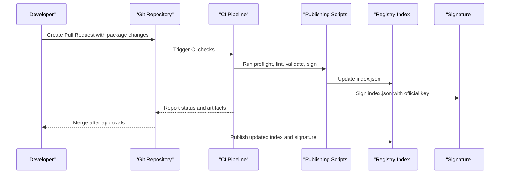
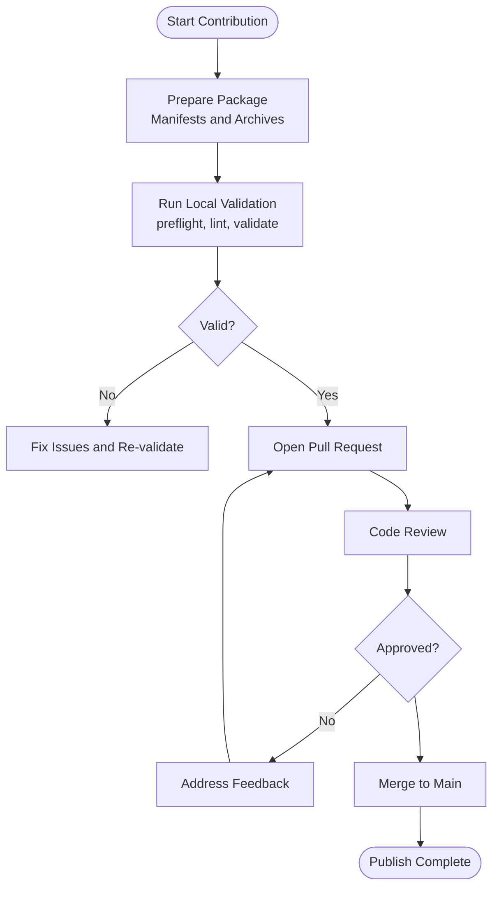
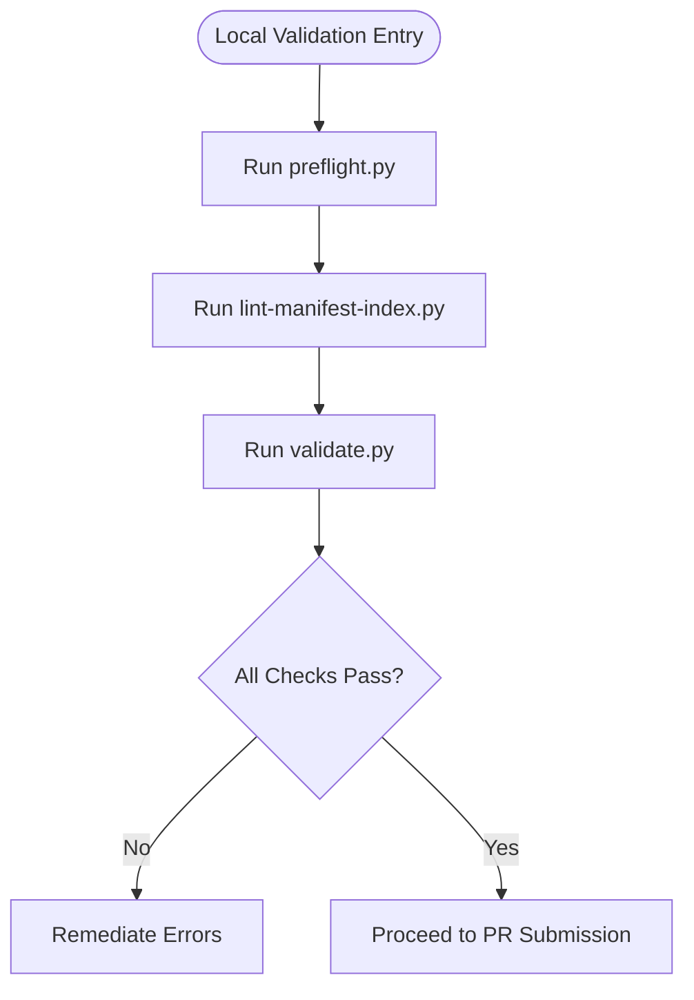
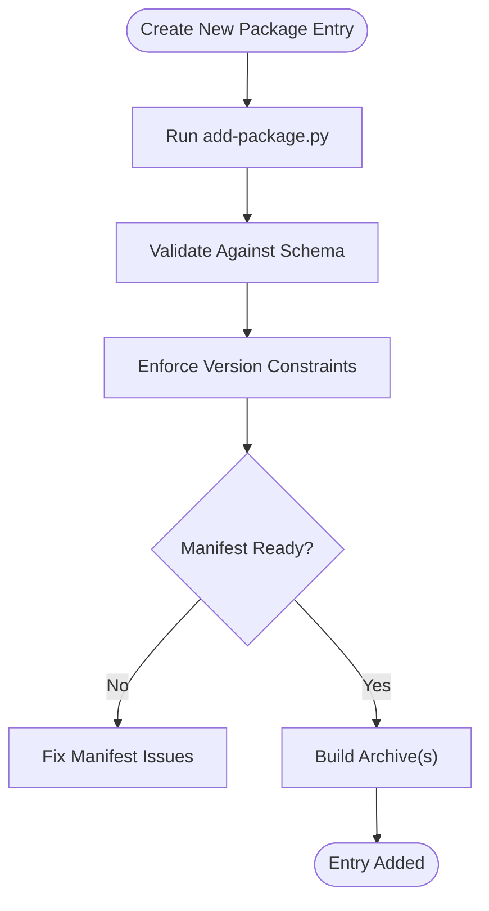
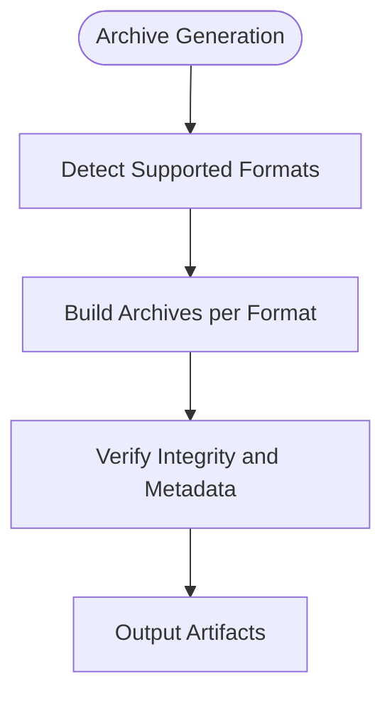
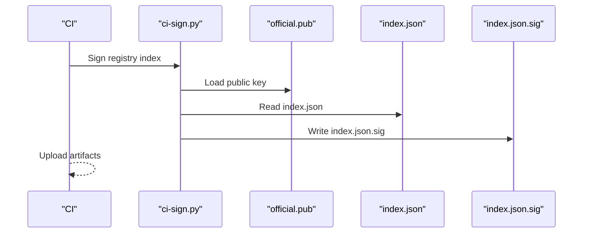
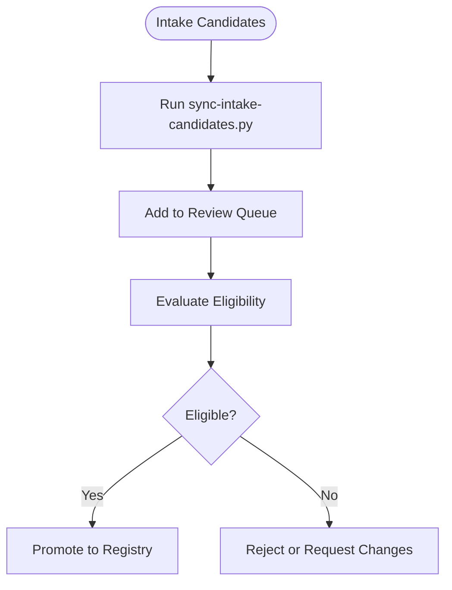
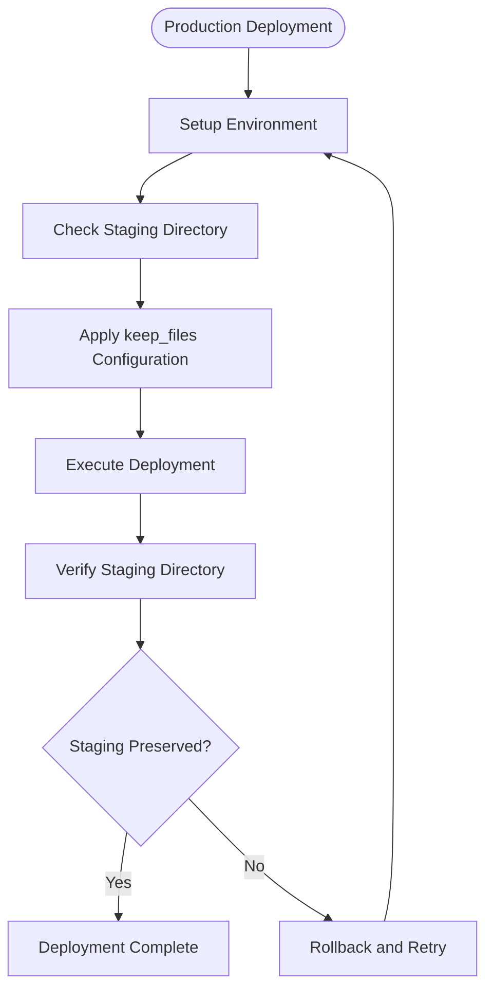
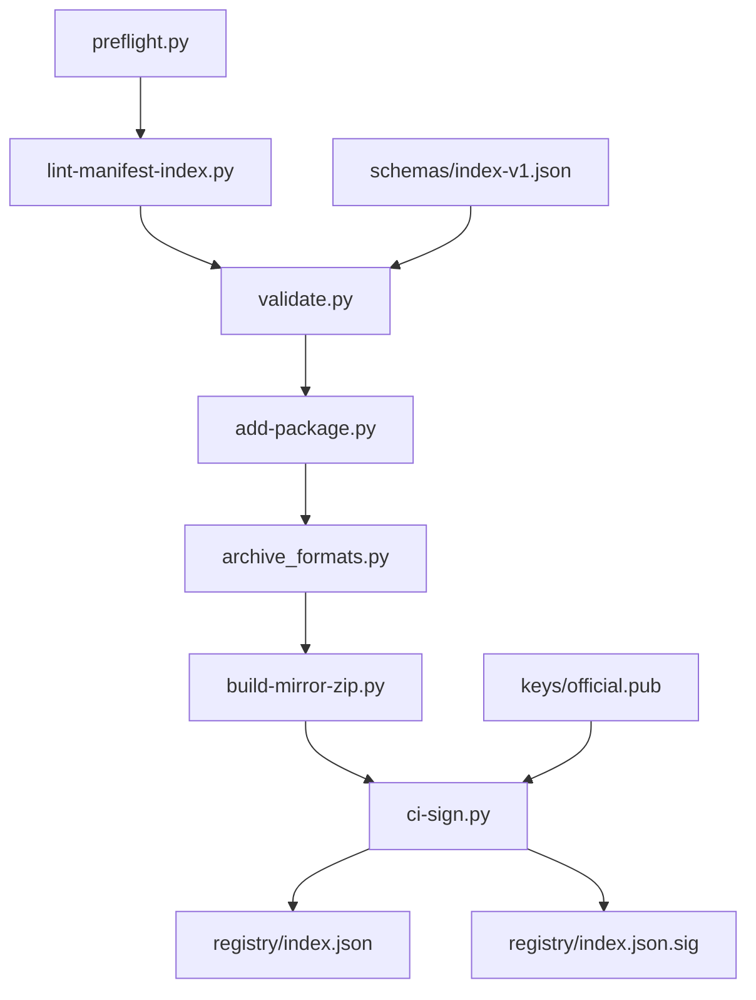

# Package Publishing Workflow

<cite>
**Referenced Files in This Document**
- [README.md](file://README.md)
- [SECURITY.md](file://SECURITY.md)
- [.github/pull_request_template.md](file://.github/pull_request_template.md)
- [scripts/add-package.py](file://scripts/add-package.py)
- [scripts/validate.py](file://scripts/validate.py)
- [scripts/lint-manifest-index.py](file://scripts/lint-manifest-index.py)
- [scripts/ci-sign.py](file://scripts/ci-sign.py)
- [scripts/preflight.py](file://scripts/preflight.py)
- [scripts/build-mirror-zip.py](file://scripts/build-mirror-zip.py)
- [scripts/archive_formats.py](file://scripts/archive_formats.py)
- [scripts/nu_version_constraint.py](file://scripts/nu_version_constraint.py)
- [scripts/sync-intake-candidates.py](file://scripts/sync-intake-candidates.py)
- [registry/index.json](file://registry/index.json)
- [registry/index.json.sig](file://registry/index.json.sig)
- [schemas/index-v1.json](file://schemas/index-v1.json)
- [keys/official.pub](file://keys/official.pub)
</cite>

## Update Summary
**Changes Made**
- Updated Production Deployment section to reflect staging directory preservation fix
- Enhanced CI/CD workflow documentation with proper staging directory handling
- Added troubleshooting guidance for staging directory issues during production deployments

## Table of Contents
1. [Introduction](#introduction)
2. [Project Structure](#project-structure)
3. [Core Components](#core-components)
4. [Architecture Overview](#architecture-overview)
5. [Detailed Component Analysis](#detailed-component-analysis)
6. [Dependency Analysis](#dependency-analysis)
7. [Performance Considerations](#performance-considerations)
8. [Troubleshooting Guide](#troubleshooting-guide)
9. [Conclusion](#conclusion)
10. [Appendices](#appendices)

## Introduction
This document describes the end-to-end package publishing workflow for the repository, from local preparation and validation to manifest creation, archive generation, signing, and registry publication. It also covers contribution via pull requests, code review requirements, approval workflows, versioning strategies, backward compatibility, deprecation policies, release management, troubleshooting common issues, rollback procedures, and best practices for quality and community standards.

## Project Structure
The repository organizes publishing tooling under scripts/, registry metadata under registry/, schema definitions under schemas/, keys under keys/, and documentation under docs/. GitHub automation templates are under .github/. The registry index and its signature represent the authoritative source of truth for published packages.

```mermaid
graph TB
subgraph "Contributor"
PR["Pull Request"]
Local["Local Validation<br/>and Build"]
end
subgraph "Repository"
Scripts["Publishing Scripts<br/>add-package.py, validate.py,<br/>lint-manifest-index.py, ci-sign.py,<br/>preflight.py, build-mirror-zip.py,<br/>archive_formats.py, nu_version_constraint.py"]
Registry["Registry Index<br/>index.json + index.json.sig"]
Schema["Schema Definitions<br/>index-v1.json"]
Keys["Signing Key<br/>official.pub"]
end
subgraph "CI"
CI["Automated Checks<br/>Lint, Validate, Sign, Mirror"]
end
PR --> Local
Local --> Scripts
Scripts --> Registry
Scripts --> Schema
Scripts --> Keys
Scripts --> CI
CI --> Registry
```

**Diagram sources**
- [scripts/add-package.py](file://scripts/add-package.py)
- [scripts/validate.py](file://scripts/validate.py)
- [scripts/lint-manifest-index.py](file://scripts/lint-manifest-index.py)
- [scripts/ci-sign.py](file://scripts/ci-sign.py)
- [scripts/preflight.py](file://scripts/preflight.py)
- [scripts/build-mirror-zip.py](file://scripts/build-mirror-zip.py)
- [scripts/archive_formats.py](file://scripts/archive_formats.py)
- [scripts/nu_version_constraint.py](file://scripts/nu_version_constraint.py)
- [registry/index.json](file://registry/index.json)
- [registry/index.json.sig](file://registry/index.json.sig)
- [schemas/index-v1.json](file://schemas/index-v1.json)
- [keys/official.pub](file://keys/official.pub)

**Section sources**
- [README.md](file://README.md)
- [SECURITY.md](file://SECURITY.md)

## Core Components
- add-package.py: Orchestrates adding a new package entry into the registry index, including validation and optional signing.
- validate.py: Validates manifests and archives against schema and policy constraints.
- lint-manifest-index.py: Lints the registry index for structural correctness and consistency.
- ci-sign.py: Signs the registry index or artifacts using the official key material.
- preflight.py: Runs pre-publish checks (e.g., environment, permissions, prerequisites).
- build-mirror-zip.py: Builds mirror archives for distribution.
- archive_formats.py: Defines supported archive formats and their properties.
- nu_version_constraint.py: Enforces Nushell version constraints for compatibility.
- sync-intake-candidates.py: Synchronizes intake candidates for review and inclusion.
- registry/index.json: Canonical registry index describing available packages and versions.
- registry/index.json.sig: Signature over the registry index ensuring integrity and authenticity.
- schemas/index-v1.json: JSON schema defining the structure of the registry index.
- keys/official.pub: Public key used to verify signatures.

**Section sources**
- [scripts/add-package.py](file://scripts/add-package.py)
- [scripts/validate.py](file://scripts/validate.py)
- [scripts/lint-manifest-index.py](file://scripts/lint-manifest-index.py)
- [scripts/ci-sign.py](file://scripts/ci-sign.py)
- [scripts/preflight.py](file://scripts/preflight.py)
- [scripts/build-mirror-zip.py](file://scripts/build-mirror-zip.py)
- [scripts/archive_formats.py](file://scripts/archive_formats.py)
- [scripts/nu_version_constraint.py](file://scripts/nu_version_constraint.py)
- [scripts/sync-intake-candidates.py](file://scripts/sync-intake-candidates.py)
- [registry/index.json](file://registry/index.json)
- [registry/index.json.sig](file://registry/index.json.sig)
- [schemas/index-v1.json](file://schemas/index-v1.json)
- [keys/official.pub](file://keys/official.pub)

## Architecture Overview
The publishing pipeline integrates local contributor actions with automated CI checks and registry updates. Contributors prepare and validate packages locally, submit a pull request, and rely on CI to run linters, validators, and signers. Upon approval, changes are merged and the registry is updated and signed.



**Diagram sources**
- [scripts/preflight.py](file://scripts/preflight.py)
- [scripts/lint-manifest-index.py](file://scripts/lint-manifest-index.py)
- [scripts/validate.py](file://scripts/validate.py)
- [scripts/ci-sign.py](file://scripts/ci-sign.py)
- [registry/index.json](file://registry/index.json)
- [registry/index.json.sig](file://registry/index.json.sig)
- [keys/official.pub](file://keys/official.pub)

## Detailed Component Analysis

### Contribution and Pull Request Workflow
- Open a pull request with package additions or updates.
- Ensure local validation passes before submitting.
- Reviewers check compliance with schema, versioning, and security policies.
- Approvals required per repository guidelines; merge triggers final CI verification.



**Section sources**
- [.github/pull_request_template.md](file://.github/pull_request_template.md)

### Local Validation and Preflight
- Use preflight to ensure environment readiness and prerequisites.
- Lint the registry index to catch structural issues early.
- Validate manifests and archives against the schema and policy rules.



**Section sources**
- [scripts/preflight.py](file://scripts/preflight.py)
- [scripts/lint-manifest-index.py](file://scripts/lint-manifest-index.py)
- [scripts/validate.py](file://scripts/validate.py)

### Manifest Creation and Versioning
- Add package entries using add-package.py, which enforces schema compliance and version constraints.
- Use nu_version_constraint.py to ensure compatibility with target Nushell versions.
- Maintain semantic versioning and clear changelogs for transparency.



**Section sources**
- [scripts/add-package.py](file://scripts/add-package.py)
- [scripts/nu_version_constraint.py](file://scripts/nu_version_constraint.py)
- [schemas/index-v1.json](file://schemas/index-v1.json)

### Archive Generation and Formats
- Supported archive formats are defined by archive_formats.py.
- build-mirror-zip.py creates distributable mirror archives for consumption.



**Section sources**
- [scripts/archive_formats.py](file://scripts/archive_formats.py)
- [scripts/build-mirror-zip.py](file://scripts/build-mirror-zip.py)

### Signing and Registry Publication
- ci-sign.py signs the registry index using the official public key material.
- After merging, the updated index.json and its signature index.json.sig are published.



**Diagram sources**
- [scripts/ci-sign.py](file://scripts/ci-sign.py)
- [keys/official.pub](file://keys/official.pub)
- [registry/index.json](file://registry/index.json)
- [registry/index.json.sig](file://registry/index.json.sig)

**Section sources**
- [scripts/ci-sign.py](file://scripts/ci-sign.py)
- [keys/official.pub](file://keys/official.pub)
- [registry/index.json](file://registry/index.json)
- [registry/index.json.sig](file://registry/index.json.sig)

### Intake Candidates and Sync
- sync-intake-candidates.py manages candidate packages for review and potential inclusion.



**Section sources**
- [scripts/sync-intake-candidates.py](file://scripts/sync-intake-candidates.py)

### Production Deployment and Staging Directory Management
**Updated** Enhanced production deployment workflow now properly preserves the gh-pages/staging directory during production deployments, preventing data loss during the publish process. The keep_files configuration has been corrected to false to ensure staging directory integrity.

- Production deployments now maintain staging directory persistence through improved keep_files configuration
- Staging directory content is preserved across deployment cycles to prevent accidental data loss
- Enhanced error handling ensures staging directory operations complete successfully
- Improved artifact retention policies protect critical deployment intermediaries



**Section sources**
- [.github/workflows/production.yml](file://.github/workflows/production.yml)

## Dependency Analysis
The publishing pipeline depends on scripts that interact with registry metadata, schema definitions, and signing keys. CI orchestrates these components to ensure consistent and secure publishing.



**Diagram sources**
- [scripts/preflight.py](file://scripts/preflight.py)
- [scripts/lint-manifest-index.py](file://scripts/lint-manifest-index.py)
- [scripts/validate.py](file://scripts/validate.py)
- [scripts/add-package.py](file://scripts/add-package.py)
- [scripts/archive_formats.py](file://scripts/archive_formats.py)
- [scripts/build-mirror-zip.py](file://scripts/build-mirror-zip.py)
- [scripts/ci-sign.py](file://scripts/ci-sign.py)
- [schemas/index-v1.json](file://schemas/index-v1.json)
- [keys/official.pub](file://keys/official.pub)
- [registry/index.json](file://registry/index.json)
- [registry/index.json.sig](file://registry/index.json.sig)

**Section sources**
- [scripts/preflight.py](file://scripts/preflight.py)
- [scripts/lint-manifest-index.py](file://scripts/lint-manifest-index.py)
- [scripts/validate.py](file://scripts/validate.py)
- [scripts/add-package.py](file://scripts/add-package.py)
- [scripts/archive_formats.py](file://scripts/archive_formats.py)
- [scripts/build-mirror-zip.py](file://scripts/build-mirror-zip.py)
- [scripts/ci-sign.py](file://scripts/ci-sign.py)
- [schemas/index-v1.json](file://schemas/index-v1.json)
- [keys/official.pub](file://keys/official.pub)
- [registry/index.json](file://registry/index.json)
- [registry/index.json.sig](file://registry/index.json.sig)

## Performance Considerations
- Parallelize independent validation steps where possible (linting and format checks).
- Cache intermediate artifacts to reduce rebuild times.
- Limit archive sizes and prefer compressed formats for faster distribution.
- Optimize script I/O operations when updating large registry indexes.
- Configure staging directory preservation to minimize unnecessary file operations during deployment.

## Troubleshooting Guide
Common issues and resolutions:
- Validation failures: Re-run validate.py with verbose output; check schema conformance and version constraints.
- Linting errors: Inspect registry index structure and ensure all fields match the schema.
- Signing errors: Verify key availability and permissions; ensure the correct public key is used.
- Archive build failures: Confirm supported formats and artifact paths; re-run build-mirror-zip.py with debug flags.
- Preflight failures: Check environment variables, dependencies, and permissions.
- **Staging directory issues**: If staging directory content is missing after deployment, verify keep_files configuration is set to false and check deployment logs for permission errors.

Rollback procedures:
- Revert registry index to the last known good state.
- Re-sign the reverted index to maintain integrity.
- Restore staging directory from backup if needed.
- Notify stakeholders and update documentation if necessary.

Best practices:
- Keep manifests minimal and accurate.
- Use semantic versioning consistently.
- Document breaking changes clearly.
- Perform thorough local testing before PR submission.
- Monitor staging directory integrity during production deployments.

**Section sources**
- [scripts/validate.py](file://scripts/validate.py)
- [scripts/lint-manifest-index.py](file://scripts/lint-manifest-index.py)
- [scripts/ci-sign.py](file://scripts/ci-sign.py)
- [scripts/build-mirror-zip.py](file://scripts/build-mirror-zip.py)
- [scripts/preflight.py](file://scripts/preflight.py)
- [schemas/index-v1.json](file://schemas/index-v1.json)
- [keys/official.pub](file://keys/official.pub)
- [registry/index.json](file://registry/index.json)
- [registry/index.json.sig](file://registry/index.json.sig)

## Conclusion
The package publishing workflow combines robust local validation, structured manifest creation, secure signing, and automated CI checks to ensure high-quality, trustworthy releases. By following the outlined processes, contributors can confidently publish packages while maintaining backward compatibility and adhering to community standards. The enhanced production deployment system now provides reliable staging directory preservation, ensuring deployment stability and data integrity.

## Appendices
- Security considerations: Follow SECURITY.md for vulnerability handling and key management.
- Documentation references: Consult README.md for project overview and usage instructions.

**Section sources**
- [SECURITY.md](file://SECURITY.md)
- [README.md](file://README.md)