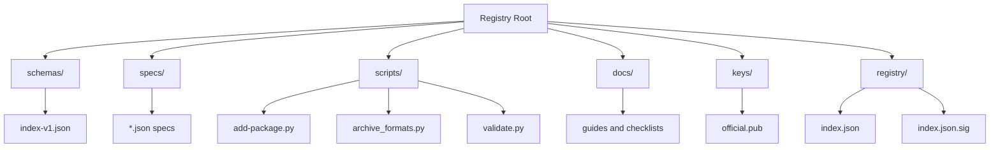
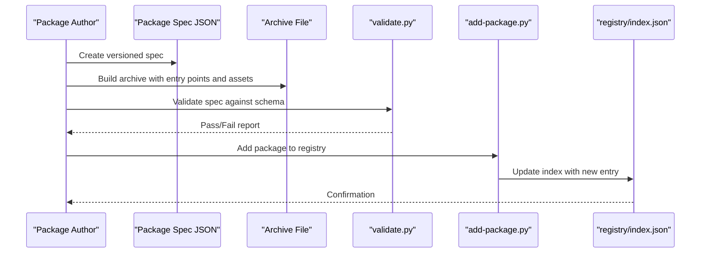
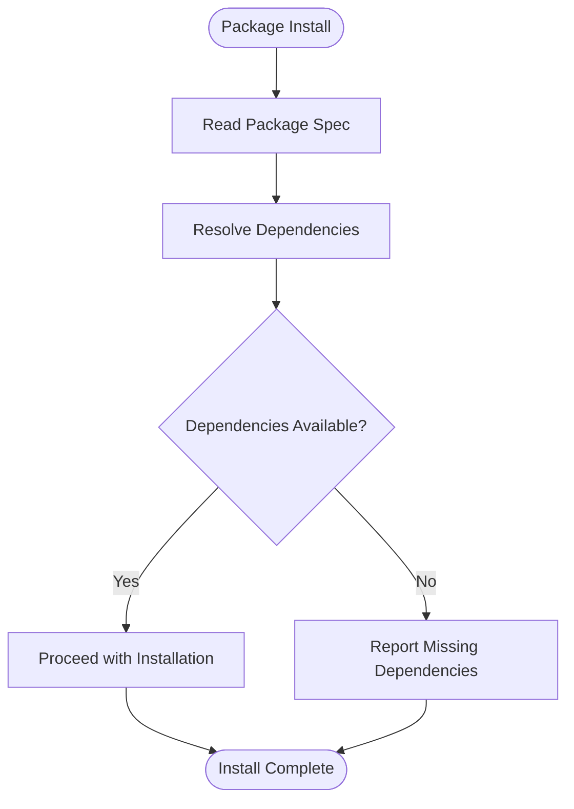

# Package Structure and Organization

<cite>
**Referenced Files in This Document**
- [README.md](file://README.md)
- [index-v1.json](file://schemas/index-v1.json)
- [FMotalleb-nu_plugin_desktop_notifications-0.114.1.json](file://specs/FMotalleb-nu_plugin_desktop_notifications-0.114.1.json)
- [SuaveIV-nu_script_wttr-0.1.0-main.json](file://specs/SuaveIV-nu_script_wttr-0.1.0-main.json)
- [Trivernis-nu-plugin-dialog-0.1.0.json](file://specs/Trivernis-nu-plugin-dialog-0.1.0.json)
- [amtoine-nu-git-manager-0.8.0.json](file://specs/amtoine-nu-git-manager-0.8.0.json)
- [nushell-prophet-dotnu-0.0.18.json](file://specs/nushell-prophet-dotnu-0.0.18.json)
- [add-package.py](file://scripts/add-package.py)
- [archive_formats.py](file://scripts/archive_formats.py)
- [validate.py](file://scripts/validate.py)
</cite>

## Table of Contents
1. [Introduction](#introduction)
2. [Project Structure](#project-structure)
3. [Core Components](#core-components)
4. [Architecture Overview](#architecture-overview)
5. [Detailed Component Analysis](#detailed-component-analysis)
6. [Dependency Analysis](#dependency-analysis)
7. [Performance Considerations](#performance-considerations)
8. [Troubleshooting Guide](#troubleshooting-guide)
9. [Conclusion](#conclusion)

## Introduction
This document explains how packages are structured and organized within the Numan Registry ecosystem. It covers directory layout, file naming conventions, organizational patterns for different package types (plugins, scripts, utilities), archive composition, entry points, dependencies, metadata, documentation placement, tests, and best practices to keep packages clean and maintainable. Guidance is grounded in the repository’s schema definitions and concrete package specs.

## Project Structure
The registry defines a clear separation between:
- Schema definitions that describe the package index format
- Concrete package specifications used by tools and CI
- Scripts that validate, add, and process archives
- Documentation and operational guides

**Diagram sources**
- [index-v1.json](file://schemas/index-v1.json)
- [add-package.py](file://scripts/add-package.py)
- [archive_formats.py](file://scripts/archive_formats.py)
- [validate.py](file://scripts/validate.py)

**Section sources**
- [README.md](file://README.md)

## Core Components
- Schema definition: The package index schema defines the structure and fields required for each package version entry.
- Package specs: Each JSON file under specs represents a single package version with metadata, archive details, and distribution information.
- Validation and tooling: Scripts enforce schema compliance, compute checksums, and manage archive formats.

Key responsibilities:
- Schema enforces consistent metadata across all packages
- Specs serve as the canonical source of truth for each published version
- Tooling ensures integrity and correctness during publishing and verification

**Section sources**
- [index-v1.json](file://schemas/index-v1.json)
- [FMotalleb-nu_plugin_desktop_notifications-0.114.1.json](file://specs/FMotalleb-nu_plugin_desktop_notifications-0.114.1.json)
- [SuaveIV-nu_script_wttr-0.1.0-main.json](file://specs/SuaveIV-nu_script_wttr-0.1.0-main.json)
- [Trivernis-nu-plugin-dialog-0.1.0.json](file://specs/Trivernis-nu-plugin-dialog-0.1.0.json)
- [amtoine-nu-git-manager-0.8.0.json](file://specs/amtoine-nu-git-manager-0.8.0.json)
- [nushell-prophet-dotnu-0.0.18.json](file://specs/nushell-prophet-dotnu-0.0.18.json)
- [validate.py](file://scripts/validate.py)

## Architecture Overview
At a high level, the package lifecycle involves:
- Authoring a package spec following the schema
- Packaging artifacts into an archive with a defined internal layout
- Validating the spec and archive using provided scripts
- Publishing the spec and archive to the registry

**Diagram sources**
- [validate.py](file://scripts/validate.py)
- [add-package.py](file://scripts/add-package.py)
- [index-v1.json](file://schemas/index-v1.json)

## Detailed Component Analysis

### Package Types and Naming Conventions
- Plugins: Typically named with “plugin” or “nu_plugin” segments; include binary or compiled components and may provide Nushell plugin manifests.
- Scripts: Named with “script” segments; contain executable scripts or shell/Nushell files intended for direct execution.
- Utilities: General-purpose packages that bundle helper tools, completions, or small utilities.

Naming examples from specs:
- Plugin example: desktop notifications plugin
- Script example: weather script
- Utility example: dialog plugin or custom completions

Guidelines:
- Use descriptive names that indicate type and purpose
- Keep version numbers separate from the name
- Avoid special characters; use hyphens for readability

**Section sources**
- [FMotalleb-nu_plugin_desktop_notifications-0.114.1.json](file://specs/FMotalleb-nu_plugin_desktop_notifications-0.114.1.json)
- [SuaveIV-nu_script_wttr-0.1.0-main.json](file://specs/SuaveIV-nu_script_wttr-0.1.0-main.json)
- [Trivernis-nu-plugin-dialog-0.1.0.json](file://specs/Trivernis-nu-plugin-dialog-0.1.0.json)

### Archive Composition and Entry Points
Archives should be self-contained and include:
- Entry point(s): Executable binaries or scripts that users invoke
- Assets: Data files, configuration templates, or resources referenced by entry points
- Metadata: Optional README or LICENSE inside the archive for clarity
- Dependencies: External dependencies must be declared in the spec; do not bundle third-party binaries unless necessary

Entry point patterns:
- Binary plugins: Provide a single executable compatible with the target platform
- Script-based packages: Include a main script file with appropriate shebangs and permissions
- Utility bundles: Organize multiple helpers under a top-level directory with a documented CLI interface

Best practices:
- Keep the archive flat when possible to simplify installation
- Use consistent paths for entry points across platforms where feasible
- Document expected runtime environment and prerequisites in the spec

**Section sources**
- [archive_formats.py](file://scripts/archive_formats.py)
- [SuaveIV-nu_script_wttr-0.1.0-main.json](file://specs/SuaveIV-nu_script_wttr-0.1.0-main.json)

### Metadata and Schema Compliance
Each package spec must conform to the index schema:
- Required fields include version, name, description, archive URL, checksums, and supported platforms
- Optional fields can include documentation links, license, and maintainer info
- Versioning follows semantic versioning principles

Compliance checklist:
- All required fields present and correctly typed
- Checksums match the actual archive content
- URLs are stable and accessible
- Platform constraints accurately reflect compatibility

**Section sources**
- [index-v1.json](file://schemas/index-v1.json)
- [validate.py](file://scripts/validate.py)

### Binary vs Script-Based Packages
Binary packages:
- Contain precompiled executables
- Require platform-specific builds and checksums
- Should include minimal runtime dependencies

Script-based packages:
- Contain interpreted scripts (e.g., Nushell, Bash)
- Rely on external interpreters available at runtime
- Must declare interpreter requirements in the spec

Decision guidance:
- Prefer scripts for portability and ease of maintenance
- Use binaries for performance-critical operations or native integrations

**Section sources**
- [SuaveIV-nu_script_wttr-0.1.0-main.json](file://specs/SuaveIV-nu_script_wttr-0.1.0-main.json)
- [FMotalleb-nu_plugin_desktop_notifications-0.114.1.json](file://specs/FMotalleb-nu_plugin_desktop_notifications-0.114.1.json)

### Documentation Placement
- Primary documentation lives in the registry docs folder for operational guides
- Per-package documentation should be included in the archive or linked via the spec’s documentation field
- README files inside archives help users understand usage without leaving the package context

Recommendations:
- Keep README concise and focused on installation and usage
- Link to external documentation for detailed API references
- Maintain consistency across package docs

**Section sources**
- [README.md](file://README.md)
- [nushell-prophet-dotnu-0.0.18.json](file://specs/nushell-prophet-dotnu-0.0.18.json)

### Test Organization
- Tests should be colocated with source code in the author’s repository
- For registry purposes, include test fixtures or sample inputs in the archive if needed for validation
- Avoid shipping large test suites in production archives

Guidelines:
- Separate development-time tests from distribution artifacts
- Use lightweight smoke tests for critical functionality
- Document how to run tests in the package README

[No sources needed since this section provides general guidance]

### Best Practices for Clean Structure
- Favor flat directories for simplicity
- Use consistent naming for entry points and assets
- Avoid deep nesting that complicates installation
- Keep metadata accurate and up-to-date
- Regularly validate specs and archives using provided tooling

Common pitfalls to avoid:
- Missing or incorrect checksums
- Inconsistent entry point paths
- Overly large archives with unnecessary files
- Outdated dependency declarations

[No sources needed since this section provides general guidance]

## Dependency Analysis
Packages may depend on external tools or libraries. Dependencies should be:
- Declared explicitly in the spec
- Verified at install time by the consumer
- Documented clearly for end users

**Diagram sources**
- [index-v1.json](file://schemas/index-v1.json)
- [validate.py](file://scripts/validate.py)

**Section sources**
- [index-v1.json](file://schemas/index-v1.json)
- [validate.py](file://scripts/validate.py)

## Performance Considerations
- Keep archives small to reduce download and extraction time
- Use compression formats supported by the registry tooling
- Avoid bundling redundant assets or large test suites
- Prefer incremental updates and versioned archives for efficient caching

[No sources needed since this section provides general guidance]

## Troubleshooting Guide
Common issues and resolutions:
- Schema validation failures: Ensure all required fields are present and correctly formatted
- Checksum mismatches: Rebuild the archive and regenerate checksums
- Missing entry points: Verify that the archive contains the expected executable or script
- Dependency errors: Confirm that required interpreters or libraries are installed on the target system

Useful tools:
- validate.py for schema and integrity checks
- add-package.py for adding new entries to the registry index
- archive_formats.py for understanding supported archive structures

**Section sources**
- [validate.py](file://scripts/validate.py)
- [add-package.py](file://scripts/add-package.py)
- [archive_formats.py](file://scripts/archive_formats.py)

## Conclusion
A well-structured package in the Numan Registry ecosystem follows clear conventions for naming, organization, and metadata. By adhering to the schema, maintaining accurate specs, and organizing archives thoughtfully, authors can ensure reliable distribution and easy consumption. Leveraging the provided tooling helps maintain consistency and quality across the registry.