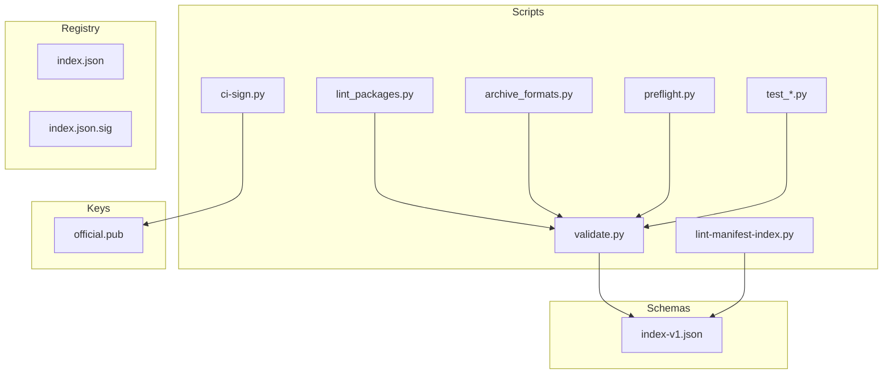
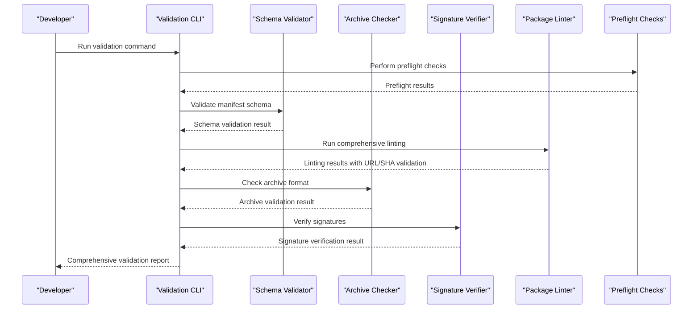
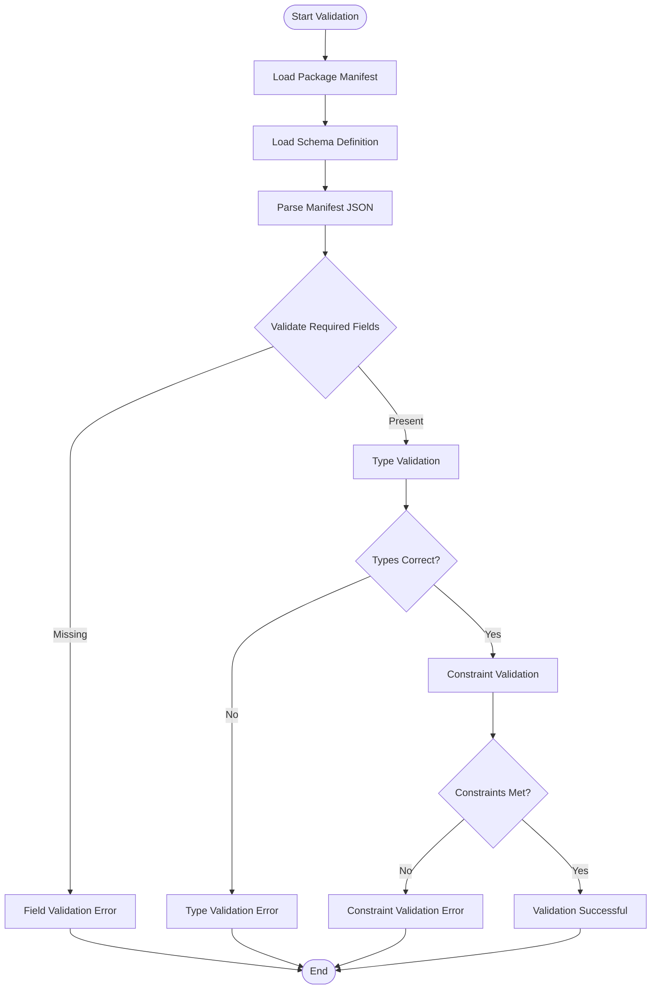
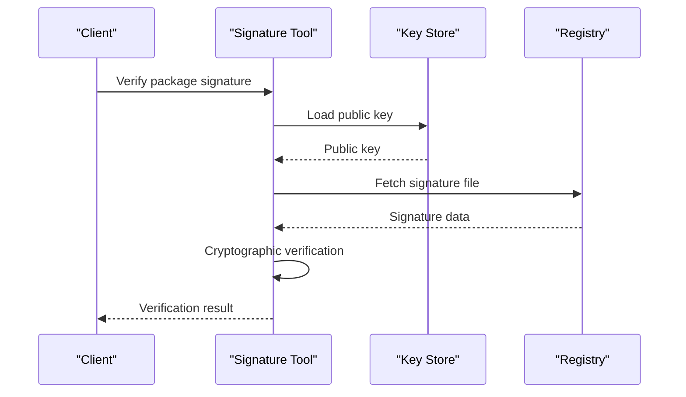
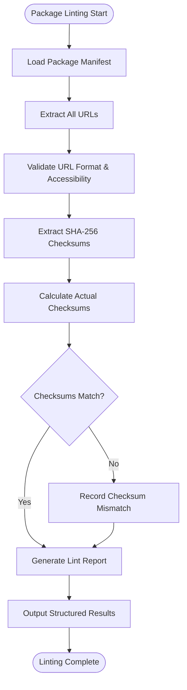
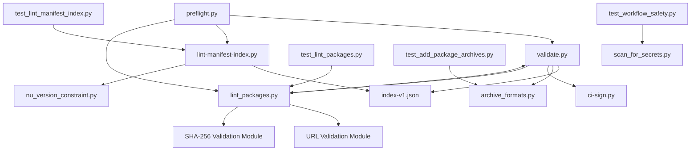

# Package Validation and Testing

<cite>
**Referenced Files in This Document**
- [validate.py](file://scripts/validate.py)
- [lint-manifest-index.py](file://scripts/lint-manifest-index.py)
- [lint_packages.py](file://scripts/lint_packages.py)
- [test_lint_packages.py](file://scripts/test_lint_packages.py)
- [archive_formats.py](file://scripts/archive_formats.py)
- [preflight.py](file://scripts/preflight.py)
- [index-v1.json](file://schemas/index-v1.json)
- [ci-sign.py](file://scripts/ci-sign.py)
- [test_add_package_archives.py](file://scripts/test_add_package_archives.py)
- [test_lint_manifest_index.py](file://scripts/test_lint_manifest_index.py)
- [test_workflow_safety.py](file://scripts/test_workflow_safety.py)
- [nu_version_constraint.py](file://scripts/nu_version_constraint.py)
- [scan_for_secrets.py](file://scripts/scan_for_secrets.py)
- [add-package.py](file://scripts/add-package.py)
- [index.json](file://registry/index.json)
- [index.json.sig](file://registry/index.json.sig)
- [official.pub](file://keys/official.pub)
</cite>

## Update Summary
**Changes Made**
- Added comprehensive package linting infrastructure with scripts/lint_packages.py for URL and SHA-256 validation
- Integrated structured error reporting system for improved debugging
- Added CI pipeline integration for automated validation
- Included new unit tests in scripts/test_lint_packages.py to ensure reliability
- Updated validation pipeline documentation to reflect new linting capabilities

## Table of Contents
1. [Introduction](#introduction)
2. [Project Structure](#project-structure)
3. [Core Components](#core-components)
4. [Architecture Overview](#architecture-overview)
5. [Detailed Component Analysis](#detailed-component-analysis)
6. [New Package Linting Infrastructure](#new-package-linting-infrastructure)
7. [Dependency Analysis](#dependency-analysis)
8. [Performance Considerations](#performance-considerations)
9. [Troubleshooting Guide](#troubleshooting-guide)
10. [Conclusion](#conclusion)
11. [Appendices](#appendices)

## Introduction

This document provides comprehensive guidance for validating and testing packages in the Nushell registry system. The validation pipeline ensures package integrity, security, and compliance through multiple layers of verification including manifest schema validation, archive format verification, signature checking, and comprehensive linting processes.

The system supports both local development workflows and CI/CD integration, providing developers with robust tools to ensure their packages meet all requirements before submission to the registry. The newly added package linting infrastructure enhances the validation process with URL and SHA-256 validation capabilities.

## Project Structure

The validation and testing infrastructure is organized into several key directories:



**Diagram sources**
- [validate.py](file://scripts/validate.py)
- [lint-manifest-index.py](file://scripts/lint-manifest-index.py)
- [lint_packages.py](file://scripts/lint_packages.py)
- [archive_formats.py](file://scripts/archive_formats.py)
- [index-v1.json](file://schemas/index-v1.json)

**Section sources**
- [README.md](file://README.md)

## Core Components

### Validation Pipeline Overview

The validation pipeline consists of several interconnected components that work together to ensure package integrity:

1. **Manifest Schema Validation**: Validates package metadata against the defined schema
2. **Archive Format Verification**: Ensures package archives are properly formatted and accessible
3. **Signature Checking**: Verifies cryptographic signatures for authenticity
4. **Comprehensive Linting Process**: Checks manifest consistency, URL validity, and SHA-256 checksums
5. **Preflight Checks**: Performs preliminary validation before full processing

### Key Validation Tools

#### Manifest Schema Validator
The schema validator ensures that package manifests conform to the required structure and data types defined in the index-v1 schema.

#### Archive Format Checker
This component validates that package archives are in supported formats and contain the expected file structure.

#### Signature Verification Tool
Cryptographic signature verification ensures package authenticity and integrity using the official public key.

#### Package Linter (New)
The comprehensive package linter performs URL validation, SHA-256 checksum verification, and structured error reporting for enhanced debugging capabilities.

**Section sources**
- [validate.py](file://scripts/validate.py)
- [lint_packages.py](file://scripts/lint_packages.py)
- [index-v1.json](file://schemas/index-v1.json)

## Architecture Overview

The validation architecture follows a layered approach with clear separation of concerns:



**Diagram sources**
- [validate.py](file://scripts/validate.py)
- [lint-manifest-index.py](file://scripts/lint-manifest-index.py)
- [lint_packages.py](file://scripts/lint_packages.py)
- [archive_formats.py](file://scripts/archive_formats.py)
- [ci-sign.py](file://scripts/ci-sign.py)

## Detailed Component Analysis

### Manifest Schema Validation

The manifest schema validation process ensures that package metadata conforms to the strict requirements defined in the index-v1 schema.

#### Schema Definition
The schema defines required fields, data types, constraints, and relationships between different components of the package manifest.

#### Validation Process


**Diagram sources**
- [index-v1.json](file://schemas/index-v1.json)
- [validate.py](file://scripts/validate.py)

### Archive Format Verification

The archive verification process ensures that package archives are properly formatted and contain all required files.

#### Supported Formats
- ZIP archives with specific directory structure
- Tar.gz archives with proper compression
- Custom Nushell package formats

#### Verification Steps
1. **Format Detection**: Automatically detect archive format
2. **Structure Validation**: Verify expected file hierarchy
3. **Content Validation**: Check for required files and permissions
4. **Size Limits**: Enforce maximum archive size constraints

### Signature Checking

Cryptographic signature verification ensures package authenticity and prevents tampering.

#### Signature Workflow


**Diagram sources**
- [ci-sign.py](file://scripts/ci-sign.py)
- [official.pub](file://keys/official.pub)
- [index.json.sig](file://registry/index.json.sig)

### Linting Process

The linting process ensures manifest consistency and registry compliance through automated checks.

#### Linting Rules
- **Field Consistency**: Ensure all required fields are present and correctly formatted
- **Version Compatibility**: Validate version numbers and dependency constraints
- **Naming Conventions**: Enforce consistent naming patterns
- **Security Checks**: Scan for potential security issues

#### Compliance Validation


**Diagram sources**
- [lint-manifest-index.py](file://scripts/lint-manifest-index.py)
- [nu_version_constraint.py](file://scripts/nu_version_constraint.py)

## New Package Linting Infrastructure

The comprehensive package linting infrastructure represents a significant enhancement to the validation system, providing advanced URL and SHA-256 validation capabilities with structured error reporting.

### Package Linter Features

#### URL Validation
The package linter automatically validates all URLs referenced in package manifests, ensuring they are properly formatted and accessible. This includes:
- Download URL validation for package archives
- Documentation URL verification
- Repository link validation

#### SHA-256 Checksum Validation
The system performs comprehensive SHA-256 checksum validation to ensure package integrity:
- Automatic checksum calculation for downloaded archives
- Comparison against declared checksums in manifests
- Integrity verification for all package assets

#### Structured Error Reporting
Enhanced error reporting provides detailed information about validation failures:
- Specific error categorization (URL errors, checksum mismatches, format issues)
- Detailed context for debugging validation problems
- Actionable suggestions for resolving common issues

### Integration with CI Pipeline

The package linter integrates seamlessly with the CI pipeline to provide automated validation:
- Pre-commit hooks for developer convenience
- Automated validation during pull request processing
- Comprehensive reporting for build status feedback

### Testing Framework

Comprehensive unit tests ensure the reliability of the linting functionality:
- Test coverage for URL validation scenarios
- Checksum validation test cases
- Error handling and edge case testing



**Diagram sources**
- [lint_packages.py](file://scripts/lint_packages.py)
- [test_lint_packages.py](file://scripts/test_lint_packages.py)

**Section sources**
- [lint_packages.py](file://scripts/lint_packages.py)
- [test_lint_packages.py](file://scripts/test_lint_packages.py)

## Dependency Analysis

The validation system has well-defined dependencies between components:



**Diagram sources**
- [validate.py](file://scripts/validate.py)
- [lint-manifest-index.py](file://scripts/lint-manifest-index.py)
- [lint_packages.py](file://scripts/lint_packages.py)
- [preflight.py](file://scripts/preflight.py)
- [test_lint_manifest_index.py](file://scripts/test_lint_manifest_index.py)
- [test_lint_packages.py](file://scripts/test_lint_packages.py)

**Section sources**
- [validate.py](file://scripts/validate.py)
- [lint-manifest-index.py](file://scripts/lint-manifest-index.py)
- [lint_packages.py](file://scripts/lint_packages.py)

## Performance Considerations

### Optimization Strategies

For large packages or complex dependency trees, consider the following optimization techniques:

1. **Parallel Processing**: Run independent validation steps concurrently
2. **Caching**: Cache schema definitions, URL responses, and frequently accessed resources
3. **Incremental Validation**: Only re-validate changed components
4. **Memory Management**: Stream large files instead of loading entirely into memory
5. **Network Optimization**: Implement connection pooling for URL validation

### Scaling Considerations

- **Batch Processing**: Process multiple packages in parallel when possible
- **Resource Limits**: Implement appropriate timeouts and resource limits
- **Progress Reporting**: Provide real-time feedback during long-running validations
- **Retry Logic**: Implement intelligent retry mechanisms for transient network failures

## Troubleshooting Guide

### Common Validation Errors

#### Schema Validation Failures
- **Missing Required Fields**: Ensure all mandatory fields are present in the manifest
- **Invalid Data Types**: Verify that field values match expected data types
- **Constraint Violations**: Check that values comply with defined constraints

#### Package Linting Issues (New)
- **Invalid URLs**: Ensure all URLs are properly formatted and accessible
- **Checksum Mismatches**: Verify that SHA-256 checksums match the actual package content
- **Network Timeouts**: Check connectivity and implement appropriate timeout settings

#### Archive Format Issues
- **Unsupported Format**: Convert to a supported archive format
- **Corrupted Archive**: Rebuild the package archive
- **Missing Files**: Verify all required files are included

#### Signature Verification Problems
- **Expired Keys**: Update the public key if it has expired
- **Mismatched Signatures**: Regenerate signatures for the package
- **Permission Issues**: Ensure proper file permissions for signature files

### Debugging Techniques

1. **Verbose Logging**: Enable detailed logging to understand validation failures
2. **Step-by-Step Validation**: Run individual validation components separately
3. **Sample Manifests**: Compare against known-good manifest examples
4. **Network Diagnostics**: Check connectivity for remote resource access
5. **Structured Error Analysis**: Use the enhanced error reporting from the package linter

**Section sources**
- [test_lint_manifest_index.py](file://scripts/test_lint_manifest_index.py)
- [test_add_package_archives.py](file://scripts/test_add_package_archives.py)
- [test_lint_packages.py](file://scripts/test_lint_packages.py)

## Conclusion

The package validation and testing system provides comprehensive coverage for ensuring package quality, security, and compatibility. The newly added package linting infrastructure significantly enhances the validation process with URL and SHA-256 validation capabilities, structured error reporting, and CI pipeline integration.

By following the established validation pipeline and utilizing the provided tools, developers can maintain high standards for their Nushell packages while streamlining the submission process. The modular architecture allows for easy extension and customization to meet evolving requirements, while the extensive testing suite ensures reliability and correctness of the validation processes.

## Appendices

### Command-Line Usage Examples

#### Basic Validation
```bash
python scripts/validate.py --package <package_path>
```

#### Manifest Linting
```bash
python scripts/lint-manifest-index.py --manifest <manifest_path>
```

#### Package Linting (New)
```bash
python scripts/lint_packages.py --package <package_path> --verbose
```

#### Archive Verification
```bash
python scripts/archive_formats.py --check <archive_path>
```

#### Signature Verification
```bash
python scripts/ci-sign.py --verify <package_path> --key keys/official.pub
```

### Testing Strategies

#### Unit Testing
- Test individual validation functions with mock data
- Verify error handling for edge cases
- Validate schema parsing and transformation logic
- Test URL validation with various input formats
- Verify SHA-256 checksum calculation accuracy

#### Integration Testing
- Test complete validation pipeline with sample packages
- Verify cross-component interactions
- Test performance with large packages
- Validate CI pipeline integration

#### Security Testing
- Validate signature verification with various key formats
- Test for common attack vectors
- Ensure secure handling of sensitive data
- Verify URL sanitization and validation