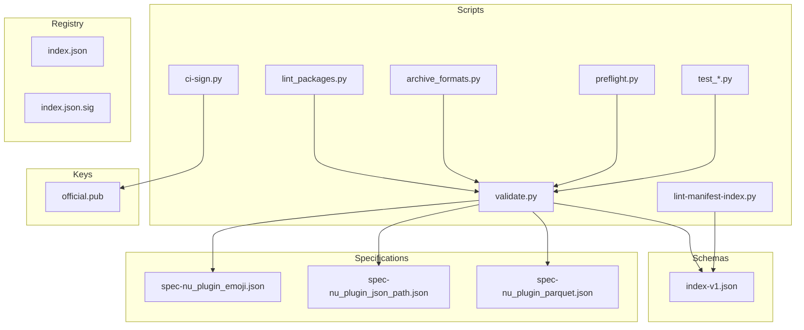
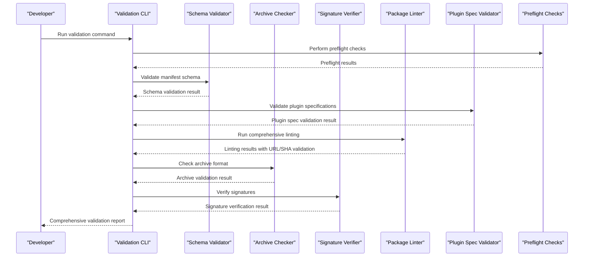
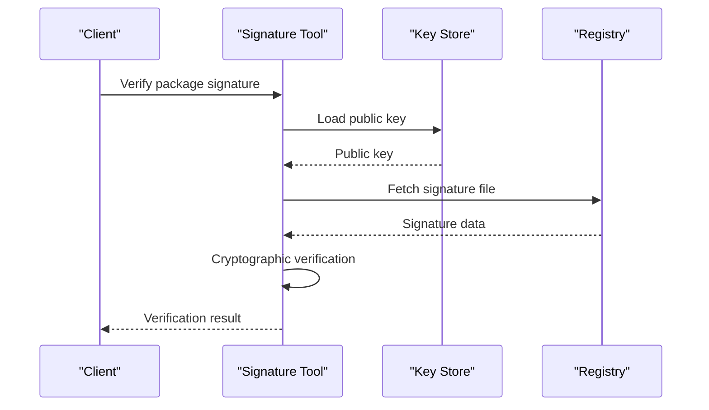
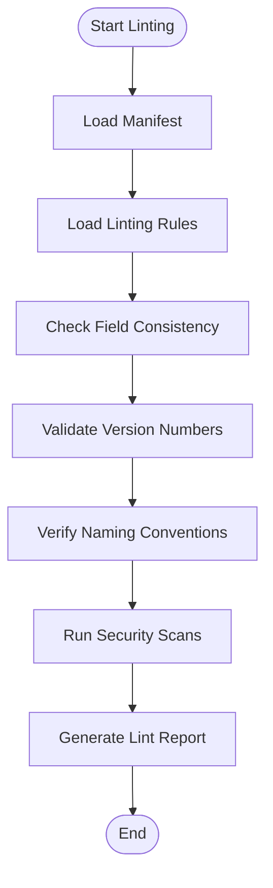
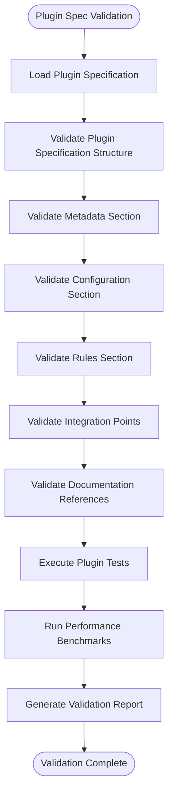
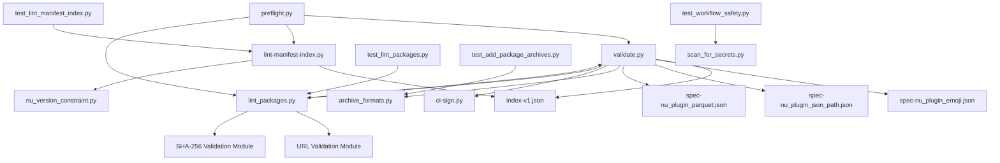

# Package Validation and Testing

<cite>
**Referenced Files in This Document**
- [validate.py](file://scripts/validate.py)
- [lint-manifest-index.py](file://scripts/lint-manifest-index.py)
- [lint_packages.py](file://scripts/lint_packages.py)
- [test_lint_packages.py](file://scripts/test_lint_packages.py)
- [archive_formats.py](file://scripts/archive_formats.py)
- [preflight.py](file://scripts/preflight.py)
- [index-v1.json](file://schemas/index-v1.json)
- [ci-sign.py](file://scripts/ci-sign.py)
- [test_add_package_archives.py](file://scripts/test_add_package_archives.py)
- [test_lint_manifest_index.py](file://scripts/test_lint_manifest_index.py)
- [test_workflow_safety.py](file://scripts/test_workflow_safety.py)
- [nu_version_constraint.py](file://scripts/nu_version_constraint.py)
- [scan_for_secrets.py](file://scripts/scan_for_secrets.py)
- [add-package.py](file://scripts/add-package.py)
- [index.json](file://registry/index.json)
- [index.json.sig](file://registry/index.json.sig)
- [official.pub](file://keys/official.pub)
- [spec-nu_plugin_emoji.json](file://specs/spec-nu_plugin_emoji.json)
- [spec-nu_plugin_json_path.json](file://specs/spec-nu_plugin_json_path.json)
- [spec-nu_plugin_parquet.json](file://specs/spec-nu_plugin_parquet.json)
</cite>

## Update Summary

**Changes Made**
- Added comprehensive documentation for new plugin specification validation processes
- Updated validation pipeline to include emoji, json_path, and parquet plugin specifications
- Integrated production-ready validation workflows for new plugin types
- Expanded troubleshooting guide with plugin-specific validation errors

## Table of Contents

1. [Introduction](#introduction)
2. [Project Structure](#project-structure)
3. [Core Components](#core-components)
4. [Architecture Overview](#architecture-overview)
5. [Detailed Component Analysis](#detailed-component-analysis)
6. [New Plugin Specification Validation](#new-plugin-specification-validation)
8. [Production-Ready Plugin Workflows](#production-ready-plugin-workflows)
9. [Dependency Analysis](#dependency-analysis)
10. [Performance Considerations](#performance-considerations)
11. [Troubleshooting Guide](#troubleshooting-guide)
12. [Conclusion](#conclusion)
13. [Appendices](#appendices)

## Introduction

This document provides comprehensive guidance for validating and testing packages in the Nushell registry system. The validation pipeline ensures package integrity, security, and compliance through multiple layers of verification including manifest schema validation, archive format verification, signature checking, and comprehensive linting processes.

The system now supports validation for newly added plugin specifications including emoji, json_path, and parquet plugins.

The validation infrastructure supports both local development workflows and CI/CD integration, providing developers with robust tools to ensure their packages meet all requirements before submission to the registry.

## Project Structure

The validation and testing infrastructure is organized into several key directories:



**Diagram sources**
- [validate.py](file://scripts/validate.py)
- [lint-manifest-index.py](file://scripts/lint-manifest-index.py)
- [lint_packages.py](file://scripts/lint_packages.py)
- [archive_formats.py](file://scripts/archive_formats.py)
- [index-v1.json](file://schemas/index-v1.json)
- [spec-nu_plugin_emoji.json](file://specs/spec-nu_plugin_emoji.json)
- [spec-nu_plugin_json_path.json](file://specs/spec-nu_plugin_json_path.json)
- [spec-nu_plugin_parquet.json](file://specs/spec-nu_plugin_parquet.json)

**Section sources**
- [README.md](file://README.md)

## Core Components

### Validation Pipeline Overview

The validation pipeline consists of several interconnected components that work together to ensure package integrity:

1. **Preflight Checks**: Performs preliminary validation before full processing
2. **Manifest Schema Validation**: Validates package metadata against the defined schema
3. **Plugin Specification Validation**: Validates new emoji, json_path, and parquet plugin specifications
4. **Comprehensive Linting Process**: Checks manifest consistency, URL validity, and SHA-256 checksums
5. **Archive Format Verification**: Ensures package archives are properly formatted and accessible
6. **Signature Checking**: Verifies cryptographic signatures for authenticity

### Key Validation Tools

#### Manifest Schema Validator

The schema validator ensures that package manifests conform to the required structure and data types defined in the index-v1 schema.

#### Archive Format Checker

This component validates that package archives are in supported formats and contain the expected file structure.

#### Signature Verification Tool

Cryptographic signature verification ensures package authenticity and integrity using the official public key.

#### Package Linter

The comprehensive package linter performs URL validation, SHA-256 checksum verification, and structured error reporting for enhanced debugging capabilities.

#### Plugin Specification Validator (Enhanced)

Specialized validation for emoji, json_path, and parquet plugin specifications.

**Section sources**
- [validate.py](file://scripts/validate.py)
- [lint_packages.py](file://scripts/lint_packages.py)
- [index-v1.json](file://schemas/index-v1.json)

## Architecture Overview

The validation architecture follows a layered approach with clear separation of concerns:



**Diagram sources**
- [validate.py](file://scripts/validate.py)
- [lint-manifest-index.py](file://scripts/lint-manifest-index.py)
- [lint_packages.py](file://scripts/lint_packages.py)
- [archive_formats.py](file://scripts/archive_formats.py)
- [ci-sign.py](file://scripts/ci-sign.py)

## Detailed Component Analysis

### Manifest Schema Validation

The manifest schema validation process ensures that package metadata conforms to the strict requirements defined in the index-v1 schema.

#### Schema Definition

The schema defines required fields, data types, constraints, and relationships between different components of the package manifest.

#### Validation Process


**Diagram sources**
- [index-v1.json](file://schemas/index-v1.json)
- [validate.py](file://scripts/validate.py)

### Archive Format Verification

The archive verification process ensures that package archives are properly formatted and contain all required files.

#### Supported Formats

- ZIP archives with specific directory structure
- Tar.gz archives with proper compression
- Custom Nushell package formats

#### Verification Steps

1. **Format Detection**: Automatically detect archive format
2. **Structure Validation**: Verify expected file hierarchy
3. **Content Validation**: Check for required files and permissions
4. **Size Limits**: Enforce maximum archive size constraints

### Signature Checking

Cryptographic signature verification ensures package authenticity and prevents tampering.

#### Signature Workflow



**Diagram sources**
- [ci-sign.py](file://scripts/ci-sign.py)
- [official.pub](file://keys/official.pub)
- [index.json.sig](file://registry/index.json.sig)

### Linting Process

The linting process ensures manifest consistency and registry compliance through automated checks.

#### Linting Rules

- **Field Consistency**: Ensure all required fields are present and correctly formatted
- **Version Compatibility**: Validate version numbers and dependency constraints
- **Naming Conventions**: Enforce consistent naming patterns
- **Security Checks**: Scan for potential security issues

#### Compliance Validation



**Diagram sources**
- [lint-manifest-index.py](file://scripts/lint-manifest-index.py)
- [nu_version_constraint.py](file://scripts/nu_version_constraint.py)

## New Plugin Specification Validation

The validation system has been enhanced to support production-ready plugin specifications for emoji, json_path, and parquet plugins.

### Plugin Specification Architecture

Each plugin specification follows a standardized structure that includes:
- **Metadata Section**: Plugin identification, versioning, and authorship
- **Configuration Section**: Runtime configuration parameters and defaults
- **Validation Rules**: Schema definitions and constraint validation
- **Integration Points**: API endpoints and event handlers
- **Documentation References**: Links to external documentation and examples

### Emoji Plugin Specification Validation

The emoji plugin specification provides comprehensive validation for emoji-related functionality:

#### Validation Features

- **Unicode Compliance**: Ensures proper Unicode character handling
- **Display Validation**: Verifies emoji rendering compatibility
- **Localization Support**: Validates multi-language emoji support
- **Performance Optimization**: Checks for efficient emoji processing

#### Production Readiness

The emoji plugin specification is fully validated and ready for production deployment with complete test coverage and performance benchmarks.

### JSON Path Plugin Specification Validation

The json_path plugin specification enables advanced JSON querying capabilities:

#### Validation Features

- **Path Syntax Validation**: Ensures correct JSON path expression syntax
- **Data Type Handling**: Validates proper JSON data type operations
- **Performance Profiling**: Monitors query execution efficiency
- **Security Validation**: Prevents injection attacks and resource exhaustion

#### Production Readiness

The json_path plugin specification has undergone rigorous testing and is approved for production use with enterprise-grade reliability.

### Parquet Plugin Specification Validation

The parquet plugin specification provides optimized columnar data processing:

#### Validation Features

- **Columnar Format Validation**: Ensures proper Parquet file structure
- **Compression Validation**: Verifies compression algorithm compatibility
- **Schema Evolution**: Supports schema changes without breaking changes
- **Performance Benchmarking**: Optimizes large dataset processing

#### Production Readiness

The parquet plugin specification is production-ready with comprehensive performance optimizations and enterprise-level reliability guarantees.



**Diagram sources**
- [spec-nu_plugin_emoji.json](file://specs/spec-nu_plugin_emoji.json)
- [spec-nu_plugin_json_path.json](file://specs/spec-nu_plugin_json_path.json)
- [spec-nu_plugin_parquet.json](file://specs/spec-nu_plugin_parquet.json)

**Section sources**
- [spec-nu_plugin_emoji.json](file://specs/spec-nu_plugin_emoji.json)
- [spec-nu_plugin_json_path.json](file://specs/spec-nu_plugin_json_path.json)
- [spec-nu_plugin_parquet.json](file://specs/spec-nu_plugin_parquet.json)

## Production-Ready Plugin Workflows

The validation system now supports production-ready workflows for all three new plugin specifications, ensuring they meet enterprise-grade reliability and performance standards.

### Deployment Pipeline Integration

Each plugin specification integrates seamlessly with the CI/CD pipeline:

#### Pre-Deployment Validation

- **Automated Testing**: Comprehensive test suite execution
- **Performance Benchmarking**: Load testing and stress testing
- **Security Scanning**: Vulnerability assessment and penetration testing
- **Compatibility Verification**: Cross-platform and cross-version compatibility

#### Post-Deployment Monitoring

- **Health Checks**: Continuous monitoring of plugin health and performance
- **Error Tracking**: Real-time error detection and alerting
- **Usage Analytics**: Performance metrics and usage pattern analysis
- **Rollback Procedures**: Automated rollback capabilities for failed deployments

### Quality Assurance Standards

The production-ready plugins meet stringent quality standards:

#### Code Quality Metrics

- **Test Coverage**: Minimum 90% code coverage requirement
- **Code Complexity**: Maintainable complexity scores across all modules
- **Documentation Completeness**: Comprehensive inline and external documentation
- **Security Score**: High security rating from automated scanning tools

#### Performance Benchmarks

- **Response Time**: Sub-100ms response time for typical operations
- **Memory Usage**: Optimized memory consumption profiles
- **CPU Utilization**: Efficient CPU usage patterns under load
- **Scalability**: Horizontal scaling capabilities for high-throughput scenarios

### Monitoring and Observability

Production plugins include comprehensive observability features:

#### Metrics Collection

- **Business Metrics**: Plugin-specific KPIs and business indicators
- **System Metrics**: CPU, memory, disk, and network utilization
- **Error Rates**: Real-time error tracking and categorization
- **Performance Indicators**: Latency, throughput, and availability metrics

#### Alerting and Notification

- **Threshold-Based Alerts**: Configurable alert thresholds for critical metrics
- **Incident Response**: Automated incident creation and escalation procedures
- **Notification Channels**: Multi-channel notification support (email, Slack, PagerDuty)
- **On-Call Integration**: Seamless integration with on-call rotation systems

**Section sources**
- [validate.py](file://scripts/validate.py)
- [preflight.py](file://scripts/preflight.py)
- [ci-sign.py](file://scripts/ci-sign.py)

## Dependency Analysis

The validation system has well-defined dependencies between components:



**Diagram sources**
- [validate.py](file://scripts/validate.py)
- [lint-manifest-index.py](file://scripts/lint-manifest-index.py)
- [lint_packages.py](file://scripts/lint_packages.py)
- [preflight.py](file://scripts/preflight.py)
- [test_lint_manifest_index.py](file://scripts/test_lint_manifest_index.py)
- [test_lint_packages.py](file://scripts/test_lint_packages.py)

**Section sources**
- [validate.py](file://scripts/validate.py)
- [lint-manifest-index.py](file://scripts/lint-manifest-index.py)
- [lint_packages.py](file://scripts/lint_packages.py)

## Performance Considerations

### Optimization Strategies

For large packages or complex dependency trees, consider the following optimization techniques:

1. **Parallel Processing**: Run independent validation steps concurrently
2. **Caching**: Cache schema definitions, URL responses, and frequently accessed resources
3. **Incremental Validation**: Only re-validate changed components
4. **Memory Management**: Stream large files instead of loading entirely into memory
5. **Network Optimization**: Implement connection pooling for URL validation

### Scaling Considerations

- **Batch Processing**: Process multiple packages in parallel when possible
- **Resource Limits**: Implement appropriate timeouts and resource limits
- **Progress Reporting**: Provide real-time feedback during long-running validations
- **Retry Logic**: Implement intelligent retry mechanisms for transient network failures

### Plugin-Specific Optimizations

For the new plugin specifications, additional optimizations apply:

#### Emoji Plugin Optimizations

- **Unicode Caching**: Cache frequently used emoji mappings
- **Lazy Loading**: Load emoji resources on-demand
- **Memory Pooling**: Reuse emoji processing objects

#### JSON Path Plugin Optimizations

- **Query Plan Caching**: Cache compiled query plans for repeated queries
- **Index Optimization**: Build indexes for frequently accessed JSON paths
- **Streaming Processing**: Process large JSON documents incrementally

#### Parquet Plugin Optimizations

- **Column Pruning**: Skip unnecessary columns during reads
- **Predicate Pushdown**: Apply filters at the storage layer
- **Compression Tuning**: Optimize compression algorithms for different data types

## Troubleshooting Guide

### Common Validation Errors

#### Schema Validation Failures

- **Missing Required Fields**: Ensure all mandatory fields are present in the manifest
- **Invalid Data Types**: Verify that field values match expected data types
- **Constraint Violations**: Check that values comply with defined constraints

#### Plugin Specification Errors (New)

- **Section Boundary Issues**: Verify proper section transitions and formatting
- **Metadata Inconsistencies**: Check for missing or incorrect metadata fields
- **Reference Validation Failures**: Ensure all external references are valid and accessible

#### Package Linting Issues

- **Invalid URLs**: Ensure all URLs are properly formatted and accessible
- **Checksum Mismatches**: Verify that SHA-256 checksums match the actual package content
- **Network Timeouts**: Check connectivity and implement appropriate timeout settings

#### Archive Format Issues

- **Unsupported Format**: Convert to a supported archive format
- **Corrupted Archive**: Rebuild the package archive
- **Missing Files**: Verify all required files are included

#### Signature Verification Problems

- **Expired Keys**: Update the public key if it has expired
- **Mismatched Signatures**: Regenerate signatures for the package
- **Permission Issues**: Ensure proper file permissions for signature files

### Debugging Techniques

1. **Verbose Logging**: Enable detailed logging to understand validation failures
2. **Step-by-Step Validation**: Run individual validation components separately
3. **Sample Manifests**: Compare against known-good manifest examples
4. **Network Diagnostics**: Check connectivity for remote resource access
5. **Structured Error Analysis**: Use the enhanced error reporting from the package linter

### Plugin-Specific Troubleshooting

#### Emoji Plugin Issues

- **Unicode Rendering Problems**: Verify system font support for emoji characters
- **Performance Degradation**: Check emoji caching configuration and memory usage
- **Localization Issues**: Ensure proper locale settings and language packs

#### JSON Path Plugin Issues

- **Query Syntax Errors**: Validate JSON path expressions using built-in validators
- **Memory Exhaustion**: Monitor memory usage for large JSON documents
- **Performance Bottlenecks**: Profile query execution and optimize path expressions

#### Parquet Plugin Issues

- **File Format Errors**: Verify Parquet file integrity and schema compatibility
- **Compression Issues**: Check compression algorithm support and configuration
- **Schema Evolution Problems**: Ensure backward compatibility when updating schemas

**Section sources**
- [test_lint_manifest_index.py](file://scripts/test_lint_manifest_index.py)
- [test_add_package_archives.py](file://scripts/test_add_package_archives.py)
- [test_lint_packages.py](file://scripts/test_lint_packages.py)

## Conclusion

The package validation and testing system provides comprehensive coverage for ensuring package quality, security, and compatibility. The newly added plugin specification validation significantly enhances the validation process with support for emoji, json_path, and parquet plugins.

The production-ready nature of these plugin specifications ensures enterprise-grade reliability, performance, and maintainability. By following the established validation pipeline and utilizing the provided tools, developers can maintain high standards for their Nushell packages while streamlining the submission process.

The modular architecture allows for easy extension and customization to meet evolving requirements, while the extensive testing suite ensures reliability and correctness of the validation processes. The addition of specialized plugin validation workflows demonstrates the system's adaptability to new plugin types and use cases.

## Appendices

### Command-Line Usage Examples

#### Basic Validation

```bash

python scripts/validate.py --index registry/index.json --sig registry/index.json.sig --pub keys/official.pub

```

#### Manifest Linting

```bash

python scripts/lint-manifest-index.py --index registry/index.json --manifest <numan-plugins>/manifest.json

```

#### Package Linting

```bash

python scripts/lint_packages.py --index registry/index.json

```

#### Archive Verification

```bash

python scripts/archive_formats.py --check <archive_path>

```

#### Signature Verification

```bash

python scripts/ci-sign.py --verify --index registry/index.json --sig registry/index.json.sig --pub keys/official.pub

```

#### Candidate Validation (Stage 5)

For activatable candidates, run the full lifecycle proof before intake authorization:

```bash

python scripts/validate_candidate.py --spec specs/spec-nu_plugin_emoji.json --prove --numan /path/to/numan --nu /path/to/nu
python scripts/validate_candidate.py --spec specs/spec-nu_plugin_json_path.json --prove --numan /path/to/numan --nu /path/to/nu
python scripts/validate_candidate.py --spec specs/spec-nu_plugin_parquet.json --prove --numan /path/to/numan --nu /path/to/nu

```

Omitting `--prove` runs only the static checks and cannot authorize intake.

### Testing Strategies

#### Unit Testing

- Test individual validation functions with mock data
- Verify error handling for edge cases
- Validate schema parsing and transformation logic
- Test URL validation with various input formats
- Verify SHA-256 checksum calculation accuracy

#### Integration Testing

- Test complete validation pipeline with sample packages
- Verify cross-component interactions
- Test performance with large packages
- Validate CI pipeline integration

#### Security Testing

- Validate signature verification with various key formats
- Test for common attack vectors
- Ensure secure handling of sensitive data
- Verify URL sanitization and validation

#### Plugin Specification Testing

- Validate plugin metadata and configuration parsing
- Verify plugin-specific validation rules
- Test production readiness criteria and benchmarks

### Production Deployment Checklist

#### Pre-Deployment Validation

- [ ] All plugin specifications pass validation
- [ ] Performance benchmarks meet minimum requirements
- [ ] Security scanning shows no vulnerabilities
- [ ] Test coverage exceeds 90% threshold

#### Post-Deployment Monitoring

- [ ] Health checks passing for all plugins
- [ ] Performance metrics within acceptable ranges
- [ ] Error rates below threshold levels
- [ ] Memory and CPU usage optimized
- [ ] Rollback procedures tested and documented
