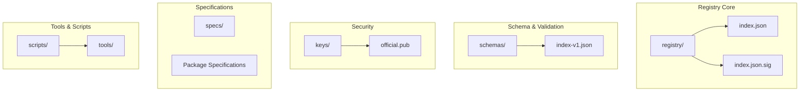
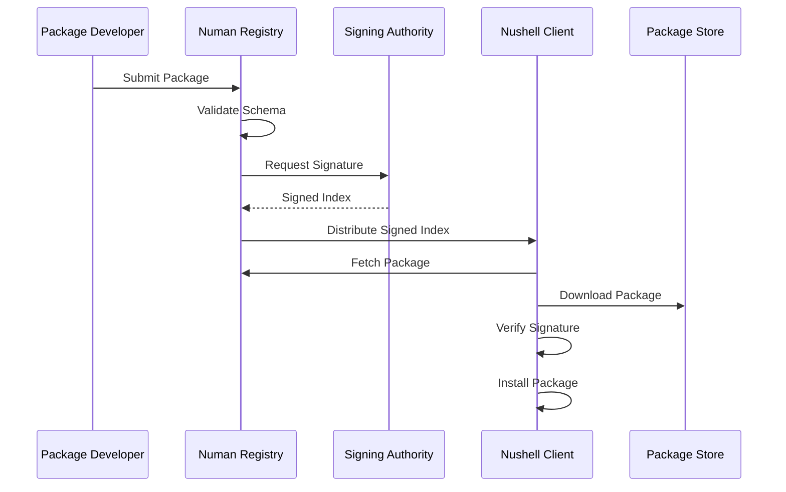
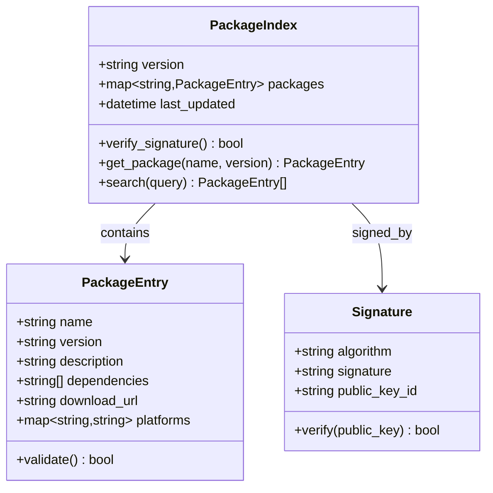
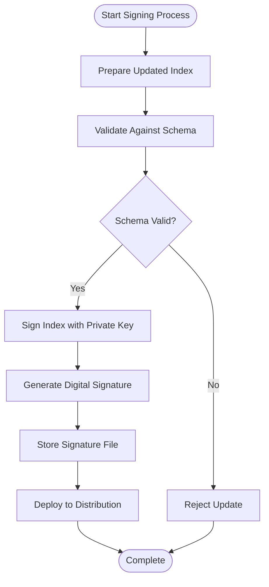
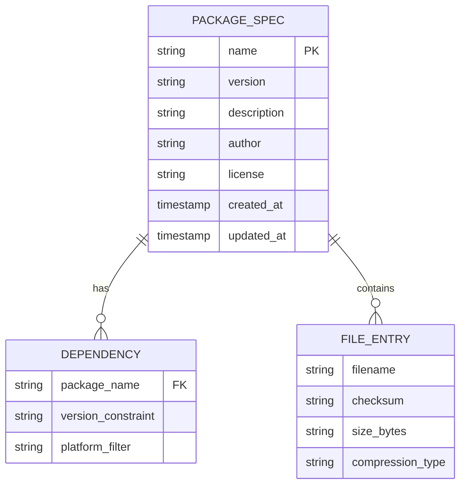
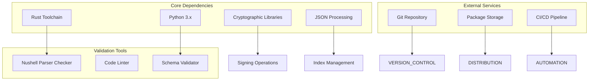

# Project Overview

<cite>
**Referenced Files in This Document**
- [README.md](file://README.md)
- [SECURITY.md](file://SECURITY.md)
- [registry/index.json](file://registry/index.json)
- [registry/index.json.sig](file://registry/index.json.sig)
- [schemas/index-v1.json](file://schemas/index-v1.json)
- [keys/official.pub](file://keys/official.pub)
- [scripts/add-package.py](file://scripts/add-package.py)
- [scripts/ci-sign.py](file://scripts/ci-sign.py)
- [scripts/lifecycle-prove.py](file://scripts/lifecycle-prove.py)
- [scripts/validate.py](file://scripts/validate.py)
- [specs/FMotalleb-nu_plugin_desktop_notifications-0.114.1.json](file://specs/FMotalleb-nu_plugin_desktop_notifications-0.114.1.json)
- [tools/numan-parser-check/src/main.rs](file://tools/numan-parser-check/src/main.rs)
</cite>

## Table of Contents
1. [Introduction](#introduction)
2. [Project Structure](#project-structure)
3. [Core Components](#core-components)
4. [Architecture Overview](#architecture-overview)
5. [Detailed Component Analysis](#detailed-component-analysis)
6. [Dependency Analysis](#dependency-analysis)
7. [Performance Considerations](#performance-considerations)
8. [Troubleshooting Guide](#troubleshooting-guide)
9. [Conclusion](#conclusion)

## Introduction

The Numan Registry is a specialized package registry designed specifically for the Nushell ecosystem. It serves as a centralized distribution hub for Nushell packages, plugins, and scripts, providing a secure and reliable way to discover, install, and manage extensions to the Nushell shell environment.

Unlike general-purpose package managers that handle various programming languages and frameworks, the Numan Registry focuses exclusively on Nushell-related content, offering tailored support for Nushell's unique architecture and security model. The registry addresses critical challenges in package distribution, including version management, dependency resolution, and most importantly, cryptographic signing and verification to ensure package integrity and authenticity.

This document provides both conceptual overviews for newcomers to Nushell package management and detailed technical information for experienced developers who need to understand the registry's architecture, security mechanisms, and operational procedures.

## Project Structure

The Numan Registry follows a well-organized directory structure that separates concerns and maintains clear boundaries between different components:

**Diagram sources**
- [registry/index.json](file://registry/index.json)
- [schemas/index-v1.json](file://schemas/index-v1.json)
- [keys/official.pub](file://keys/official.pub)

The registry maintains a clean separation between:
- **Registry data**: Package index and signatures
- **Schema definitions**: JSON schemas for validation
- **Security assets**: Cryptographic keys for signing
- **Specification files**: Detailed package metadata
- **Operational tools**: Scripts for maintenance and validation

**Section sources**
- [registry/index.json](file://registry/index.json)
- [schemas/index-v1.json](file://schemas/index-v1.json)
- [keys/official.pub](file://keys/official.pub)

## Core Components

### Registry Index System

The registry index serves as the central catalog of all available packages, plugins, and scripts. It maintains structured metadata about each package including version information, dependencies, and distribution URLs. The index is cryptographically signed to prevent tampering and ensure authenticity.

### Signing and Verification Mechanisms

The registry implements a robust cryptographic signing system using public-key cryptography. Each registry update is signed with a private key, and clients verify these signatures using the corresponding public key before accepting any package updates.

### Schema Validation

JSON schemas define the structure and constraints for registry data, ensuring consistency and validity across all package specifications. This prevents malformed or malicious entries from being added to the registry.

### Specification Management

Individual package specifications provide detailed metadata about each package, including version constraints, platform compatibility, and installation instructions. These specifications serve as the authoritative source for package information.

**Section sources**
- [registry/index.json](file://registry/index.json)
- [registry/index.json.sig](file://registry/index.json.sig)
- [schemas/index-v1.json](file://schemas/index-v1.json)

## Architecture Overview

The Numan Registry follows a distributed architecture with centralized signing authority:

**Diagram sources**
- [scripts/ci-sign.py](file://scripts/ci-sign.py)
- [scripts/validate.py](file://scripts/validate.py)
- [keys/official.pub](file://keys/official.pub)

The architecture emphasizes security through multiple layers:
- **Input validation**: All submissions are validated against schemas
- **Cryptographic signing**: Registry updates are digitally signed
- **Client-side verification**: Clients verify signatures before installation
- **Immutable storage**: Package archives are stored immutably

## Detailed Component Analysis

### Registry Index Management

The registry index is the core data structure that catalogs all available packages. It maintains version information, dependency relationships, and distribution endpoints for each package entry.

**Diagram sources**
- [registry/index.json](file://registry/index.json)
- [registry/index.json.sig](file://registry/index.json.sig)

### Security and Signing Workflow

The signing process ensures that only authorized changes can be made to the registry index. The workflow involves multiple validation steps and cryptographic verification.

**Diagram sources**
- [scripts/ci-sign.py](file://scripts/ci-sign.py)
- [scripts/lifecycle-prove.py](file://scripts/lifecycle-prove.py)

### Package Specification Management

Each package has a detailed specification file that describes its properties, dependencies, and installation requirements. These specifications are used for validation and client-side processing.

**Diagram sources**
- [specs/FMotalleb-nu_plugin_desktop_notifications-0.114.1.json](file://specs/FMotalleb-nu_plugin_desktop_notifications-0.114.1.json)

**Section sources**
- [registry/index.json](file://registry/index.json)
- [scripts/ci-sign.py](file://scripts/ci-sign.py)
- [specs/FMotalleb-nu_plugin_desktop_notifications-0.114.1.json](file://specs/FMotalleb-nu_plugin_desktop_notifications-0.114.1.json)

## Dependency Analysis

The Numan Registry has several key dependencies that enable its functionality:

**Diagram sources**
- [tools/numan-parser-check/Cargo.toml](file://tools/numan-parser-check/Cargo.toml)
- [scripts/validate.py](file://scripts/validate.py)
- [scripts/ci-sign.py](file://scripts/ci-sign.py)

Key dependencies include:
- **Rust toolchain**: For building the parser validation tool
- **Python**: For automation scripts and validation processes
- **Cryptographic libraries**: For digital signing and verification
- **JSON processing**: For schema validation and index management

**Section sources**
- [tools/numan-parser-check/Cargo.toml](file://tools/numan-parser-check/Cargo.toml)
- [scripts/validate.py](file://scripts/validate.py)

## Performance Considerations

The Numan Registry is designed with performance in mind, implementing several optimization strategies:

- **Lazy loading**: Package metadata is loaded on-demand rather than pre-caching
- **Efficient indexing**: The registry index uses optimized data structures for fast lookups
- **Caching strategies**: Client-side caching reduces redundant network requests
- **Parallel processing**: Background tasks handle time-consuming operations like signature verification
- **Compression**: Package archives are compressed to minimize bandwidth usage

## Troubleshooting Guide

Common issues and their solutions when working with the Numan Registry:

### Signature Verification Failures
- Ensure the public key is up-to-date and matches the registry's current signing key
- Verify network connectivity to the registry endpoint
- Check for clock synchronization issues that might affect certificate validation

### Package Installation Problems
- Validate package specifications against the current schema
- Check for dependency conflicts or version incompatibilities
- Verify file permissions and disk space availability

### Registry Update Issues
- Confirm proper authorization for registry modifications
- Validate all changes against the schema before submission
- Ensure cryptographic signatures are correctly generated and applied

**Section sources**
- [scripts/validate.py](file://scripts/validate.py)
- [scripts/lifecycle-prove.py](file://scripts/lifecycle-prove.py)

## Conclusion

The Numan Registry represents a mature, secure, and efficient solution for Nushell package distribution. Its architecture emphasizes security through cryptographic signing, comprehensive validation, and clear separation of concerns. The registry provides a solid foundation for the Nushell ecosystem, enabling developers to distribute packages safely and users to install them confidently.

The system's design balances security with usability, providing robust protection against tampering while maintaining simplicity for end users. As the Nushell ecosystem continues to grow, the Numan Registry will play a crucial role in ensuring the integrity and reliability of packages available to the community.

Future enhancements may include improved dependency resolution, enhanced security features, and expanded tooling for package development and distribution. The modular architecture makes it well-suited for such evolution while maintaining backward compatibility.