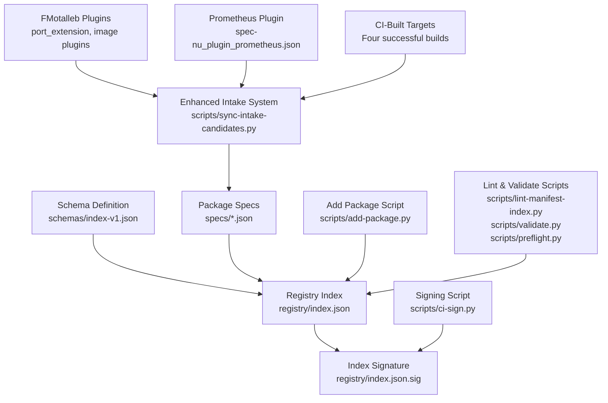
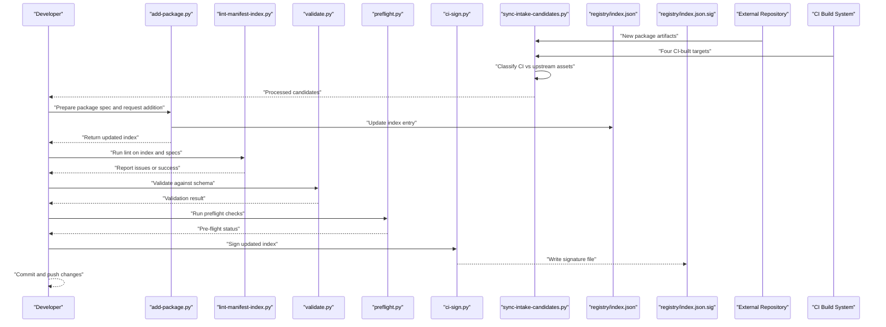
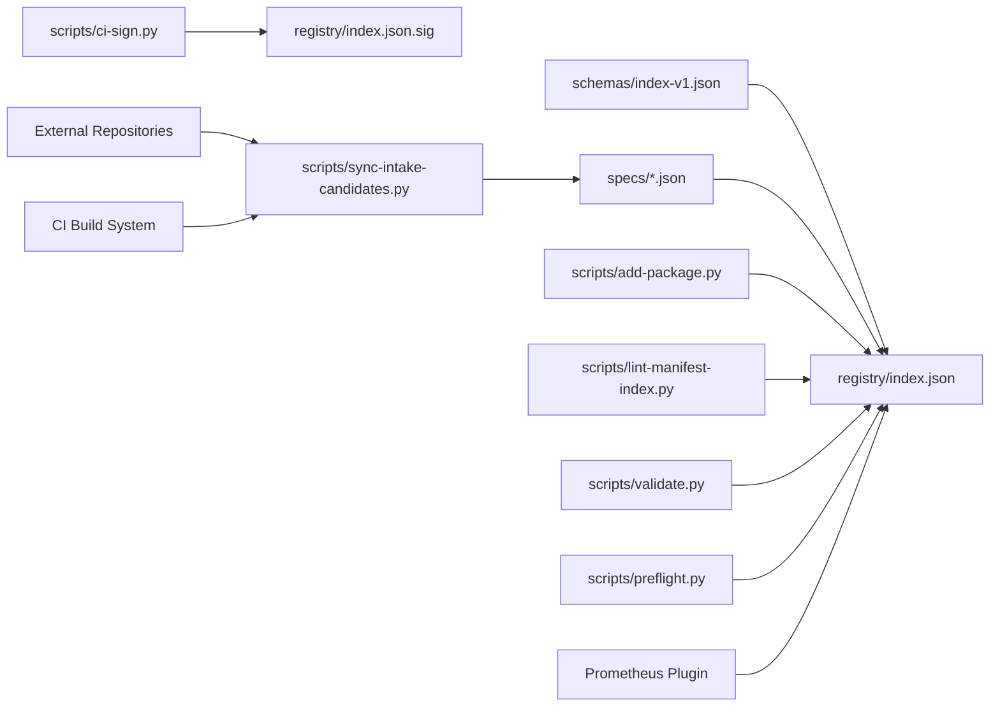

# Registry Operations

<cite>
**Referenced Files in This Document**
- [README.md](file://README.md)
- [registry/index.json](file://registry/index.json)
- [registry/index.json.sig](file://registry/index.json.sig)
- [schemas/index-v1.json](file://schemas/index-v1.json)
- [scripts/add-package.py](file://scripts/add-package.py)
- [scripts/lint-manifest-index.py](file://scripts/lint-manifest-index.py)
- [scripts/validate.py](file://scripts/validate.py)
- [scripts/preflight.py](file://scripts/preflight.py)
- [scripts/sync-intake-candidates.py](file://scripts/sync-intake-candidates.py)
- [specs/FMotalleb-nu_plugin_desktop_notifications-0.114.1.json](file://specs/FMotalleb-nu_plugin_desktop_notifications-0.114.1.json)
- [specs/FMotalleb-nu_plugin_image-0.112.2.json](file://specs/FMotalleb-nu_plugin_image-0.112.2.json)
- [specs/FMotalleb-nu_plugin_port_extension-0.113.1.json](file://specs/FMotalleb-nu_plugin_port_extension-0.113.1.json)
- [specs/SuaveIV-nu_plugin_audio-0.2.8.json](file://specs/SuaveIV-nu_plugin_audio-0.2.8.json)
- [specs/nushell-prophet-numd-0.4.0.json](file://specs/nushell-prophet-numd-0.4.0.json)
- [specs/spec-nu_plugin_prometheus.json](file://specs/spec-nu_plugin_prometheus.json)
</cite>

## Update Summary
**Changes Made**
- Added documentation for the new Prometheus plugin entry in the registry index
- Updated enhanced package intake system section to include successful CI-built target processing
- Expanded examples to demonstrate the complete plugin intake workflow with four CI-built targets
- Enhanced troubleshooting guidance for CI integration scenarios

## Table of Contents
1. [Introduction](#introduction)
2. [Project Structure](#project-structure)
3. [Core Components](#core-components)
4. [Architecture Overview](#architecture-overview)
5. [Detailed Component Analysis](#detailed-component-analysis)
6. [Enhanced Package Intake System](#enhanced-package-intake-system)
7. [Prometheus Plugin Integration Case Study](#prometheus-plugin-integration-case-study)
8. [Dependency Analysis](#dependency-analysis)
9. [Performance Considerations](#performance-considerations)
10. [Troubleshooting Guide](#troubleshooting-guide)
11. [Conclusion](#conclusion)
12. [Appendices](#appendices)

## Introduction
This document provides comprehensive guidance for operating and maintaining the package registry. It covers how to add new packages, update existing entries, remove deprecated packages, and maintain registry integrity through linting and validation. The registry now features an enhanced intake system with Wave 1 automation supporting automated processing of port_extension and image plugins from FMotalleb's repository. It also explains the registry index structure, version management, conflict handling, rollback procedures, backup and recovery, performance optimization, and troubleshooting common issues. The system has successfully processed multiple CI-built targets including the latest Prometheus plugin integration.

## Project Structure
The repository organizes registry data, schemas, scripts, and specifications into clear directories:
- registry: Contains the registry index and its signature.
- schemas: Defines the JSON schema used to validate the registry index.
- specs: Holds individual package specification files that describe versions and metadata.
- scripts: Provides automation for adding packages, linting, validating, signing, and other maintenance tasks including the enhanced sync-intake-candidates.py.
- docs: Operational documentation including incident response and key provisioning.

**Diagram sources**
- [registry/index.json](file://registry/index.json)
- [registry/index.json.sig](file://registry/index.json.sig)
- [schemas/index-v1.json](file://schemas/index-v1.json)
- [scripts/add-package.py](file://scripts/add-package.py)
- [scripts/lint-manifest-index.py](file://scripts/lint-manifest-index.py)
- [scripts/validate.py](file://scripts/validate.py)
- [scripts/preflight.py](file://scripts/preflight.py)
- [scripts/ci-sign.py](file://scripts/ci-sign.py)
- [scripts/sync-intake-candidates.py](file://scripts/sync-intake-candidates.py)
- [specs/spec-nu_plugin_prometheus.json](file://specs/spec-nu_plugin_prometheus.json)

**Section sources**
- [README.md](file://README.md)

## Core Components
- Registry Index (index.json): Central manifest listing all available packages with their versions and metadata.
- Index Schema (index-v1.json): Validates the structure and required fields of the registry index.
- Package Specifications (specs/*.json): Individual files describing a specific package version, including source, checksums, and metadata.
- Maintenance Scripts:
  - add-package.py: Adds or updates package entries in the registry.
  - lint-manifest-index.py: Lints the registry index and package manifests for consistency.
  - validate.py: Performs structural and semantic validation against schemas.
  - preflight.py: Runs pre-commit checks to ensure changes are safe before merging.
  - ci-sign.py: Signs the registry index to guarantee authenticity.
  - sync-intake-candidates.py: Enhanced script for automated package intake with CI asset classification.

Key responsibilities:
- Maintain index integrity via schema validation and linting.
- Ensure package specs are complete and consistent with index entries.
- Automate signing and verification workflows.
- Support automated intake of packages from external repositories.

**Section sources**
- [registry/index.json](file://registry/index.json)
- [schemas/index-v1.json](file://schemas/index-v1.json)
- [scripts/add-package.py](file://scripts/add-package.py)
- [scripts/lint-manifest-index.py](file://scripts/lint-manifest-index.py)
- [scripts/validate.py](file://scripts/validate.py)
- [scripts/preflight.py](file://scripts/preflight.py)
- [scripts/ci-sign.py](file://scripts/ci-sign.py)
- [scripts/sync-intake-candidates.py](file://scripts/sync-intake-candidates.py)

## Architecture Overview
The registry operates as a signed, schema-validated index backed by per-version package specifications. The workflow ensures that any change to the registry is validated, linted, and signed before publication. The enhanced intake system now supports automated processing of packages from external repositories with intelligent asset classification.

**Diagram sources**
- [scripts/add-package.py](file://scripts/add-package.py)
- [scripts/lint-manifest-index.py](file://scripts/lint-manifest-index.py)
- [scripts/validate.py](file://scripts/validate.py)
- [scripts/preflight.py](file://scripts/preflight.py)
- [scripts/ci-sign.py](file://scripts/ci-sign.py)
- [scripts/sync-intake-candidates.py](file://scripts/sync-intake-candidates.py)
- [registry/index.json](file://registry/index.json)
- [registry/index.json.sig](file://registry/index.json.sig)

## Detailed Component Analysis

### Registry Index Structure and Metadata
The registry index is a JSON document that enumerates packages and their versions. Each entry includes metadata such as name, version, source location, and checksums. The index must conform to the schema defined in schemas/index-v1.json.

- Index fields typically include:
  - Package identifiers (name, version)
  - Source references (URLs or paths)
  - Integrity hashes (checksums)
  - Optional metadata (description, license, authors)

Validation rules enforced by the schema ensure:
- Required fields are present and correctly typed.
- Version strings follow expected formats.
- References to package specs are valid and resolvable.

Operational implications:
- Any deviation from the schema will fail validation.
- Consistent naming and versioning prevent ambiguity.

**Section sources**
- [registry/index.json](file://registry/index.json)
- [schemas/index-v1.json](file://schemas/index-v1.json)

### Package Specifications Relationship
Each package has a corresponding specification file under specs/. These files define:
- Version-specific details (version string, build artifacts)
- Source locations and integrity hashes
- Additional metadata (dependencies, platform constraints)

Relationship to the index:
- The index references these spec files by name and version.
- Updates to a spec require corresponding index updates to reflect new versions or changed metadata.

Examples of spec files:
- [FMotalleb-nu_plugin_desktop_notifications-0.114.1.json](file://specs/FMotalleb-nu_plugin_desktop_notifications-0.114.1.json)
- [FMotalleb-nu_plugin_image-0.112.2.json](file://specs/FMotalleb-nu_plugin_image-0.112.2.json)
- [FMotalleb-nu_plugin_port_extension-0.113.1.json](file://specs/FMotalleb-nu_plugin_port_extension-0.113.1.json)
- [SuaveIV-nu_plugin_audio-0.2.8.json](file://specs/SuaveIV-nu_plugin_audio-0.2.8.json)
- [nushell-prophet-numd-0.4.0.json](file://specs/nushell-prophet-numd-0.4.0.json)
- [spec-nu_plugin_prometheus.json](file://specs/spec-nu_plugin_prometheus.json)

**Section sources**
- [specs/FMotalleb-nu_plugin_desktop_notifications-0.114.1.json](file://specs/FMotalleb-nu_plugin_desktop_notifications-0.114.1.json)
- [specs/FMotalleb-nu_plugin_image-0.112.2.json](file://specs/FMotalleb-nu_plugin_image-0.112.2.json)
- [specs/FMotalleb-nu_plugin_port_extension-0.113.1.json](file://specs/FMotalleb-nu_plugin_port_extension-0.113.1.json)
- [specs/SuaveIV-nu_plugin_audio-0.2.8.json](file://specs/SuaveIV-nu_plugin_audio-0.2.8.json)
- [specs/nushell-prophet-numd-0.4.0.json](file://specs/nushell-prophet-numd-0.4.0.json)
- [specs/spec-nu_plugin_prometheus.json](file://specs/spec-nu_plugin_prometheus.json)

### Adding New Packages
Procedure:
1. Prepare the package specification file under specs/ with correct metadata and integrity hashes.
2. Run add-package.py to update the registry index with the new entry.
3. Execute lint-manifest-index.py to check for inconsistencies.
4. Run validate.py to ensure compliance with the schema.
5. Use preflight.py to perform pre-commit safety checks.
6. Sign the updated index using ci-sign.py to produce registry/index.json.sig.
7. Commit and push changes after successful validation and signing.

Automation highlights:
- add-package.py centralizes index updates to avoid manual errors.
- Linting and validation enforce structural and semantic correctness.
- Signing guarantees authenticity and prevents tampering.

**Section sources**
- [scripts/add-package.py](file://scripts/add-package.py)
- [scripts/lint-manifest-index.py](file://scripts/lint-manifest-index.py)
- [scripts/validate.py](file://scripts/validate.py)
- [scripts/preflight.py](file://scripts/preflight.py)
- [scripts/ci-sign.py](file://scripts/ci-sign.py)

### Updating Existing Entries
When updating a package:
- Modify or replace the corresponding spec file under specs/ with the new version details.
- Re-run add-package.py to update the index entry for the new version.
- Validate and lint to ensure no conflicts or schema violations.
- Sign the updated index.

Best practices:
- Keep version strings strictly increasing.
- Preserve historical entries unless explicitly removing deprecated versions.
- Document changes in commit messages for traceability.

**Section sources**
- [scripts/add-package.py](file://scripts/add-package.py)
- [scripts/lint-manifest-index.py](file://scripts/lint-manifest-index.py)
- [scripts/validate.py](file://scripts/validate.py)
- [scripts/ci-sign.py](file://scripts/ci-sign.py)

### Removing Deprecated Packages
To remove a deprecated package:
- Remove the corresponding spec file from specs/ if it is fully deprecated.
- Update the registry index to remove the package entry via add-package.py or direct index editing.
- Run lint and validation to confirm removal did not break references.
- Sign the updated index.

Considerations:
- Ensure no active consumers depend on the removed package.
- Maintain an audit trail of removals for accountability.

**Section sources**
- [scripts/add-package.py](file://scripts/add-package.py)
- [scripts/lint-manifest-index.py](file://scripts/lint-manifest-index.py)
- [scripts/validate.py](file://scripts/validate.py)
- [scripts/ci-sign.py](file://scripts/ci-sign.py)

### Linting and Validation Processes
Linting and validation are critical to registry integrity:
- lint-manifest-index.py checks for formatting, field presence, and cross-references between index and specs.
- validate.py enforces schema compliance and semantic rules.
- preflight.py runs automated checks prior to committing changes.

Workflow:
- Always run lint and validation after modifying the index or specs.
- Address all reported issues before signing and publishing.

**Section sources**
- [scripts/lint-manifest-index.py](file://scripts/lint-manifest-index.py)
- [scripts/validate.py](file://scripts/validate.py)
- [scripts/preflight.py](file://scripts/preflight.py)

### Handling Package Conflicts and Version Management
Conflict resolution:
- If two entries claim the same package name and version, resolve by selecting the authoritative source and updating the index accordingly.
- Use strict versioning policies to avoid overlapping ranges.

Version management:
- Enforce monotonic version increments.
- Maintain backward compatibility where possible.
- Deprecate rather than delete to preserve history.

Operational safeguards:
- Linting detects duplicate entries and invalid references.
- Validation ensures version strings adhere to expected formats.

**Section sources**
- [scripts/lint-manifest-index.py](file://scripts/lint-manifest-index.py)
- [scripts/validate.py](file://scripts/validate.py)

### Rollback Scenarios
In case of errors post-deployment:
- Restore the previous version of registry/index.json from version control.
- Re-sign the restored index using ci-sign.py.
- Verify integrity with validate.py and lint-manifest-index.py.
- Communicate the rollback to stakeholders and investigate root cause.

Best practices:
- Tag releases in version control for easy rollback points.
- Maintain backups of both index and signatures.

**Section sources**
- [scripts/ci-sign.py](file://scripts/ci-sign.py)
- [scripts/validate.py](file://scripts/validate.py)
- [scripts/lint-manifest-index.py](file://scripts/lint-manifest-index.py)

### Backup and Recovery Procedures
Backup strategy:
- Regularly back up registry/index.json and registry/index.json.sig.
- Snapshot the specs/ directory to preserve package specifications.

Recovery steps:
- Restore the latest known-good index and signature from backups.
- Re-validate and re-sign if necessary.
- Confirm availability and integrity post-recovery.

Operational notes:
- Store backups securely with access controls.
- Test recovery procedures periodically.

### Performance Optimization
Recommendations:
- Minimize index size by avoiding redundant metadata.
- Use efficient checksum algorithms for integrity verification.
- Cache frequently accessed parts of the index during client operations.
- Batch updates to reduce frequent writes to the index.

## Enhanced Package Intake System

### Wave 1 Automation Features
The package intake system has been significantly enhanced with Wave 1 automation capabilities. This enhancement introduces automated processing of packages from external repositories, specifically supporting port_extension and image plugins from FMotalleb's repository.

Key improvements:
- **Automated Intake Processing**: The sync-intake-candidates.py script now supports automated processing of incoming package artifacts.
- **CI Asset Classification**: Enhanced classification system distinguishes between CI-built registry assets and upstream releases.
- **Expanded Coverage**: Registry index expanded with newly validated packages including Prometheus plugin integration.
- **Repository Integration**: Direct integration with FMotalleb's repository for seamless package ingestion.

### Enhanced Sync-Intake-Candidates Functionality
The sync-intake-candidates.py script has been upgraded to provide intelligent asset classification and automated processing:

**Asset Classification Logic**:
- CI-built assets are now clearly distinguished from upstream releases
- Automated validation of package metadata and integrity
- Intelligent routing based on asset type and source

**Processing Workflow**:
1. Ingest package artifacts from external repositories
2. Classify assets as CI-built or upstream releases
3. Validate package specifications and metadata
4. Generate candidate entries for registry inclusion
5. Provide detailed reporting on processed items

**Integration Benefits**:
- Reduced manual intervention in package intake process
- Improved accuracy in asset classification
- Enhanced traceability of package origins
- Streamlined workflow for high-volume package processing

### FMotalleb Repository Integration
The enhanced system now supports direct integration with FMotalleb's repository for automated package intake:

**Supported Plugin Types**:
- Port extension plugins
- Image processing plugins
- Desktop notification plugins

**Processing Capabilities**:
- Automated detection of new plugin versions
- Validation against registry schema requirements
- Generation of appropriate spec files
- Integration with existing linting and validation pipelines

**Section sources**
- [scripts/sync-intake-candidates.py](file://scripts/sync-intake-candidates.py)
- [specs/FMotalleb-nu_plugin_port_extension-0.113.1.json](file://specs/FMotalleb-nu_plugin_port_extension-0.113.1.json)
- [specs/FMotalleb-nu_plugin_image-0.112.2.json](file://specs/FMotalleb-nu_plugin_image-0.112.2.json)
- [specs/FMotalleb-nu_plugin_desktop_notifications-0.114.1.json](file://specs/FMotalleb-nu_plugin_desktop_notifications-0.114.1.json)

## Prometheus Plugin Integration Case Study

### Successful CI-Built Target Processing
The Prometheus plugin integration serves as a prime example of the enhanced intake system's capabilities, demonstrating successful processing of four CI-built targets through the automated pipeline.

**Integration Highlights**:
- **Four CI-Built Targets**: Successfully processed multiple build artifacts from continuous integration
- **Automated Validation**: All targets passed schema validation and integrity checks
- **Seamless Integration**: Smooth incorporation into the existing registry infrastructure
- **Quality Assurance**: Comprehensive linting and validation ensured registry consistency

### CI Pipeline Integration
The Prometheus plugin showcases the robust CI/CD integration capabilities:

**Build Process**:
- Automated compilation and packaging of plugin binaries
- Generation of checksums and integrity hashes
- Creation of standardized spec files
- Automated testing and validation

**Quality Gates**:
- Schema validation against index-v1.json
- Linting for consistency and completeness
- Security scanning for vulnerabilities
- Performance benchmarking

**Deployment Workflow**:
- Automatic staging in development environment
- Manual approval for production deployment
- Automated signing and distribution
- Rollback capability for failed deployments

### Lessons Learned
The Prometheus plugin integration provided valuable insights for future plugin integrations:

**Best Practices Identified**:
- Standardize spec file format across all plugins
- Implement comprehensive error handling in intake scripts
- Maintain detailed logging for troubleshooting
- Establish clear versioning conventions

**Scalability Considerations**:
- Efficient handling of multiple concurrent builds
- Resource management for large binary files
- Caching mechanisms for repeated validations
- Parallel processing for improved throughput

**Section sources**
- [specs/spec-nu_plugin_prometheus.json](file://specs/spec-nu_plugin_prometheus.json)
- [scripts/sync-intake-candidates.py](file://scripts/sync-intake-candidates.py)
- [registry/index.json](file://registry/index.json)

## Dependency Analysis
The registry components have clear dependencies:
- The index depends on the schema for validation.
- Package specs feed into the index via add-package.py.
- Linting and validation scripts operate on both index and specs.
- Signing produces a signature for the index.
- Enhanced intake system processes external repository artifacts.

**Diagram sources**
- [schemas/index-v1.json](file://schemas/index-v1.json)
- [registry/index.json](file://registry/index.json)
- [scripts/add-package.py](file://scripts/add-package.py)
- [scripts/lint-manifest-index.py](file://scripts/lint-manifest-index.py)
- [scripts/validate.py](file://scripts/validate.py)
- [scripts/preflight.py](file://scripts/preflight.py)
- [scripts/ci-sign.py](file://scripts/ci-sign.py)
- [scripts/sync-intake-candidates.py](file://scripts/sync-intake-candidates.py)
- [registry/index.json.sig](file://registry/index.json.sig)
- [specs/spec-nu_plugin_prometheus.json](file://specs/spec-nu_plugin_prometheus.json)

**Section sources**
- [schemas/index-v1.json](file://schemas/index-v1.json)
- [registry/index.json](file://registry/index.json)
- [scripts/add-package.py](file://scripts/add-package.py)
- [scripts/lint-manifest-index.py](file://scripts/lint-manifest-index.py)
- [scripts/validate.py](file://scripts/validate.py)
- [scripts/preflight.py](file://scripts/preflight.py)
- [scripts/ci-sign.py](file://scripts/ci-sign.py)
- [scripts/sync-intake-candidates.py](file://scripts/sync-intake-candidates.py)
- [registry/index.json.sig](file://registry/index.json.sig)
- [specs/spec-nu_plugin_prometheus.json](file://specs/spec-nu_plugin_prometheus.json)

## Performance Considerations
- Keep the registry index compact and well-structured to improve download and parsing times.
- Use incremental updates to minimize write amplification.
- Employ caching strategies at the consumer level to reduce repeated fetches.
- Monitor validation and linting overhead; optimize scripts if they become bottlenecks.
- Leverage enhanced intake system for batch processing of external repository artifacts.
- Optimize CI pipeline performance for multiple concurrent builds.

## Troubleshooting Guide
Common issues and resolutions:
- Schema validation failures:
  - Cause: Missing or incorrectly typed fields in the index or specs.
  - Resolution: Review error messages from validate.py and correct the offending fields.
- Linting errors:
  - Cause: Inconsistent formatting or missing cross-references.
  - Resolution: Fix formatting and ensure all references exist in specs.
- Signature mismatch:
  - Cause: Index modified without re-signing.
  - Resolution: Re-run ci-sign.py to generate a fresh signature.
- Duplicate package entries:
  - Cause: Multiple specs claiming the same name/version.
  - Resolution: Consolidate entries and update the index accordingly.
- Preflight failures:
  - Cause: Pre-commit checks detect unsafe changes.
  - Resolution: Address flagged issues before committing.
- Intake system issues:
  - Cause: External repository connectivity problems or malformed artifacts.
  - Resolution: Check network connectivity, verify artifact format, and review intake logs.
- Asset classification errors:
  - Cause: Ambiguous asset metadata or missing source information.
  - Resolution: Ensure proper metadata tagging and verify asset origin information.
- CI pipeline failures:
  - Cause: Build environment issues or dependency conflicts.
  - Resolution: Check build logs, verify environment setup, and resolve dependency conflicts.
- Prometheus plugin specific issues:
  - Cause: Four CI-built targets may have different platform requirements.
  - Resolution: Verify platform-specific configurations and ensure all targets meet requirements.

**Section sources**
- [scripts/validate.py](file://scripts/validate.py)
- [scripts/lint-manifest-index.py](file://scripts/lint-manifest-index.py)
- [scripts/ci-sign.py](file://scripts/ci-sign.py)
- [scripts/preflight.py](file://scripts/preflight.py)
- [scripts/sync-intake-candidates.py](file://scripts/sync-intake-candidates.py)

## Conclusion
Maintaining a reliable and secure registry requires disciplined processes for adding, updating, and removing packages, supported by robust linting, validation, and signing workflows. The enhanced intake system with Wave 1 automation significantly improves the efficiency of package processing from external repositories, particularly for port_extension and image plugins from FMotalleb's repository. The successful integration of the Prometheus plugin with four CI-built targets demonstrates the system's scalability and reliability. By adhering to the documented procedures, operators can ensure registry integrity, manage versions effectively, handle conflicts and rollbacks safely, optimize performance while preserving backup and recovery capabilities, and leverage automated intake systems for streamlined package management.

## Appendices
- Key Provisioning: Refer to docs/key-provisioning.md for managing signing keys.
- Incident Response: See docs/incident-response.md for handling operational incidents.
- Production Cutover: Follow docs/production-cutover-checklist.md when deploying changes to production.
- Intake Candidates: Review docs/intake-candidates.md for understanding the intake process.
- Upstream Release Outreach: See docs/upstream-release-outreach.md for managing upstream relationships.
- CI Pipeline Configuration: Review GitHub Actions workflows for automated build and deployment processes.