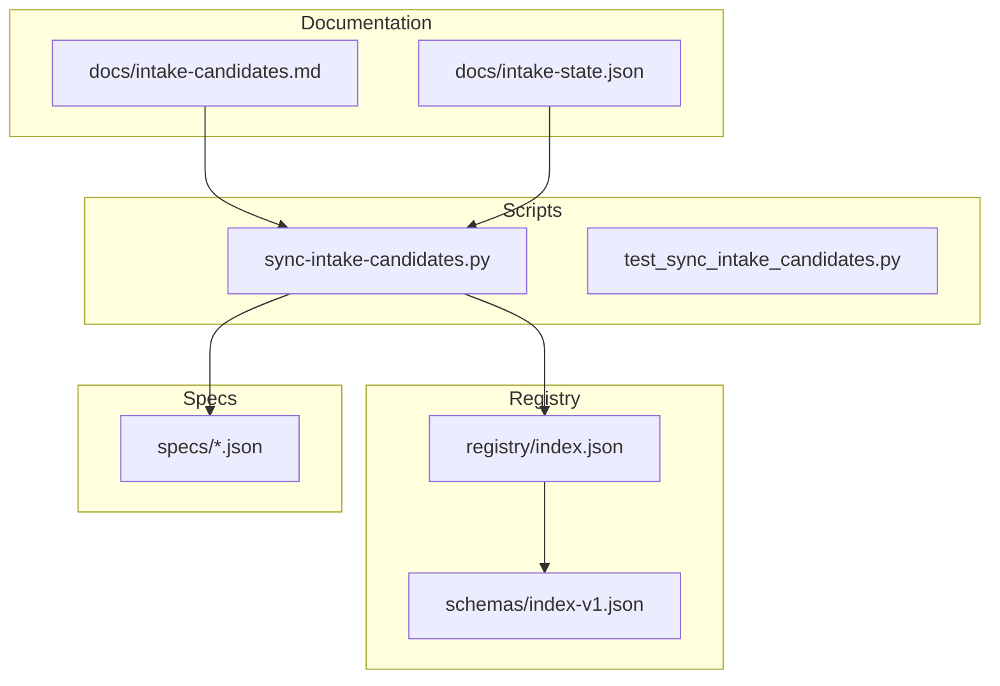
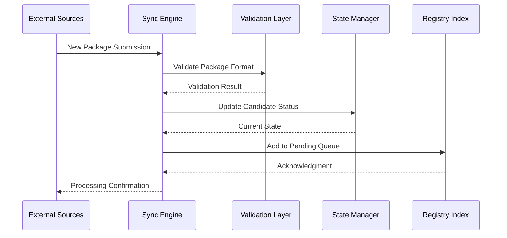
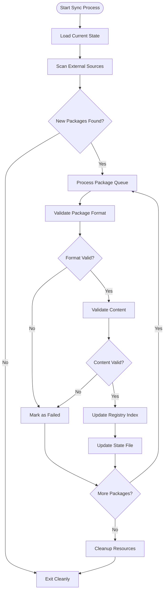
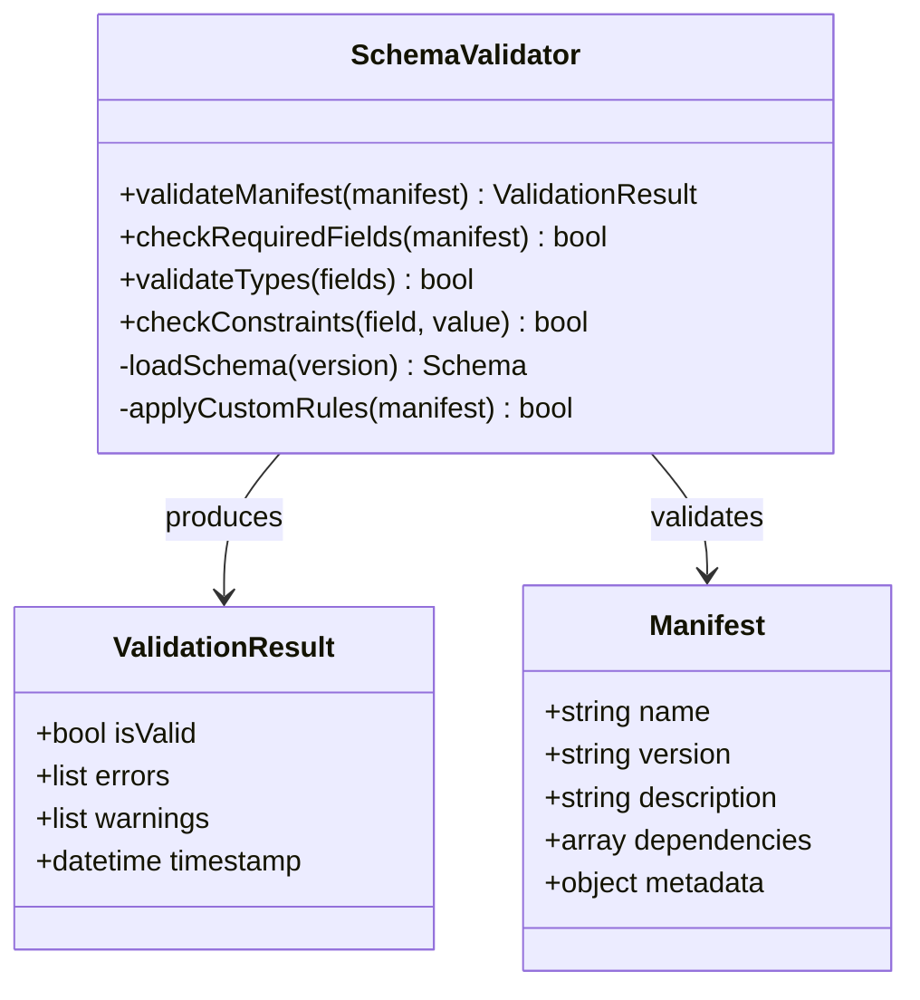
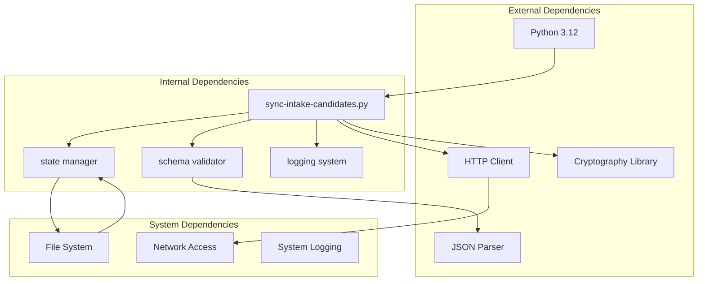

# Intake Candidates

<cite>
**Referenced Files in This Document**
- [README.md](file://README.md)
- [docs/intake-candidates.md](file://docs/intake-candidates.md)
- [scripts/sync-intake-candidates.py](file://scripts/sync-intake-candidates.py)
- [docs/intake-state.json](file://docs/intake-state.json)
- [scripts/test_sync_intake_candidates.py](file://scripts/test_sync_intake_candidates.py)
- [registry/index.json](file://registry/index.json)
- [schemas/index-v1.json](file://schemas/index-v1.json)
</cite>

## Table of Contents

1. [Introduction](#introduction)
2. [Project Structure](#project-structure)
3. [Core Components](#core-components)
4. [Architecture Overview](#architecture-overview)
5. [Detailed Component Analysis](#detailed-component-analysis)
6. [Dependency Analysis](#dependency-analysis)
7. [Performance Considerations](#performance-considerations)
8. [Troubleshooting Guide](#troubleshooting-guide)
9. [Conclusion](#conclusion)

## Introduction

The Intake Candidates system is a critical component of the Nushell registry management infrastructure. It serves as a pipeline for processing and validating new package submissions before they are integrated into the official Nushell registry. This system ensures quality control, security validation, and proper formatting of packages before they become publicly available through the registry.

The intake process acts as a gatekeeper mechanism that automatically synchronizes candidate packages from various sources, validates their compliance with registry standards, and prepares them for human review and final approval.

## Project Structure

The Intake Candidates system is organized across several key directories and files:

**Diagram sources**
- [docs/intake-candidates.md](file://docs/intake-candidates.md)
- [scripts/sync-intake-candidates.py](file://scripts/sync-intake-candidates.py)
- [docs/intake-state.json](file://docs/intake-state.json)
- [registry/index.json](file://registry/index.json)
- [schemas/index-v1.json](file://schemas/index-v1.json)

**Section sources**
- [README.md](file://README.md)
- [docs/intake-candidates.md](file://docs/intake-candidates.md)

## Core Components

### Synchronization Engine

The primary component responsible for coordinating the intake process is the synchronization engine, implemented in Python. This engine handles:

- **Package Discovery**: Scanning external sources for new or updated packages
- **Validation Pipeline**: Ensuring packages meet registry requirements
- **State Management**: Tracking the progress and status of candidate packages
- **Error Handling**: Managing failures and retry mechanisms

### State Management System

The state management system maintains the current status of all candidate packages through a JSON-based state file. This includes:

- Package metadata and version information
- Validation results and error messages
- Processing timestamps and queue positions
- Approval workflow status

### Registry Integration

The system integrates with the main registry through:

- **Schema Validation**: Ensuring package manifests conform to the defined schema
- **Index Updates**: Maintaining the registry index with valid candidates
- **Signature Verification**: Validating cryptographic signatures where applicable

**Section sources**
- [scripts/sync-intake-candidates.py](file://scripts/sync-intake-candidates.py)
- [docs/intake-state.json](file://docs/intake-state.json)
- [schemas/index-v1.json](file://schemas/index-v1.json)

## Architecture Overview

The Intake Candidates system follows a pipeline architecture with clear separation of concerns:

**Diagram sources**
- [scripts/sync-intake-candidates.py](file://scripts/sync-intake-candidates.py)
- [docs/intake-state.json](file://docs/intake-state.json)
- [registry/index.json](file://registry/index.json)

The architecture emphasizes:

- **Modularity**: Each component has a single responsibility
- **Fault Tolerance**: Failed operations don't crash the entire pipeline
- **Scalability**: Support for concurrent processing of multiple packages
- **Auditability**: Complete logging and state tracking

## Detailed Component Analysis

### Synchronization Script Analysis

The main synchronization script orchestrates the entire intake process:

#### Key Responsibilities:

- **Input Processing**: Reading candidate packages from various sources
- **Parallel Processing**: Handling multiple packages simultaneously
- **Error Recovery**: Implementing retry logic for transient failures
- **Progress Tracking**: Updating state files with current processing status

#### Processing Workflow:

**Diagram sources**
- [scripts/sync-intake-candidates.py](file://scripts/sync-intake-candidates.py)

**Section sources**
- [scripts/sync-intake-candidates.py](file://scripts/sync-intake-candidates.py)
- [scripts/test_sync_intake_candidates.py](file://scripts/test_sync_intake_candidates.py)

### State Management Analysis

The state management system uses a JSON-based approach for persistence:

#### State Structure:

- **Candidate Registry**: List of all packages in the intake pipeline
- **Processing Queue**: Currently being processed packages
- **History Log**: Past processing attempts and results
- **Configuration**: Runtime settings and thresholds

#### Concurrency Control:

- **Atomic Updates**: `open_intake_pr.py` writes `docs/intake-state.json` via a sibling temporary file and an atomic `os.replace`, so readers never see a partially-written file.
- **Backup Mechanisms**: The previous `docs/intake-state.json` contents are copied to `docs/intake-state.json.bak` before each replacement.
- **File Locking**: Not implemented; this is a maintainer-run tool and concurrent edits are assumed to be coordinated out of band.

**Section sources**
- [docs/intake-state.json](file://docs/intake-state.json)

### Schema Validation Analysis

The system enforces strict schema compliance through:

#### Schema Definition:

- **Version Compatibility**: Supports multiple schema versions
- **Field Validation**: Type checking and constraint enforcement
- **Cross-field Validation**: Complex business rule validation

#### Validation Process:

**Diagram sources**
- [schemas/index-v1.json](file://schemas/index-v1.json)

**Section sources**
- [schemas/index-v1.json](file://schemas/index-v1.json)

## Dependency Analysis

The Intake Candidates system has well-defined dependencies:

**Diagram sources**
- [scripts/sync-intake-candidates.py](file://scripts/sync-intake-candidates.py)
- [docs/intake-state.json](file://docs/intake-state.json)

### Coupling Analysis:

- **Low Coupling**: Components interact through well-defined interfaces
- **High Cohesion**: Related functionality grouped within modules
- **Clear Boundaries**: Minimal shared state between components

**Section sources**
- [scripts/sync-intake-candidates.py](file://scripts/sync-intake-candidates.py)

## Performance Considerations

The Intake Candidates system is designed with performance in mind:

### Optimization Strategies:

- **Parallel Processing**: Multiple packages processed concurrently
- **Caching**: Frequently accessed data cached in memory
- **Lazy Loading**: Resources loaded only when needed
- **Batch Operations**: Grouped database/file operations

### Scalability Features:

- **Horizontal Scaling**: Support for multiple worker processes
- **Queue-based Processing**: Decoupled producer-consumer pattern
- **Resource Monitoring**: Automatic scaling based on load
- **Graceful Degradation**: Reduced functionality under stress

### Memory Management:

- **Streaming Processing**: Large files processed without full loading
- **Garbage Collection**: Explicit cleanup of temporary resources
- **Memory Limits**: Configurable resource constraints

## Troubleshooting Guide

### Common Issues and Solutions:

#### Synchronization Failures:

- **Network Timeouts**: Check network connectivity and retry configuration
- **Authentication Errors**: Verify API keys and credentials
- **Rate Limiting**: Implement exponential backoff strategies

#### Validation Errors:

- **Schema Mismatches**: Update package manifests to match current schema
- **Missing Dependencies**: Ensure all required fields are present
- **Invalid Formats**: Correct JSON/YAML formatting issues

#### State Corruption:

- **File Lock Conflicts**: Ensure single-process access to state files
- **Incomplete Updates**: Use atomic write operations
- **Backup Restoration**: Restore from last known good state

### Debugging Techniques:

- **Verbose Logging**: Enable detailed log output for troubleshooting
- **State Inspection**: Examine intermediate state files
- **Network Tracing**: Monitor HTTP requests and responses
- **Performance Profiling**: Identify bottlenecks in processing pipeline

**Section sources**
- [scripts/sync-intake-candidates.py](file://scripts/sync-intake-candidates.py)
- [docs/intake-state.json](file://docs/intake-state.json)

## Conclusion

The Intake Candidates system provides a robust, scalable foundation for managing package submissions to the Nushell registry. Its modular architecture, comprehensive validation pipeline, and fault-tolerant design ensure reliable operation even under high load conditions.

Key strengths include:

- **Comprehensive Validation**: Multi-layered validation ensures package quality
- **Scalable Architecture**: Designed to handle growing package volumes
- **Operational Resilience**: Robust error handling and recovery mechanisms
- **Maintainable Codebase**: Clear separation of concerns and well-documented interfaces

Future enhancements could include:

- **Machine Learning Integration**: Automated quality assessment
- **Enhanced Security Scanning**: Deeper code analysis capabilities
- **Improved User Experience**: Better feedback and reporting mechanisms
- **Advanced Analytics**: Usage patterns and quality metrics

The system successfully balances automation with human oversight, ensuring both efficiency and quality in the package intake process.
