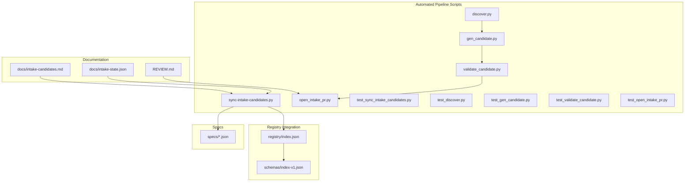
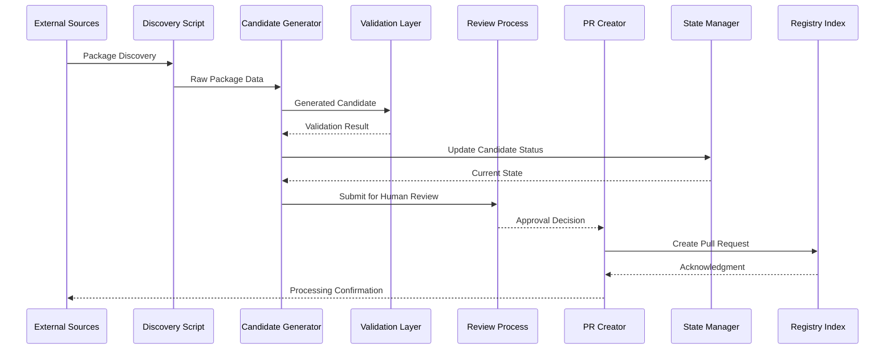
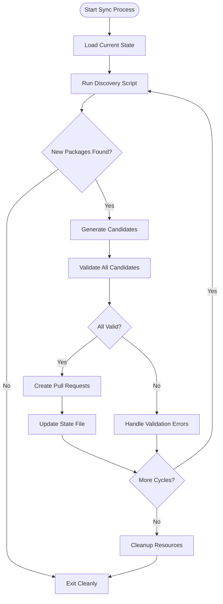
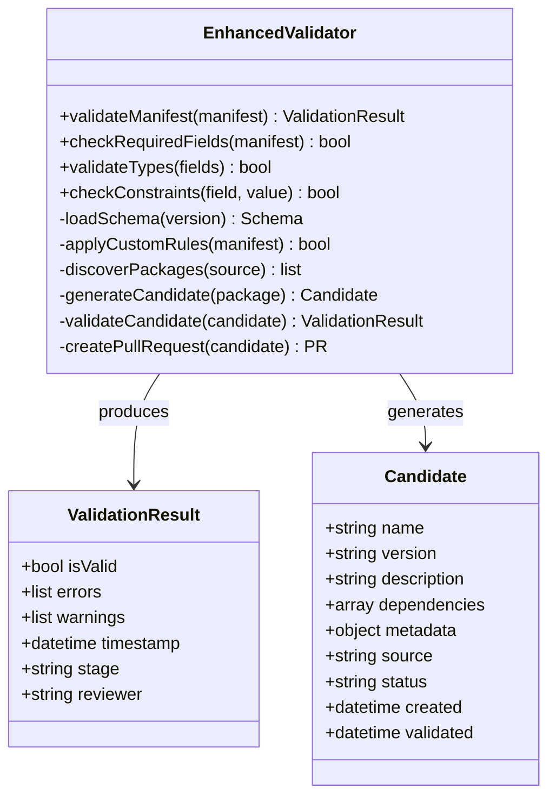
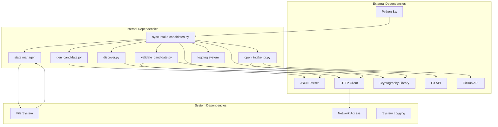

# Intake Candidates

<cite>
**Referenced Files in This Document**
- [README.md](file://README.md)
- [docs/intake-candidates.md](file://docs/intake-candidates.md)
- [scripts/sync-intake-candidates.py](file://scripts/sync-intake-candidates.py)
- [scripts/discover.py](file://scripts/discover.py)
- [scripts/gen_candidate.py](file://scripts/gen_candidate.py)
- [scripts/validate_candidate.py](file://scripts/validate_candidate.py)
- [scripts/open_intake_pr.py](file://scripts/open_intake_pr.py)
- [REVIEW.md](file://REVIEW.md)
- [docs/intake-state.json](file://docs/intake-state.json)
- [scripts/test_sync_intake_candidates.py](file://scripts/test_sync_intake_candidates.py)
- [registry/index.json](file://registry/index.json)
- [schemas/index-v1.json](file://schemas/index-v1.json)
</cite>

## Update Summary
**Changes Made**
- Added comprehensive automated intake pipeline with new discovery, generation, validation, and PR creation scripts
- Integrated new REVIEW.md guide for intake candidate review procedures
- Enhanced registry integration with automated workflow support
- Updated architecture diagrams to reflect new pipeline components
- Expanded troubleshooting section with new script-specific guidance

## Table of Contents
1. [Introduction](#introduction)
2. [Project Structure](#project-structure)
3. [Core Components](#core-components)
4. [Architecture Overview](#architecture-overview)
5. [Automated Pipeline Components](#automated-pipeline-components)
6. [Review Process Guide](#review-process-guide)
7. [Detailed Component Analysis](#detailed-component-analysis)
8. [Dependency Analysis](#dependency-analysis)
9. [Performance Considerations](#performance-considerations)
10. [Troubleshooting Guide](#troubleshooting-guide)
11. [Conclusion](#conclusion)

## Introduction

The Intake Candidates system is a critical component of the Nushell registry management infrastructure. It serves as a comprehensive pipeline for processing and validating new package submissions before they are integrated into the official Nushell registry. This system ensures quality control, security validation, and proper formatting of packages before they become publicly available through the registry.

The intake process acts as a gatekeeper mechanism that automatically synchronizes candidate packages from various sources, validates their compliance with registry standards, and prepares them for human review and final approval. The system now features a fully automated pipeline that includes discovery, candidate generation, validation, and pull request creation capabilities.

## Project Structure

The Intake Candidates system has been enhanced with a comprehensive automated pipeline organized across several key directories and files:

**Diagram sources**
- [docs/intake-candidates.md](file://docs/intake-candidates.md)
- [scripts/sync-intake-candidates.py](file://scripts/sync-intake-candidates.py)
- [scripts/discover.py](file://scripts/discover.py)
- [scripts/gen_candidate.py](file://scripts/gen_candidate.py)
- [scripts/validate_candidate.py](file://scripts/validate_candidate.py)
- [scripts/open_intake_pr.py](file://scripts/open_intake_pr.py)
- [docs/intake-state.json](file://docs/intake-state.json)
- [registry/index.json](file://registry/index.json)
- [schemas/index-v1.json](file://schemas/index-v1.json)
- [REVIEW.md](file://REVIEW.md)

**Section sources**
- [README.md](file://README.md)
- [docs/intake-candidates.md](file://docs/intake-candidates.md)

## Core Components

### Enhanced Synchronization Engine
The primary component responsible for coordinating the intake process is the synchronization engine, implemented in Python. This engine handles:

- **Package Discovery**: Scanning external sources for new or updated packages using the dedicated discover.py script
- **Candidate Generation**: Creating structured candidate manifests from discovered packages via gen_candidate.py
- **Validation Pipeline**: Ensuring packages meet registry requirements through validate_candidate.py
- **State Management**: Tracking the progress and status of candidate packages
- **PR Creation**: Automated pull request generation for approved candidates using open_intake_pr.py

### State Management System
The state management system maintains the current status of all candidate packages through a JSON-based state file. This includes:

- Package metadata and version information
- Validation results and error messages
- Processing timestamps and queue positions
- Approval workflow status
- Pipeline stage tracking (discovery → generation → validation → review → integration)

### Registry Integration
The system integrates with the main registry through:

- **Schema Validation**: Ensuring package manifests conform to the defined schema
- **Index Updates**: Maintaining the registry index with valid candidates
- **Signature Verification**: Validating cryptographic signatures where applicable
- **Automated PR Workflow**: Creating pull requests for manual review and approval

**Section sources**
- [scripts/sync-intake-candidates.py](file://scripts/sync-intake-candidates.py)
- [scripts/discover.py](file://scripts/discover.py)
- [scripts/gen_candidate.py](file://scripts/gen_candidate.py)
- [scripts/validate_candidate.py](file://scripts/validate_candidate.py)
- [scripts/open_intake_pr.py](file://scripts/open_intake_pr.py)
- [docs/intake-state.json](file://docs/intake-state.json)
- [schemas/index-v1.json](file://schemas/index-v1.json)

## Architecture Overview

The Intake Candidates system follows a comprehensive pipeline architecture with clear separation of concerns and automated workflow stages:

**Diagram sources**
- [scripts/sync-intake-candidates.py](file://scripts/sync-intake-candidates.py)
- [scripts/discover.py](file://scripts/discover.py)
- [scripts/gen_candidate.py](file://scripts/gen_candidate.py)
- [scripts/validate_candidate.py](file://scripts/validate_candidate.py)
- [scripts/open_intake_pr.py](file://scripts/open_intake_pr.py)
- [docs/intake-state.json](file://docs/intake-state.json)
- [registry/index.json](file://registry/index.json)

The architecture emphasizes:

- **Modularity**: Each component has a single responsibility
- **Fault Tolerance**: Failed operations don't crash the entire pipeline
- **Scalability**: Support for concurrent processing of multiple packages
- **Auditability**: Complete logging and state tracking
- **Human Oversight**: Built-in review process for quality assurance

## Automated Pipeline Components

### Discovery Phase
The discovery phase uses the `discover.py` script to scan external sources for new or updated packages:

#### Key Responsibilities:
- **Source Monitoring**: Continuous monitoring of package repositories and sources
- **Change Detection**: Identifying new versions and updates to existing packages
- **Metadata Extraction**: Collecting package information and dependencies
- **Filtering**: Applying criteria to determine which packages warrant intake consideration

### Candidate Generation Phase
The `gen_candidate.py` script transforms discovered packages into standardized candidate manifests:

#### Processing Workflow:
- **Template Application**: Using predefined templates for consistent formatting
- **Dependency Resolution**: Analyzing and documenting package dependencies
- **Version Management**: Handling semantic versioning and compatibility
- **Manifest Creation**: Generating JSON manifests conforming to registry schema

### Validation Phase
The `validate_candidate.py` script performs comprehensive validation of generated candidates:

#### Validation Layers:
- **Schema Compliance**: Ensuring manifest structure matches registry requirements
- **Content Validation**: Verifying package content integrity and completeness
- **Security Scanning**: Checking for potential security issues
- **Quality Assessment**: Evaluating code quality and documentation standards

### PR Creation Phase
The `open_intake_pr.py` script automates the creation of pull requests for approved candidates:

#### Automation Features:
- **Branch Management**: Creating feature branches for each candidate
- **Commit Generation**: Automating commit messages and change descriptions
- **PR Templates**: Using standardized pull request templates
- **Notification System**: Alerting maintainers about new candidates

**Section sources**
- [scripts/discover.py](file://scripts/discover.py)
- [scripts/gen_candidate.py](file://scripts/gen_candidate.py)
- [scripts/validate_candidate.py](file://scripts/validate_candidate.py)
- [scripts/open_intake_pr.py](file://scripts/open_intake_pr.py)

## Review Process Guide

The new `REVIEW.md` document provides comprehensive guidance for the human review process that bridges automated validation and final integration:

### Review Workflow
The review process ensures quality and security before packages enter the official registry:

#### Review Stages:
1. **Automated Pre-screening**: Initial validation by the pipeline
2. **Manual Review**: Human assessment of package quality and security
3. **Approval Decision**: Final decision on package acceptance
4. **Integration Preparation**: Preparing approved packages for registry inclusion

### Review Criteria
Reviewers evaluate candidates based on established criteria:

#### Quality Standards:
- Code quality and maintainability
- Documentation completeness
- Security considerations
- Dependency management
- License compliance

#### Technical Requirements:
- Schema compliance verification
- Version compatibility checks
- Performance benchmarks
- Testing coverage assessment

**Section sources**
- [REVIEW.md](file://REVIEW.md)

## Detailed Component Analysis

### Enhanced Synchronization Script Analysis

The main synchronization script orchestrates the entire intake process with enhanced automation:

#### Key Responsibilities:
- **Input Processing**: Reading candidate packages from various sources
- **Pipeline Coordination**: Managing the flow between discovery, generation, validation, and PR creation
- **Parallel Processing**: Handling multiple packages simultaneously
- **Error Recovery**: Implementing retry logic for transient failures
- **Progress Tracking**: Updating state files with current processing status

#### Processing Workflow:

**Diagram sources**
- [scripts/sync-intake-candidates.py](file://scripts/sync-intake-candidates.py)

**Section sources**
- [scripts/sync-intake-candidates.py](file://scripts/sync-intake-candidates.py)
- [scripts/test_sync_intake_candidates.py](file://scripts/test_sync_intake_candidates.py)

### State Management Analysis

The state management system uses a JSON-based approach for persistence with enhanced tracking:

#### Enhanced State Structure:
- **Candidate Registry**: List of all packages in the intake pipeline
- **Processing Queue**: Currently being processed packages
- **History Log**: Past processing attempts and results
- **Configuration**: Runtime settings and thresholds
- **Pipeline Stage Tracking**: Current stage of each candidate (discovery, generation, validation, review, integration)
- **Review Status**: Human review progress and decisions

#### Concurrency Control:
- **File Locking**: Prevents simultaneous modifications
- **Atomic Updates**: Ensures state consistency
- **Backup Mechanisms**: Automatic state backups during updates
- **Recovery Procedures**: State recovery from backup files

**Section sources**
- [docs/intake-state.json](file://docs/intake-state.json)

### Schema Validation Analysis

The system enforces strict schema compliance through enhanced validation:

#### Enhanced Schema Definition:
- **Version Compatibility**: Supports multiple schema versions
- **Field Validation**: Type checking and constraint enforcement
- **Cross-field Validation**: Complex business rule validation
- **Custom Validators**: Extensible validation rules for specific requirements

#### Validation Process:

**Diagram sources**
- [schemas/index-v1.json](file://schemas/index-v1.json)

**Section sources**
- [schemas/index-v1.json](file://schemas/index-v1.json)

## Dependency Analysis

The Intake Candidates system has well-defined dependencies with enhanced automation:

**Diagram sources**
- [scripts/sync-intake-candidates.py](file://scripts/sync-intake-candidates.py)
- [scripts/discover.py](file://scripts/discover.py)
- [scripts/gen_candidate.py](file://scripts/gen_candidate.py)
- [scripts/validate_candidate.py](file://scripts/validate_candidate.py)
- [scripts/open_intake_pr.py](file://scripts/open_intake_pr.py)
- [docs/intake-state.json](file://docs/intake-state.json)

### Coupling Analysis:
- **Low Coupling**: Components interact through well-defined interfaces
- **High Cohesion**: Related functionality grouped within modules
- **Clear Boundaries**: Minimal shared state between components
- **Service-Oriented**: Each script focuses on a specific pipeline stage

**Section sources**
- [scripts/sync-intake-candidates.py](file://scripts/sync-intake-candidates.py)

## Performance Considerations

The Intake Candidates system is designed with performance in mind and enhanced automation:

### Optimization Strategies:
- **Parallel Processing**: Multiple packages processed concurrently across pipeline stages
- **Caching**: Frequently accessed data cached in memory
- **Lazy Loading**: Resources loaded only when needed
- **Batch Operations**: Grouped database/file operations
- **Pipeline Parallelization**: Independent stages can run concurrently

### Scalability Features:
- **Horizontal Scaling**: Support for multiple worker processes
- **Queue-based Processing**: Decoupled producer-consumer pattern
- **Resource Monitoring**: Automatic scaling based on load
- **Graceful Degradation**: Reduced functionality under stress
- **Distributed Processing**: Potential for multi-node deployment

### Memory Management:
- **Streaming Processing**: Large files processed without full loading
- **Garbage Collection**: Explicit cleanup of temporary resources
- **Memory Limits**: Configurable resource constraints
- **Resource Pooling**: Efficient reuse of network connections and file handles

## Troubleshooting Guide

### Common Issues and Solutions:

#### Discovery Phase Issues:
- **Network Timeouts**: Check network connectivity and retry configuration
- **Authentication Errors**: Verify API keys and credentials for external sources
- **Rate Limiting**: Implement exponential backoff strategies
- **Source Availability**: Monitor external repository availability

#### Candidate Generation Issues:
- **Template Errors**: Validate template syntax and variable substitution
- **Dependency Resolution**: Check dependency graph for circular references
- **Version Conflicts**: Resolve incompatible version specifications
- **Manifest Formatting**: Ensure proper JSON structure and required fields

#### Validation Issues:
- **Schema Mismatches**: Update package manifests to match current schema
- **Missing Dependencies**: Ensure all required fields are present
- **Invalid Formats**: Correct JSON/YAML formatting issues
- **Security Flags**: Address security scanning alerts appropriately

#### PR Creation Issues:
- **Git Authentication**: Verify GitHub token permissions and access
- **Branch Conflicts**: Resolve conflicts with existing branches
- **Commit Restrictions**: Check repository policies and branch protection rules
- **API Rate Limits**: Implement appropriate throttling for GitHub API calls

#### State Management Issues:
- **File Lock Conflicts**: Ensure single-process access to state files
- **Incomplete Updates**: Use atomic write operations
- **Backup Restoration**: Restore from last known good state
- **State Corruption**: Implement state recovery mechanisms

### Debugging Techniques:
- **Verbose Logging**: Enable detailed log output for troubleshooting
- **State Inspection**: Examine intermediate state files
- **Network Tracing**: Monitor HTTP requests and responses
- **Performance Profiling**: Identify bottlenecks in processing pipeline
- **Pipeline Stage Isolation**: Test individual pipeline stages independently
- **Mock Services**: Use mocked external services for testing

### Script-Specific Troubleshooting:

#### discover.py Issues:
- **Source Configuration**: Verify external source URLs and authentication
- **Change Detection**: Check polling intervals and change detection algorithms
- **Data Parsing**: Validate parsing logic for different source formats

#### gen_candidate.py Issues:
- **Template Variables**: Ensure all required variables are provided
- **Dependency Graph**: Validate dependency resolution logic
- **Version Handling**: Check semantic version parsing and comparison

#### validate_candidate.py Issues:
- **Schema Updates**: Keep validation rules synchronized with schema changes
- **Custom Rules**: Review custom validation logic for false positives
- **Security Scanning**: Update security databases and scanning rules

#### open_intake_pr.py Issues:
- **GitHub API**: Monitor API rate limits and authentication tokens
- **Branch Management**: Clean up stale branches and handle naming conflicts
- **PR Templates**: Update templates to match current review requirements

**Section sources**
- [scripts/sync-intake-candidates.py](file://scripts/sync-intake-candidates.py)
- [scripts/discover.py](file://scripts/discover.py)
- [scripts/gen_candidate.py](file://scripts/gen_candidate.py)
- [scripts/validate_candidate.py](file://scripts/validate_candidate.py)
- [scripts/open_intake_pr.py](file://scripts/open_intake_pr.py)
- [docs/intake-state.json](file://docs/intake-state.json)

## Conclusion

The Intake Candidates system provides a robust, scalable foundation for managing package submissions to the Nushell registry. Its modular architecture, comprehensive validation pipeline, and fault-tolerant design ensure reliable operation even under high load conditions. The recent enhancements with automated discovery, candidate generation, validation, and PR creation capabilities significantly improve the efficiency and reliability of the intake process.

Key strengths include:

- **Comprehensive Validation**: Multi-layered validation ensures package quality
- **Scalable Architecture**: Designed to handle growing package volumes
- **Operational Resilience**: Robust error handling and recovery mechanisms
- **Maintainable Codebase**: Clear separation of concerns and well-documented interfaces
- **Automated Workflow**: End-to-end automation reduces manual intervention
- **Human Oversight**: Built-in review process ensures quality assurance

Future enhancements could include:

- **Machine Learning Integration**: Automated quality assessment and anomaly detection
- **Enhanced Security Scanning**: Deeper code analysis capabilities
- **Improved User Experience**: Better feedback and reporting mechanisms
- **Advanced Analytics**: Usage patterns and quality metrics
- **Multi-language Support**: Extended support for different package formats
- **Distributed Processing**: Support for large-scale distributed deployments

The system successfully balances automation with human oversight, ensuring both efficiency and quality in the package intake process while providing a solid foundation for future growth and enhancement.