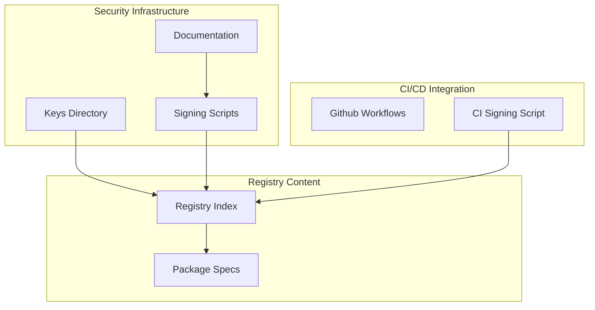
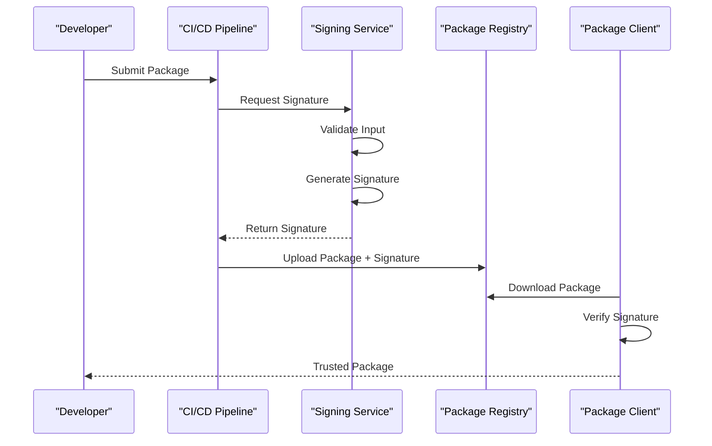
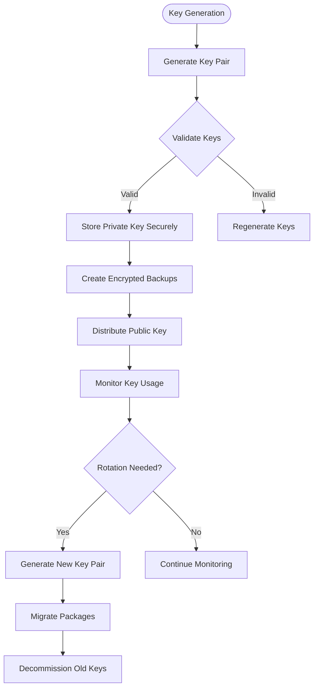
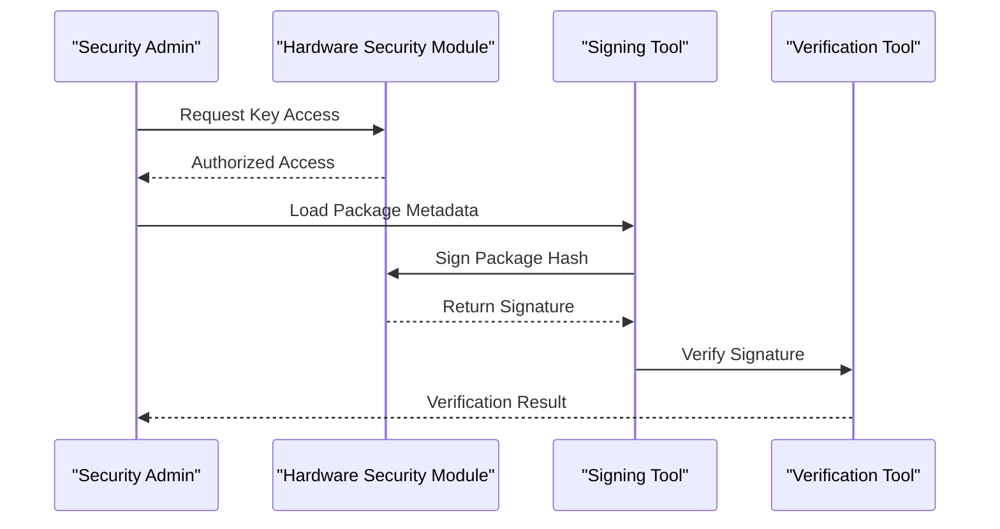
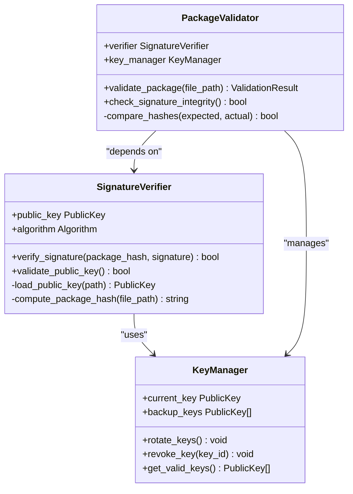
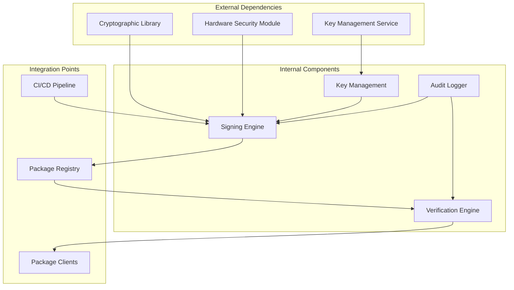
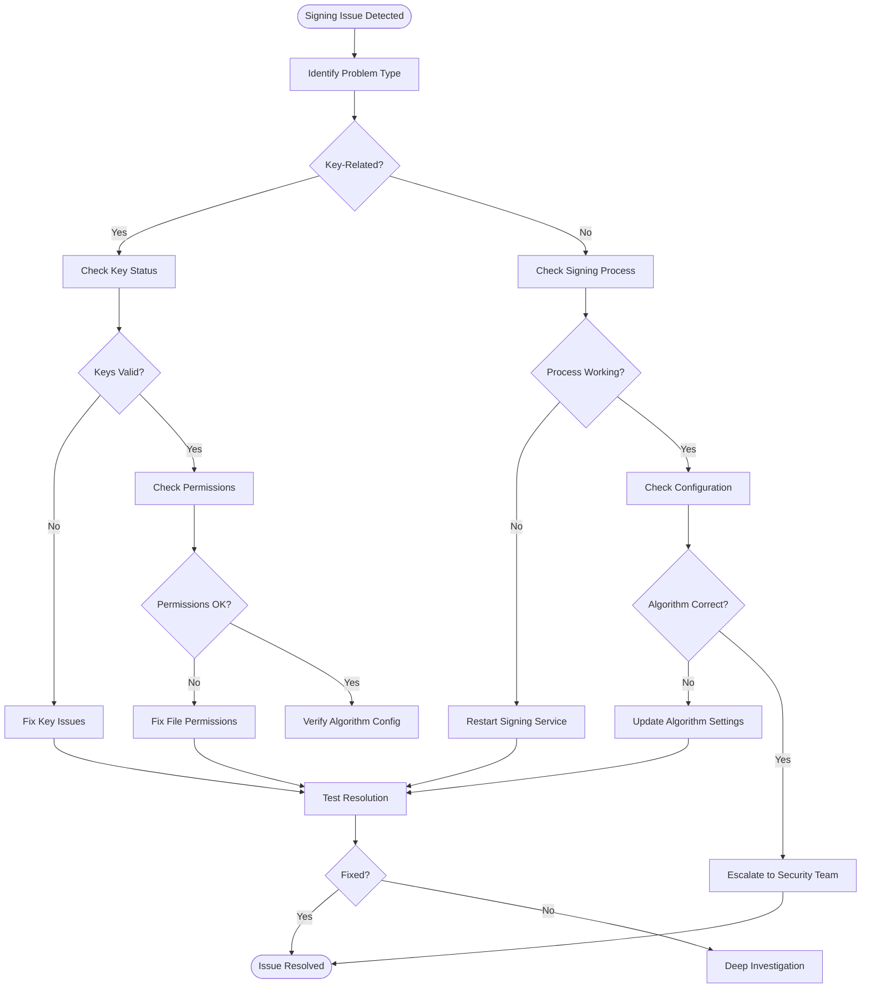

# Security and Signing

<cite>
**Referenced Files in This Document**
- [SECURITY.md](file://SECURITY.md)
- [docs/key-provisioning.md](file://docs/key-provisioning.md)
- [docs/incident-response.md](file://docs/incident-response.md)
- [scripts/ci-sign.py](file://scripts/ci-sign.py)
- [keys/official.pub](file://keys/official.pub)
- [registry/index.json.sig](file://registry/index.json.sig)
- [scripts/provision-production-key.sh](file://scripts/provision-production-key.sh)
- [specs/*.json](file://specs/)
</cite>

## Table of Contents
1. [Introduction](#introduction)
2. [Project Structure](#project-structure)
3. [Core Components](#core-components)
4. [Architecture Overview](#architecture-overview)
5. [Detailed Component Analysis](#detailed-component-analysis)
6. [Dependency Analysis](#dependency-analysis)
7. [Performance Considerations](#performance-considerations)
8. [Troubleshooting Guide](#troubleshooting-guide)
9. [Conclusion](#conclusion)

## Introduction

The Numan Registry implements a comprehensive digital signature system to ensure package authenticity and integrity. This document provides detailed guidance on the cryptographic signing infrastructure, key management procedures, CI/CD integration, and security best practices for maintaining a secure package distribution pipeline.

The signing system protects against tampering, ensures packages originate from trusted sources, and maintains the integrity of the entire package lifecycle from development to deployment.

## Project Structure

The security and signing infrastructure is organized across several key directories:

**Diagram sources**
- [keys/official.pub](file://keys/official.pub)
- [registry/index.json.sig](file://registry/index.json.sig)
- [scripts/ci-sign.py](file://scripts/ci-sign.py)

**Section sources**
- [SECURITY.md](file://SECURITY.md)
- [docs/key-provisioning.md](file://docs/key-provisioning.md)

## Core Components

### Digital Signature System

The Numan Registry uses asymmetric cryptography to sign package metadata and verify their authenticity. The system employs public-key cryptography where:

- **Private Keys**: Used for signing packages (kept secure and restricted)
- **Public Keys**: Used for verification (distributed to clients)
- **Signature Files**: Cryptographic proofs attached to package metadata

### Key Management Framework

The key management system handles the complete lifecycle of cryptographic keys:

- **Key Generation**: Secure creation of signing key pairs
- **Storage**: Encrypted storage with access controls
- **Rotation**: Scheduled key updates and migration procedures
- **Revocation**: Emergency key deactivation protocols

### Signing Pipeline Integration

The signing process integrates seamlessly with CI/CD pipelines:

- **Automated Signing**: Package signing during build processes
- **Manual Verification**: Post-deployment validation procedures
- **Audit Logging**: Comprehensive signing activity tracking

**Section sources**
- [docs/key-provisioning.md:1-50](file://docs/key-provisioning.md#L1-L50)
- [scripts/ci-sign.py:1-100](file://scripts/ci-sign.py#L1-L100)

## Architecture Overview

The signing architecture follows a layered approach with clear separation of concerns:

**Diagram sources**
- [scripts/ci-sign.py:1-150](file://scripts/ci-sign.py#L1-L150)
- [registry/index.json.sig:1-100](file://registry/index.json.sig#L1-L100)

## Detailed Component Analysis

### Key Generation and Provisioning

The key generation process follows industry best practices for cryptographic key creation:

#### Key Generation Process
1. **Algorithm Selection**: RSA or ECDSA with appropriate key sizes
2. **Secure Randomness**: Hardware-backed random number generation
3. **Key Validation**: Mathematical verification of key pair integrity
4. **Backup Creation**: Secure duplication for disaster recovery

#### Key Storage Architecture

**Diagram sources**
- [docs/key-provisioning.md:1-200](file://docs/key-provisioning.md#L1-L200)
- [scripts/provision-production-key.sh:1-100](file://scripts/provision-production-key.sh#L1-L100)

### Signing Process Implementation

The signing process ensures package integrity through multiple validation layers:

#### Automated Signing Workflow
1. **Input Validation**: Verify package metadata format and content
2. **Hash Generation**: Create cryptographic hash of package contents
3. **Signature Creation**: Sign the hash using private key
4. **Metadata Update**: Attach signature to package metadata
5. **Verification Test**: Self-verify the generated signature

#### Manual Signing Procedures
For emergency or special cases, manual signing procedures are available:

**Diagram sources**
- [scripts/ci-sign.py:100-300](file://scripts/ci-sign.py#L100-L300)

### Verification System

The verification system provides robust package authentication:

#### Client-Side Verification
1. **Public Key Distribution**: Secure delivery of verification keys
2. **Signature Extraction**: Parse signature from package metadata
3. **Hash Recalculation**: Compute package hash independently
4. **Cryptographic Verification**: Validate signature against hash and public key

#### Server-Side Verification

**Diagram sources**
- [scripts/validate.py:1-200](file://scripts/validate.py#L1-L200)

**Section sources**
- [scripts/ci-sign.py:1-500](file://scripts/ci-sign.py#L1-L500)
- [scripts/validate.py:1-300](file://scripts/validate.py#L1-L300)

## Dependency Analysis

The signing system has well-defined dependencies and integration points:

**Diagram sources**
- [scripts/ci-sign.py:1-100](file://scripts/ci-sign.py#L1-L100)
- [scripts/validate.py:1-100](file://scripts/validate.py#L1-L100)

**Section sources**
- [scripts/ci-sign.py:1-200](file://scripts/ci-sign.py#L1-L200)
- [scripts/validate.py:1-200](file://scripts/validate.py#L1-L200)

## Performance Considerations

### Signing Performance Optimization

The signing system is optimized for high-throughput environments:

- **Asynchronous Processing**: Non-blocking signature operations
- **Batch Operations**: Multiple package signing in single operations
- **Caching Strategies**: Cached public keys and verified hashes
- **Resource Pooling**: Connection and key material pooling

### Verification Efficiency

Client-side verification is designed for minimal overhead:

- **Lazy Loading**: Public keys loaded only when needed
- **Incremental Verification**: Partial verification for large packages
- **Parallel Processing**: Concurrent verification of multiple packages

## Troubleshooting Guide

### Common Signing Issues

#### Key-Related Problems
1. **Expired Keys**: Check key expiration dates and renewal schedules
2. **Permission Errors**: Verify file system permissions for key access
3. **Corrupted Keys**: Validate key integrity and regenerate if necessary

#### Signature Verification Failures
1. **Algorithm Mismatch**: Ensure consistent cryptographic algorithms
2. **Hash Mismatches**: Verify package content hasn't been modified
3. **Public Key Issues**: Confirm correct public key distribution

### Debugging Procedures

**Diagram sources**
- [docs/incident-response.md:1-200](file://docs/incident-response.md#L1-L200)

### Emergency Response Procedures

In case of compromised keys or packages:

1. **Immediate Containment**: Disable affected keys and quarantine packages
2. **Impact Assessment**: Determine scope of compromise
3. **Remediation**: Generate new keys and re-sign affected packages
4. **Communication**: Notify stakeholders and update documentation
5. **Post-Mortem**: Analyze incident and improve security measures

**Section sources**
- [docs/incident-response.md:1-300](file://docs/incident-response.md#L1-L300)

## Conclusion

The Numan Registry's security and signing infrastructure provides comprehensive protection for package distribution. By implementing proper key management, automated signing processes, and robust verification mechanisms, the system ensures package authenticity and integrity throughout the software supply chain.

Key recommendations for maintaining security:

- **Regular Key Rotation**: Implement scheduled key updates
- **Access Control**: Restrict private key access to essential personnel
- **Monitoring**: Continuous monitoring of signing activities
- **Testing**: Regular testing of signing and verification processes
- **Documentation**: Maintain up-to-date security procedures

This security framework protects both developers and end-users by ensuring that all packages distributed through the Numan Registry are authentic and unmodified.