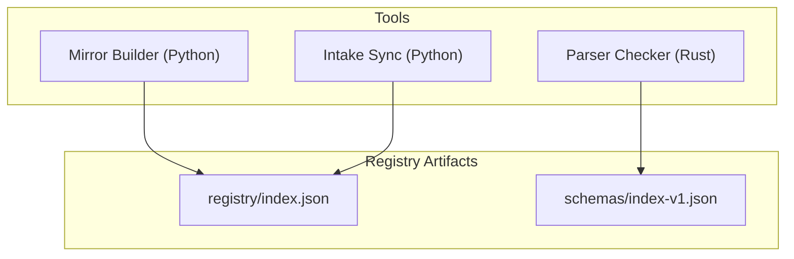
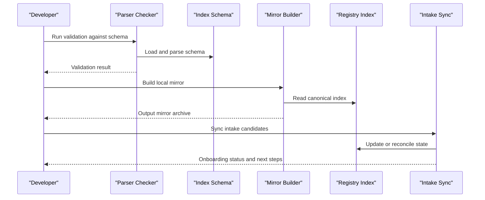
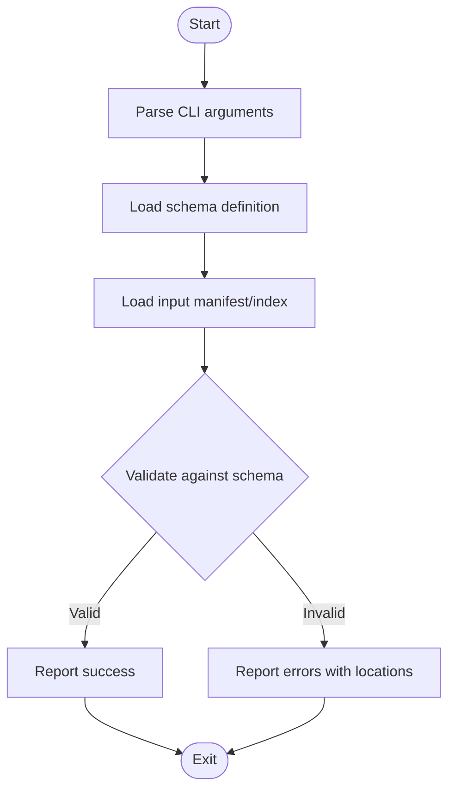
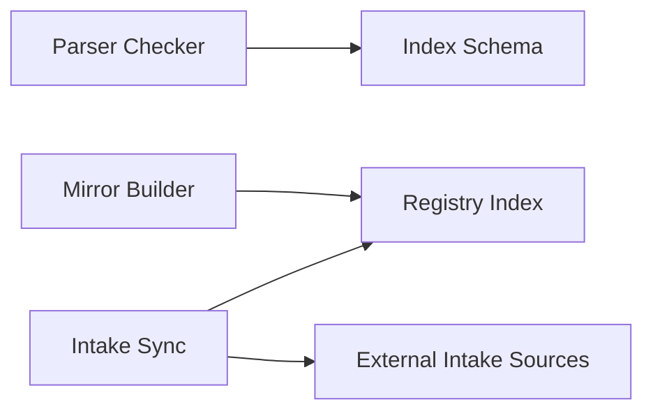

# Tools and Utilities

<cite>
**Referenced Files in This Document**
- [README.md](file://README.md)
- [build-mirror-zip.py](file://scripts/build-mirror-zip.py)
- [sync-intake-candidates.py](file://scripts/sync-intake-candidates.py)
- [main.rs](file://tools/numan-parser-check/src/main.rs)
- [Cargo.toml](file://tools/numan-parser-check/Cargo.toml)
- [index.json](file://registry/index.json)
- [index-v1.json](file://schemas/index-v1.json)
</cite>

## Table of Contents
1. [Introduction](#introduction)
2. [Project Structure](#project-structure)
3. [Core Components](#core-components)
4. [Architecture Overview](#architecture-overview)
5. [Detailed Component Analysis](#detailed-component-analysis)
6. [Dependency Analysis](#dependency-analysis)
7. [Performance Considerations](#performance-considerations)
8. [Troubleshooting Guide](#troubleshooting-guide)
9. [Conclusion](#conclusion)

## Introduction
This document describes the standalone tools and utilities that accompany the Numan Registry. It focuses on:
- The Rust-based parser checker tool for validating package manifests against the registry schema.
- The mirror building utility for creating local, signed copies of the registry index.
- The intake candidate synchronization tool used to prepare and onboard new packages into the registry pipeline.

It also covers installation steps, usage patterns, configuration options, relationships to the main registry system, troubleshooting tips, and performance guidance.

## Project Structure
The relevant parts of the repository for these tools are:
- tools/numan-parser-check: A Rust crate implementing the parser checker.
- scripts/build-mirror-zip.py: A Python script to build a local mirror archive of the registry index.
- scripts/sync-intake-candidates.py: A Python script to synchronize intake candidates for onboarding.
- registry/index.json: The canonical registry index file consumed by clients and tools.
- schemas/index-v1.json: The JSON Schema used to validate the registry index structure.

**Diagram sources**
- [main.rs](file://tools/numan-parser-check/src/main.rs)
- [Cargo.toml](file://tools/numan-parser-check/Cargo.toml)
- [build-mirror-zip.py](file://scripts/build-mirror-zip.py)
- [sync-intake-candidates.py](file://scripts/sync-intake-candidates.py)
- [index.json](file://registry/index.json)
- [index-v1.json](file://schemas/index-v1.json)

**Section sources**
- [README.md](file://README.md)

## Core Components
- Parser Checker (Rust): Validates package manifests or registry index entries against the official schema. It is built as a standalone binary from a Rust crate and can be integrated into CI pipelines or run locally during development.
- Mirror Builder (Python): Produces a local, versioned snapshot of the registry index suitable for offline use or distribution. It typically reads the canonical index and writes an archive with deterministic naming and optional checksums.
- Intake Candidate Synchronization (Python): Bridges external intake lists or repositories with the registry’s internal state, preparing candidates for review and eventual publication. It updates local tracking files and prepares artifacts for downstream signing and publishing steps.

**Section sources**
- [main.rs](file://tools/numan-parser-check/src/main.rs)
- [Cargo.toml](file://tools/numan-parser-check/Cargo.toml)
- [build-mirror-zip.py](file://scripts/build-mirror-zip.py)
- [sync-intake-candidates.py](file://scripts/sync-intake-candidates.py)
- [index.json](file://registry/index.json)
- [index-v1.json](file://schemas/index-v1.json)

## Architecture Overview
The tools interact with the registry through well-defined artifacts:
- The parser checker consumes the schema to enforce structural correctness.
- The mirror builder reads the canonical index and produces a local artifact.
- The intake sync tool coordinates candidate data with the registry index and supporting metadata.

**Diagram sources**
- [main.rs](file://tools/numan-parser-check/src/main.rs)
- [index-v1.json](file://schemas/index-v1.json)
- [build-mirror-zip.py](file://scripts/build-mirror-zip.py)
- [index.json](file://registry/index.json)
- [sync-intake-candidates.py](file://scripts/sync-intake-candidates.py)

## Detailed Component Analysis

### Parser Checker (Rust)
Purpose:
- Validate package manifests and registry index entries against the official schema to ensure consistency and correctness before publication.

Compilation and Installation:
- Requires a Rust toolchain (cargo).
- Build the binary from the crate directory.
- Optionally install globally for easy invocation.

Usage Patterns:
- Validate a single manifest or index file.
- Integrate into CI to block invalid submissions.
- Provide human-readable error messages pointing to schema violations.

Configuration and Customization:
- Point to the schema location if not embedded.
- Adjust verbosity or output format via flags.

Relationship to Main System:
- Enforces schema compliance for all registry artifacts.
- Prevents malformed entries from entering the pipeline.

Common Workflows:
- Local pre-commit validation.
- Automated checks in pull request workflows.

**Diagram sources**
- [main.rs](file://tools/numan-parser-check/src/main.rs)
- [Cargo.toml](file://tools/numan-parser-check/Cargo.toml)
- [index-v1.json](file://schemas/index-v1.json)

**Section sources**
- [main.rs](file://tools/numan-parser-check/src/main.rs)
- [Cargo.toml](file://tools/numan-parser-check/Cargo.toml)

### Mirror Building Utility (Python)
Purpose:
- Create a local, versioned copy of the registry index for offline distribution or caching.

Installation and Dependencies:
- Requires Python 3.x and standard library modules.
- No extra dependencies beyond what is needed for JSON handling and archiving.

Usage Patterns:
- Pull the latest canonical index and write a zip archive.
- Generate deterministic filenames and optional checksums.
- Support incremental updates by comparing timestamps or hashes.

Configuration and Customization:
- Specify source index path or URL.
- Choose output directory and archive name pattern.
- Toggle compression level or include signature verification.

Relationship to Main System:
- Consumes registry/index.json and may reference signatures when available.
- Ensures consistent snapshots across environments.

Common Workflows:
- Scheduled jobs to refresh mirrors.
- Pre-release packaging for distribution channels.

**Diagram sources**
- [build-mirror-zip.py](file://scripts/build-mirror-zip.py)
- [index.json](file://registry/index.json)

**Section sources**
- [build-mirror-zip.py](file://scripts/build-mirror-zip.py)

### Intake Candidate Synchronization Tool (Python)
Purpose:
- Synchronize external intake candidates with the registry’s internal state to prepare packages for onboarding.

Installation and Dependencies:
- Requires Python 3.x and standard library modules.
- May rely on additional libraries for HTTP requests or YAML/JSON processing depending on implementation.

Usage Patterns:
- Import candidate lists from external sources.
- Merge with existing intake state and resolve conflicts.
- Produce updated intake state files and readiness reports.

Configuration and Customization:
- Define source endpoints or file paths for candidate lists.
- Configure merge strategies and conflict resolution rules.
- Enable dry-run mode for previewing changes.

Relationship to Main System:
- Updates intake state files that feed into the publishing pipeline.
- Coordinates with signing and lifecycle stages for new packages.

Common Workflows:
- Periodic sync jobs triggered by upstream releases.
- Manual reconciliation after policy changes.

**Diagram sources**
- [sync-intake-candidates.py](file://scripts/sync-intake-candidates.py)

**Section sources**
- [sync-intake-candidates.py](file://scripts/sync-intake-candidates.py)

## Dependency Analysis
- Parser Checker depends on the Rust toolchain and the schema definition for validation.
- Mirror Builder depends on Python and the canonical registry index.
- Intake Sync depends on Python and external intake sources plus the registry index for reconciliation.

**Diagram sources**
- [main.rs](file://tools/numan-parser-check/src/main.rs)
- [index-v1.json](file://schemas/index-v1.json)
- [build-mirror-zip.py](file://scripts/build-mirror-zip.py)
- [index.json](file://registry/index.json)
- [sync-intake-candidates.py](file://scripts/sync-intake-candidates.py)

**Section sources**
- [index.json](file://registry/index.json)
- [index-v1.json](file://schemas/index-v1.json)

## Performance Considerations
- Parser Checker:
  - Cache schema loading to avoid repeated I/O.
  - Stream large inputs where possible to reduce memory pressure.
- Mirror Builder:
  - Use incremental updates to minimize network and disk operations.
  - Prefer streaming writes for large archives.
- Intake Sync:
  - Batch operations and deduplicate candidates to reduce processing time.
  - Use efficient merging algorithms for large candidate sets.

[No sources needed since this section provides general guidance]

## Troubleshooting Guide
- Parser Checker:
  - Ensure the schema path is correct and readable.
  - Verify input files conform to expected formats; check error messages for exact schema violations.
- Mirror Builder:
  - Confirm network access or local index availability.
  - Validate permissions for output directories and checksum files.
- Intake Sync:
  - Check connectivity to external intake sources.
  - Review merge logs for conflicts and apply resolution policies.

**Section sources**
- [build-mirror-zip.py](file://scripts/build-mirror-zip.py)
- [sync-intake-candidates.py](file://scripts/sync-intake-candidates.py)
- [main.rs](file://tools/numan-parser-check/src/main.rs)

## Conclusion
These tools collectively strengthen the Numan Registry by enforcing schema compliance, enabling reliable local mirrors, and streamlining the onboarding of new packages. Integrating them into development and CI workflows ensures consistency, reduces errors, and accelerates release cycles.

[No sources needed since this section summarizes without analyzing specific files]