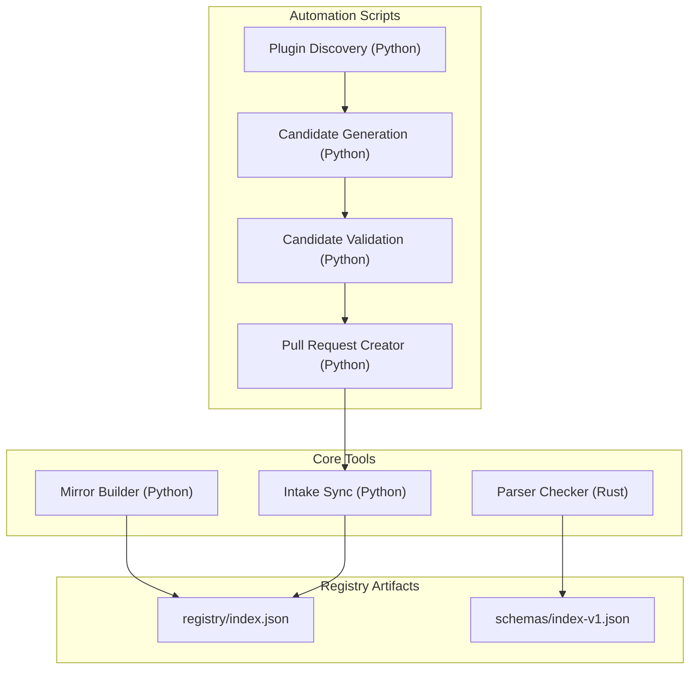
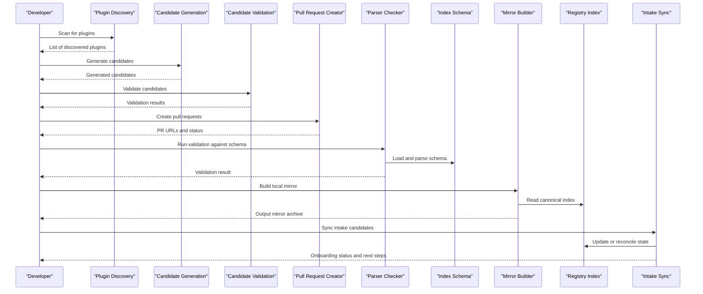
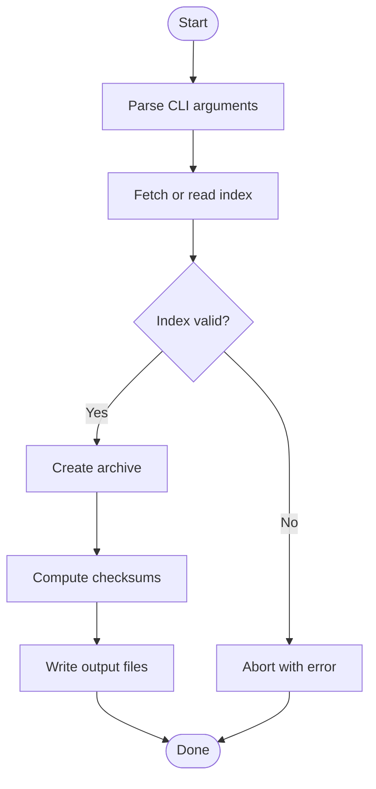
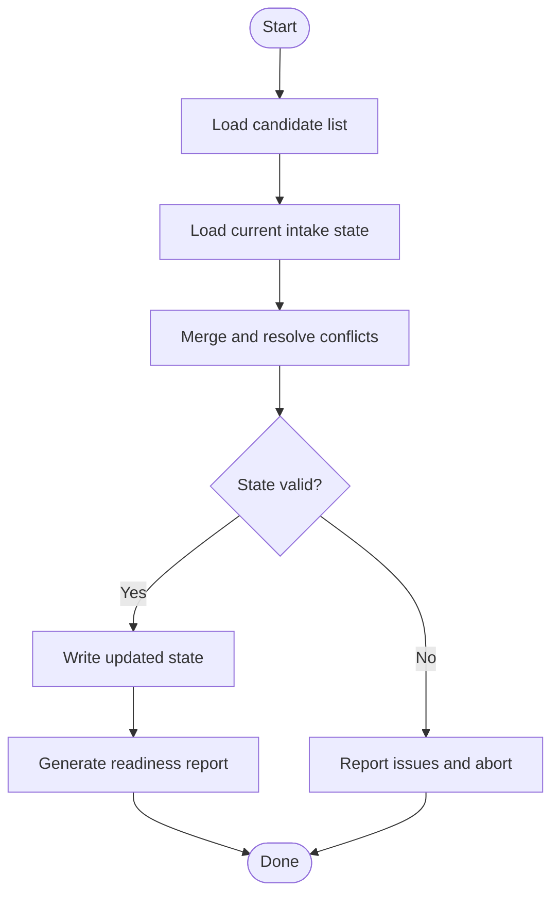
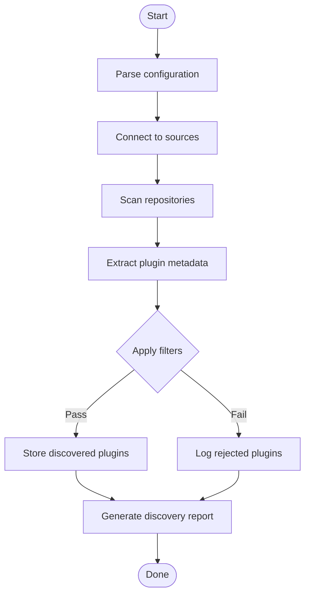
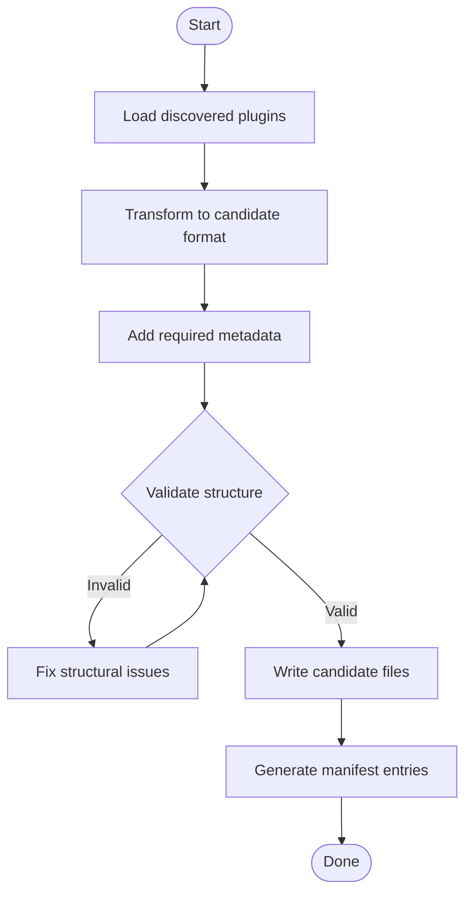
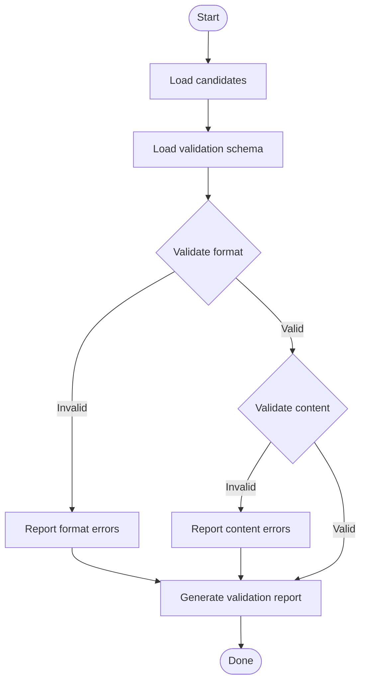
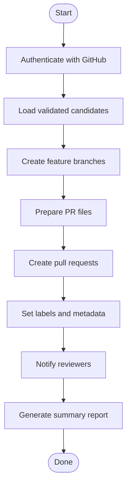
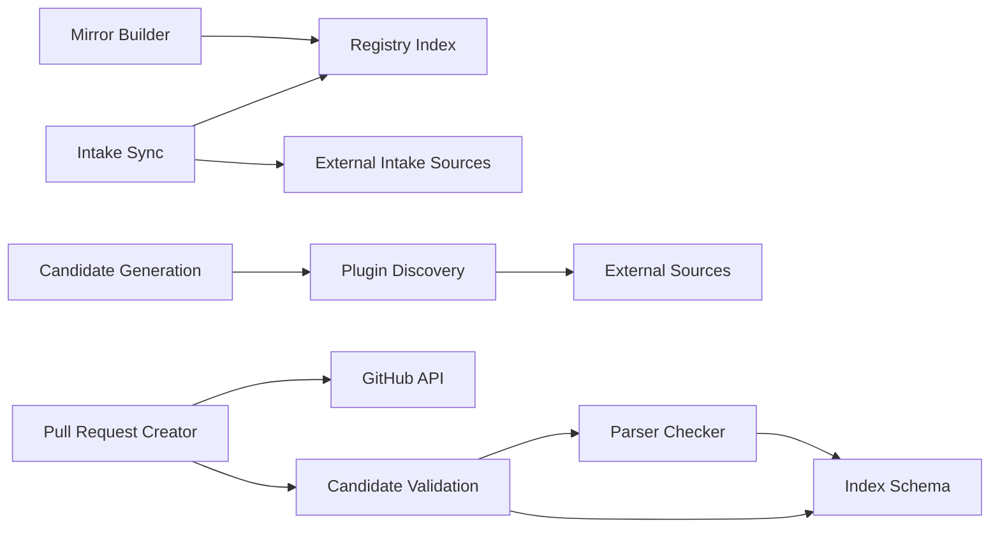

# Tools and Utilities

<cite>
**Referenced Files in This Document**
- [README.md](file://README.md)
- [build-mirror-zip.py](file://scripts/build-mirror-zip.py)
- [sync-intake-candidates.py](file://scripts/sync-intake-candidates.py)
- [discover.py](file://scripts/discover.py)
- [gen_candidate.py](file://scripts/gen_candidate.py)
- [validate_candidate.py](file://scripts/validate_candidate.py)
- [open_intake_pr.py](file://scripts/open_intake_pr.py)
- [main.rs](file://tools/numan-parser-check/src/main.rs)
- [Cargo.toml](file://tools/numan-parser-check/Cargo.toml)
- [index.json](file://registry/index.json)
- [index-v1.json](file://schemas/index-v1.json)
</cite>

## Update Summary
**Changes Made**
- Added comprehensive documentation for four new automation scripts: discover.py, gen_candidate.py, validate_candidate.py, and open_intake_pr.py
- Updated architecture overview to include the new intake pipeline automation tools
- Enhanced detailed component analysis with new sections for each automation script
- Updated dependency analysis to reflect the new tool relationships
- Added troubleshooting guidance specific to the new automation tools

## Table of Contents
1. [Introduction](#introduction)
2. [Project Structure](#project-structure)
3. [Core Components](#core-components)
4. [Architecture Overview](#architecture-overview)
5. [Detailed Component Analysis](#detailed-component-analysis)
6. [Dependency Analysis](#dependency-analysis)
7. [Performance Considerations](#performance-considerations)
8. [Troubleshooting Guide](#troubleshooting-guide)
9. [Conclusion](#conclusion)

## Introduction
This document describes the standalone tools and utilities that accompany the Numan Registry. It focuses on:
- The Rust-based parser checker tool for validating package manifests against the registry schema.
- The mirror building utility for creating local, signed copies of the registry index.
- The intake candidate synchronization tool used to prepare and onboard new packages into the registry pipeline.
- **New**: Four automation scripts that streamline the plugin discovery, candidate generation, validation, and pull request creation processes.

It also covers installation steps, usage patterns, configuration options, relationships to the main registry system, troubleshooting tips, and performance guidance.

## Project Structure
The relevant parts of the repository for these tools are:
- tools/numan-parser-check: A Rust crate implementing the parser checker.
- scripts/build-mirror-zip.py: A Python script to build a local mirror archive of the registry index.
- scripts/sync-intake-candidates.py: A Python script to synchronize intake candidates for onboarding.
- **New**: scripts/discover.py: Automates plugin discovery from various sources.
- **New**: scripts/gen_candidate.py: Generates intake candidates from discovered plugins.
- **New**: scripts/validate_candidate.py: Validates candidate packages against registry requirements.
- **New**: scripts/open_intake_pr.py: Creates pull requests for intake candidates.
- registry/index.json: The canonical registry index file consumed by clients and tools.
- schemas/index-v1.json: The JSON Schema used to validate the registry index structure.

**Diagram sources**
- [main.rs](file://tools/numan-parser-check/src/main.rs)
- [Cargo.toml](file://tools/numan-parser-check/Cargo.toml)
- [build-mirror-zip.py](file://scripts/build-mirror-zip.py)
- [sync-intake-candidates.py](file://scripts/sync-intake-candidates.py)
- [discover.py](file://scripts/discover.py)
- [gen_candidate.py](file://scripts/gen_candidate.py)
- [validate_candidate.py](file://scripts/validate_candidate.py)
- [open_intake_pr.py](file://scripts/open_intake_pr.py)
- [index.json](file://registry/index.json)
- [index-v1.json](file://schemas/index-v1.json)

**Section sources**
- [README.md](file://README.md)

## Core Components
- Parser Checker (Rust): Validates package manifests or registry index entries against the official schema. It is built as a standalone binary from a Rust crate and can be integrated into CI pipelines or run locally during development.
- Mirror Builder (Python): Produces a local, versioned snapshot of the registry index suitable for offline use or distribution. It typically reads the canonical index and writes an archive with deterministic naming and optional checksums.
- Intake Candidate Synchronization (Python): Bridges external intake lists or repositories with the registry's internal state, preparing candidates for review and eventual publication. It updates local tracking files and prepares artifacts for downstream signing and publishing steps.
- **New**: Plugin Discovery (Python): Automatically scans various sources to identify potential plugins for inclusion in the registry.
- **New**: Candidate Generation (Python): Processes discovered plugins to create structured intake candidates with metadata and validation data.
- **New**: Candidate Validation (Python): Ensures generated candidates meet all registry requirements before proceeding to pull request creation.
- **New**: Pull Request Creator (Python): Automates the creation of GitHub pull requests for approved intake candidates.

**Section sources**
- [main.rs](file://tools/numan-parser-check/src/main.rs)
- [Cargo.toml](file://tools/numan-parser-check/Cargo.toml)
- [build-mirror-zip.py](file://scripts/build-mirror-zip.py)
- [sync-intake-candidates.py](file://scripts/sync-intake-candidates.py)
- [discover.py](file://scripts/discover.py)
- [gen_candidate.py](file://scripts/gen_candidate.py)
- [validate_candidate.py](file://scripts/validate_candidate.py)
- [open_intake_pr.py](file://scripts/open_intake_pr.py)
- [index.json](file://registry/index.json)
- [index-v1.json](file://schemas/index-v1.json)

## Architecture Overview
The tools interact with the registry through well-defined artifacts:
- The parser checker consumes the schema to enforce structural correctness.
- The mirror builder reads the canonical index and produces a local artifact.
- The intake sync tool coordinates candidate data with the registry index and supporting metadata.
- **New**: The automation pipeline flows from discovery through generation, validation, and pull request creation.

**Diagram sources**
- [main.rs](file://tools/numan-parser-check/src/main.rs)
- [index-v1.json](file://schemas/index-v1.json)
- [build-mirror-zip.py](file://scripts/build-mirror-zip.py)
- [index.json](file://registry/index.json)
- [sync-intake-candidates.py](file://scripts/sync-intake-candidates.py)
- [discover.py](file://scripts/discover.py)
- [gen_candidate.py](file://scripts/gen_candidate.py)
- [validate_candidate.py](file://scripts/validate_candidate.py)
- [open_intake_pr.py](file://scripts/open_intake_pr.py)

## Detailed Component Analysis

### Parser Checker (Rust)
Purpose:
- Validate package manifests and registry index entries against the official schema to ensure consistency and correctness before publication.

Compilation and Installation:
- Requires a Rust toolchain (cargo).
- Build the binary from the crate directory.
- Optionally install globally for easy invocation.

Usage Patterns:
- Validate a single manifest or index file.
- Integrate into CI to block invalid submissions.
- Provide human-readable error messages pointing to schema violations.

Configuration and Customization:
- Point to the schema location if not embedded.
- Adjust verbosity or output format via flags.

Relationship to Main System:
- Enforces schema compliance for all registry artifacts.
- Prevents malformed entries from entering the pipeline.

Common Workflows:
- Local pre-commit validation.
- Automated checks in pull request workflows.

**Diagram sources**
- [main.rs](file://tools/numan-parser-check/src/main.rs)
- [Cargo.toml](file://tools/numan-parser-check/Cargo.toml)
- [index-v1.json](file://schemas/index-v1.json)

**Section sources**
- [main.rs](file://tools/numan-parser-check/src/main.rs)
- [Cargo.toml](file://tools/numan-parser-check/Cargo.toml)

### Mirror Building Utility (Python)
Purpose:
- Create a local, versioned copy of the registry index for offline distribution or caching.

Installation and Dependencies:
- Requires Python 3.x and standard library modules.
- No extra dependencies beyond what is needed for JSON handling and archiving.

Usage Patterns:
- Pull the latest canonical index and write a zip archive.
- Generate deterministic filenames and optional checksums.
- Support incremental updates by comparing timestamps or hashes.

Configuration and Customization:
- Specify source index path or URL.
- Choose output directory and archive name pattern.
- Toggle compression level or include signature verification.

Relationship to Main System:
- Consumes registry/index.json and may reference signatures when available.
- Ensures consistent snapshots across environments.

Common Workflows:
- Scheduled jobs to refresh mirrors.
- Pre-release packaging for distribution channels.

**Diagram sources**
- [build-mirror-zip.py](file://scripts/build-mirror-zip.py)
- [index.json](file://registry/index.json)

**Section sources**
- [build-mirror-zip.py](file://scripts/build-mirror-zip.py)

### Intake Candidate Synchronization Tool (Python)
Purpose:
- Synchronize external intake candidates with the registry's internal state to prepare packages for onboarding.

Installation and Dependencies:
- Requires Python 3.x and standard library modules.
- May rely on additional libraries for HTTP requests or YAML/JSON processing depending on implementation.

Usage Patterns:
- Import candidate lists from external sources.
- Merge with existing intake state and resolve conflicts.
- Produce updated intake state files and readiness reports.

Configuration and Customization:
- Define source endpoints or file paths for candidate lists.
- Configure merge strategies and conflict resolution rules.
- Enable dry-run mode for previewing changes.

Relationship to Main System:
- Updates intake state files that feed into the publishing pipeline.
- Coordinates with signing and lifecycle stages for new packages.

Common Workflows:
- Periodic sync jobs triggered by upstream releases.
- Manual reconciliation after policy changes.

**Diagram sources**
- [sync-intake-candidates.py](file://scripts/sync-intake-candidates.py)

**Section sources**
- [sync-intake-candidates.py](file://scripts/sync-intake-candidates.py)

### Plugin Discovery Automation (Python)
**New** Purpose:
- Automatically scan various sources to identify potential plugins for inclusion in the Numan Registry.

Installation and Dependencies:
- Requires Python 3.x and standard library modules.
- May depend on additional libraries for network requests, parsing, and data processing.

Usage Patterns:
- Scan GitHub repositories, package registries, and other sources for compatible plugins.
- Extract metadata including names, versions, descriptions, and compatibility information.
- Filter results based on predefined criteria such as language, functionality, or quality metrics.

Configuration and Customization:
- Configure source repositories and search parameters.
- Set filtering rules and quality thresholds.
- Define output formats and storage locations for discovered plugins.

Relationship to Main System:
- Feeds into the candidate generation pipeline.
- Provides raw data for intake candidate creation.

Common Workflows:
- Scheduled discovery runs to keep plugin catalog current.
- On-demand discovery for specific categories or maintainers.

**Diagram sources**
- [discover.py](file://scripts/discover.py)

**Section sources**
- [discover.py](file://scripts/discover.py)

### Candidate Generation Automation (Python)
**New** Purpose:
- Process discovered plugins to create structured intake candidates with complete metadata and validation data.

Installation and Dependencies:
- Requires Python 3.x and standard library modules.
- Depends on discovery output and may require additional libraries for data transformation.

Usage Patterns:
- Read discovered plugin data and transform into standardized candidate format.
- Generate required metadata fields and validate basic structure.
- Create candidate files with appropriate naming conventions and organization.

Configuration and Customization:
- Define candidate template structures and field mappings.
- Configure transformation rules and data enrichment processes.
- Set output directories and file naming patterns.

Relationship to Main System:
- Produces intake candidates for validation and review.
- Maintains consistency with registry schema requirements.

Common Workflows:
- Automated generation following discovery runs.
- Manual regeneration for specific plugins or updates.

**Diagram sources**
- [gen_candidate.py](file://scripts/gen_candidate.py)

**Section sources**
- [gen_candidate.py](file://scripts/gen_candidate.py)

### Candidate Validation Automation (Python)
**New** Purpose:
- Ensure generated candidates meet all registry requirements before proceeding to pull request creation.

Installation and Dependencies:
- Requires Python 3.x and standard library modules.
- Depends on the parser checker and validation schemas.

Usage Patterns:
- Validate candidate structure against registry schema.
- Check for required fields, proper formatting, and completeness.
- Generate validation reports with detailed error information.

Configuration and Customization:
- Configure validation rules and severity levels.
- Set up custom validators for specific requirements.
- Define reporting formats and notification methods.

Relationship to Main System:
- Ensures only valid candidates proceed to pull request stage.
- Integrates with the parser checker for schema validation.

Common Workflows:
- Automatic validation after candidate generation.
- Manual validation for specific candidates or batches.

**Diagram sources**
- [validate_candidate.py](file://scripts/validate_candidate.py)

**Section sources**
- [validate_candidate.py](file://scripts/validate_candidate.py)

### Pull Request Creation Automation (Python)
**New** Purpose:
- Automate the creation of GitHub pull requests for approved intake candidates.

Installation and Dependencies:
- Requires Python 3.x and standard library modules.
- Depends on GitHub API access and authentication credentials.

Usage Patterns:
- Create pull requests for validated candidates with appropriate titles and descriptions.
- Attach validation reports and candidate files to pull requests.
- Set labels, assignees, and reviewers automatically.

Configuration and Customization:
- Configure GitHub repository settings and branch policies.
- Define pull request templates and default values.
- Set up authentication and permission scopes.

Relationship to Main System:
- Completes the automated intake pipeline by creating reviewable pull requests.
- Integrates with GitHub workflow for automated testing and approval.

Common Workflows:
- Automated PR creation after successful validation.
- Batch processing for multiple candidates.

**Diagram sources**
- [open_intake_pr.py](file://scripts/open_intake_pr.py)

**Section sources**
- [open_intake_pr.py](file://scripts/open_intake_pr.py)

## Dependency Analysis
- Parser Checker depends on the Rust toolchain and the schema definition for validation.
- Mirror Builder depends on Python and the canonical registry index.
- Intake Sync depends on Python and external intake sources plus the registry index for reconciliation.
- **New**: Plugin Discovery depends on Python and external sources (GitHub, package registries).
- **New**: Candidate Generation depends on discovery output and data transformation libraries.
- **New**: Candidate Validation depends on parser checker and validation schemas.
- **New**: Pull Request Creation depends on GitHub API and authentication credentials.

**Diagram sources**
- [main.rs](file://tools/numan-parser-check/src/main.rs)
- [index-v1.json](file://schemas/index-v1.json)
- [build-mirror-zip.py](file://scripts/build-mirror-zip.py)
- [index.json](file://registry/index.json)
- [sync-intake-candidates.py](file://scripts/sync-intake-candidates.py)
- [discover.py](file://scripts/discover.py)
- [gen_candidate.py](file://scripts/gen_candidate.py)
- [validate_candidate.py](file://scripts/validate_candidate.py)
- [open_intake_pr.py](file://scripts/open_intake_pr.py)

**Section sources**
- [index.json](file://registry/index.json)
- [index-v1.json](file://schemas/index-v1.json)

## Performance Considerations
- Parser Checker:
  - Cache schema loading to avoid repeated I/O.
  - Stream large inputs where possible to reduce memory pressure.
- Mirror Builder:
  - Use incremental updates to minimize network and disk operations.
  - Prefer streaming writes for large archives.
- Intake Sync:
  - Batch operations and deduplicate candidates to reduce processing time.
  - Use efficient merging algorithms for large candidate sets.
- **New**: Plugin Discovery:
  - Implement rate limiting for external API calls.
  - Use parallel processing for scanning multiple sources.
  - Cache discovery results to avoid redundant scans.
- **New**: Candidate Generation:
  - Process candidates in batches to manage memory usage.
  - Use efficient data serialization formats.
- **New**: Candidate Validation:
  - Implement early validation checks to fail fast.
  - Use parallel validation for independent checks.
- **New**: Pull Request Creation:
  - Batch PR creation to respect API rate limits.
  - Implement retry logic for failed operations.

[No sources needed since this section provides general guidance]

## Troubleshooting Guide
- Parser Checker:
  - Ensure the schema path is correct and readable.
  - Verify input files conform to expected formats; check error messages for exact schema violations.
- Mirror Builder:
  - Confirm network access or local index availability.
  - Validate permissions for output directories and checksum files.
- Intake Sync:
  - Check connectivity to external intake sources.
  - Review merge logs for conflicts and apply resolution policies.
- **New**: Plugin Discovery:
  - Verify network connectivity to external sources.
  - Check authentication credentials for private repositories.
  - Monitor rate limiting and implement backoff strategies.
- **New**: Candidate Generation:
  - Validate input data format from discovery phase.
  - Check for missing required fields in source data.
  - Review transformation logs for data mapping errors.
- **New**: Candidate Validation:
  - Ensure parser checker is properly installed and accessible.
  - Verify schema files are up to date and accessible.
  - Check validation rule configurations for false positives.
- **New**: Pull Request Creation:
  - Verify GitHub API credentials and permissions.
  - Check repository accessibility and branch policies.
  - Review PR template configurations and file permissions.

**Section sources**
- [build-mirror-zip.py](file://scripts/build-mirror-zip.py)
- [sync-intake-candidates.py](file://scripts/sync-intake-candidates.py)
- [main.rs](file://tools/numan-parser-check/src/main.rs)
- [discover.py](file://scripts/discover.py)
- [gen_candidate.py](file://scripts/gen_candidate.py)
- [validate_candidate.py](file://scripts/validate_candidate.py)
- [open_intake_pr.py](file://scripts/open_intake_pr.py)

## Conclusion
These tools collectively strengthen the Numan Registry by enforcing schema compliance, enabling reliable local mirrors, streamlining the onboarding of new packages, and automating the entire intake pipeline from discovery to pull request creation. The new automation scripts significantly reduce manual effort while maintaining high quality standards. Integrating them into development and CI workflows ensures consistency, reduces errors, accelerates release cycles, and provides a seamless experience for both maintainers and contributors.

[No sources needed since this section summarizes without analyzing specific files]