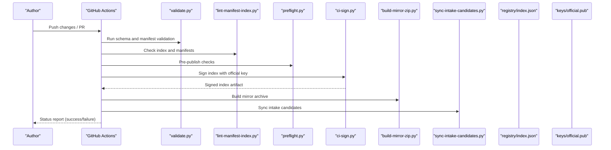
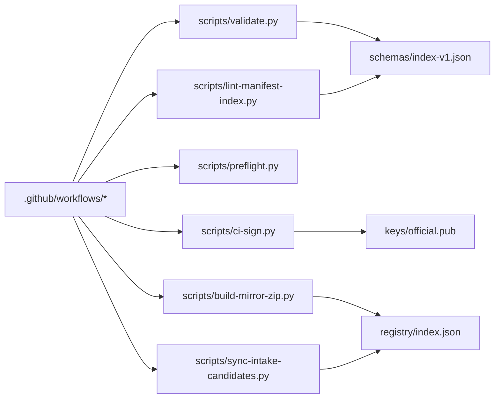

# Troubleshooting

<cite>
**Referenced Files in This Document**
- [README.md](file://README.md)
- [SECURITY.md](file://SECURITY.md)
- [AGENTS.md](file://AGENTS.md)
- [registry/index.json](file://registry/index.json)
- [registry/index.json.sig](file://registry/index.json.sig)
- [schemas/index-v1.json](file://schemas/index-v1.json)
- [scripts/ci-sign.py](file://scripts/ci-sign.py)
- [scripts/validate.py](file://scripts/validate.py)
- [scripts/lint-manifest-index.py](file://scripts/lint-manifest-index.py)
- [scripts/preflight.py](file://scripts/preflight.py)
- [scripts/scan_for_secrets.py](file://scripts/scan_for_secrets.py)
- [scripts/build-mirror-zip.py](file://scripts/build-mirror-zip.py)
- [scripts/sync-intake-candidates.py](file://scripts/sync-intake-candidates.py)
- [scripts/add-package.py](file://scripts/add-package.py)
- [scripts/archival_formats.py](file://scripts/archive_formats.py)
- [scripts/nu_version_constraint.py](file://scripts/nu_version_constraint.py)
- [scripts/provision-production-key.sh](file://scripts/provision-production-key.sh)
- [specs/FMotalleb-nu_plugin_desktop_notifications-0.114.1.json](file://specs/FMotalleb-nu_plugin_desktop_notifications-0.114.1.json)
- [specs/SuaveIV-nu_plugin_audio-0.2.8.json](file://specs/SuaveIV-nu_plugin_audio-0.2.8.json)
- [specs/nushell-prophet-dotnu-0.0.18.json](file://specs/nushell-prophet-dotnu-0.0.18.json)
- [keys/official.pub](file://keys/official.pub)
- [.github/workflows](file://.github/workflows)
</cite>

## Table of Contents
1. [Introduction](#introduction)
2. [Project Structure](#project-structure)
3. [Core Components](#core-components)
4. [Architecture Overview](#architecture-overview)
5. [Detailed Component Analysis](#detailed-component-analysis)
6. [Dependency Analysis](#dependency-analysis)
7. [Performance Considerations](#performance-considerations)
8. [Troubleshooting Guide](#troubleshooting-guide)
9. [Conclusion](#conclusion)
10. [Appendices](#appendices)

## Introduction
This document provides actionable troubleshooting guidance for the Numan Registry, focusing on:
- Package validation failures
- Signing errors
- Registry synchronization problems
- CI/CD pipeline and automation issues
- Secret scanning findings
- Performance issues with slow registry operations and large packages
- Network connectivity and mirror synchronization problems
- Step-by-step incident investigation procedures and escalation paths

The goal is to help you quickly identify root causes and apply resolutions using the repository’s scripts, schemas, and configuration artifacts.

## Project Structure
At a high level, the Numan Registry includes:
- Registry index and signature files under registry/
- JSON schema definitions under schemas/
- Validation and linting utilities under scripts/
- Example package specs under specs/
- Public key material under keys/
- GitHub Actions workflows under .github/workflows/

```mermaid
graph TB
subgraph "Registry Artifacts"
IDX["registry/index.json"]
SIG["registry/index.json.sig"]
end
subgraph "Schemas"
SCHEMA["schemas/index-v1.json"]
end
subgraph "Scripts"
VALIDATE["scripts/validate.py"]
LINT["scripts/lint-manifest-index.py"]
PREFLIGHT["scripts/preflight.py"]
SIGN["scripts/ci-sign.py"]
SECRETS["scripts/scan_for_secrets.py"]
MIRROR["scripts/build-mirror-zip.py"]
SYNC["scripts/sync-intake-candidates.py"]
ADDPKG["scripts/add-package.py"]
ARCHIVE["scripts/archive_formats.py"]
NUVER["scripts/nu_version_constraint.py"]
PROVKEY["scripts/provision-production-key.sh"]
end
subgraph "Specs"
SPEC1["specs/*.json"]
end
subgraph "Keys"
PUBKEY["keys/official.pub"]
end
subgraph "CI"
GHWF[".github/workflows/*"]
end
IDX --> SCHEMA
IDX --> VALIDATE
IDX --> LINT
IDX --> PREFLIGHT
IDX --> SIGN
IDX --> MIRROR
IDX --> SYNC
SPEC1 --> VALIDATE
SPEC1 --> LINT
PUBKEY --> SIGN
GHWF --> SIGN
GHWF --> VALIDATE
GHWF --> LINT
GHWF --> PREFLIGHT
GHWF --> SECRETS
GHWF --> MIRROR
GHWF --> SYNC
```

**Diagram sources**
- [registry/index.json](file://registry/index.json)
- [registry/index.json.sig](file://registry/index.json.sig)
- [schemas/index-v1.json](file://schemas/index-v1.json)
- [scripts/validate.py](file://scripts/validate.py)
- [scripts/lint-manifest-index.py](file://scripts/lint-manifest-index.py)
- [scripts/preflight.py](file://scripts/preflight.py)
- [scripts/ci-sign.py](file://scripts/ci-sign.py)
- [scripts/scan_for_secrets.py](file://scripts/scan_for_secrets.py)
- [scripts/build-mirror-zip.py](file://scripts/build-mirror-zip.py)
- [scripts/sync-intake-candidates.py](file://scripts/sync-intake-candidates.py)
- [scripts/add-package.py](file://scripts/add-package.py)
- [scripts/archive_formats.py](file://scripts/archive_formats.py)
- [scripts/nu_version_constraint.py](file://scripts/nu_version_constraint.py)
- [scripts/provision-production-key.sh](file://scripts/provision-production-key.sh)
- [keys/official.pub](file://keys/official.pub)
- [.github/workflows](file://.github/workflows)

**Section sources**
- [README.md](file://README.md)
- [AGENTS.md](file://AGENTS.md)

## Core Components
- Registry Index: The canonical index describing available packages and versions. It must validate against the schema and be signed for trust.
- Schema: Defines the structure and constraints for the index and manifests.
- Validation and Linting: Scripts that enforce schema compliance, manifest correctness, and preflight checks before publishing.
- Signing: CI signing step ensures the index is signed with the official public key.
- Mirror Build: Produces distributable archives for mirrors or distribution channels.
- Intake Sync: Synchronizes intake candidates into the registry state.
- Secret Scanning: Detects secrets in code and artifacts to prevent accidental exposure.
- Version Constraints: Validates Nu version compatibility for packages.

Key responsibilities:
- Ensure integrity and authenticity via signatures
- Enforce correctness via schema and lint rules
- Maintain consistency across mirrors and intake pipelines
- Prevent security regressions via secret scanning

**Section sources**
- [schemas/index-v1.json](file://schemas/index-v1.json)
- [scripts/validate.py](file://scripts/validate.py)
- [scripts/lint-manifest-index.py](file://scripts/lint-manifest-index.py)
- [scripts/preflight.py](file://scripts/preflight.py)
- [scripts/ci-sign.py](file://scripts/ci-sign.py)
- [scripts/build-mirror-zip.py](file://scripts/build-mirror-zip.py)
- [scripts/sync-intake-candidates.py](file://scripts/sync-intake-candidates.py)
- [scripts/nu_version_constraint.py](file://scripts/nu_version_constraint.py)
- [scripts/scan_for_secrets.py](file://scripts/scan_for_secrets.py)

## Architecture Overview
The typical flow involves authors submitting changes through CI, which validates manifests, builds artifacts, signs the registry index, and publishes to mirrors.

**Diagram sources**
- [.github/workflows](file://.github/workflows)
- [scripts/validate.py](file://scripts/validate.py)
- [scripts/lint-manifest-index.py](file://scripts/lint-manifest-index.py)
- [scripts/preflight.py](file://scripts/preflight.py)
- [scripts/ci-sign.py](file://scripts/ci-sign.py)
- [scripts/build-mirror-zip.py](file://scripts/build-mirror-zip.py)
- [scripts/sync-intake-candidates.py](file://scripts/sync-intake-candidates.py)
- [registry/index.json](file://registry/index.json)
- [keys/official.pub](file://keys/official.pub)

## Detailed Component Analysis

### Package Validation Failures
Common symptoms:
- CI fails at validation steps
- Errors about invalid fields, missing required properties, or type mismatches
- Manifests not matching expected schema

Diagnostic steps:
- Re-run validation locally using the validation script to reproduce the error
- Inspect the failing spec file(s) under specs/ for structural issues
- Compare against the schema definition to ensure all required fields are present and correctly typed
- Use the linter to catch index-level inconsistencies
- Confirm Nu version constraints are satisfied by the package

Resolution checklist:
- Fix schema violations in the manifest or index entry
- Ensure consistent naming and versioning conventions
- Validate local success before pushing to CI
- If needed, adjust version constraints to match supported Nu versions

**Section sources**
- [scripts/validate.py](file://scripts/validate.py)
- [scripts/lint-manifest-index.py](file://scripts/lint-manifest-index.py)
- [schemas/index-v1.json](file://schemas/index-v1.json)
- [specs/FMotalleb-nu_plugin_desktop_notifications-0.114.1.json](file://specs/FMotalleb-nu_plugin_desktop_notifications-0.114.1.json)
- [specs/SuaveIV-nu_plugin_audio-0.2.8.json](file://specs/SuaveIV-nu_plugin_audio-0.2.8.json)
- [specs/nushell-prophet-dotnu-0.0.18.json](file://specs/nushell-prophet-dotnu-0.0.18.json)
- [scripts/nu_version_constraint.py](file://scripts/nu_version_constraint.py)

### Signing Errors
Common symptoms:
- CI fails during signing step
- Signature verification errors when fetching the index
- Missing or mismatched public key

Diagnostic steps:
- Verify the presence and integrity of the public key used for verification
- Confirm the signing script executed successfully and produced the signature artifact
- Ensure the correct key material is referenced in CI environment variables or secrets
- Validate that the index content matches what was signed

Resolution checklist:
- Re-sign the index using the official key
- Update registry/index.json.sig with the new signature
- Verify signature locally before merging changes
- Rotate keys only following documented procedures and update CI accordingly

**Section sources**
- [scripts/ci-sign.py](file://scripts/ci-sign.py)
- [registry/index.json.sig](file://registry/index.json.sig)
- [keys/official.pub](file://keys/official.pub)
- [scripts/provision-production-key.sh](file://scripts/provision-production-key.sh)

### Registry Synchronization Problems
Common symptoms:
- Mirrors lag behind the main registry
- Intake candidates not reflected in the registry
- Inconsistent index states across environments

Diagnostic steps:
- Run the mirror builder to generate an up-to-date archive and compare checksums
- Execute the intake sync script to reconcile pending candidates
- Check network connectivity and permissions for remote endpoints
- Review logs from CI jobs responsible for syncing

Resolution checklist:
- Rebuild mirror archives and redeploy to mirrors
- Force re-sync intake candidates if necessary
- Validate index consistency after sync
- Monitor propagation delays and retry failed syncs

**Section sources**
- [scripts/build-mirror-zip.py](file://scripts/build-mirror-zip.py)
- [scripts/sync-intake-candidates.py](file://scripts/sync-intake-candidates.py)
- [registry/index.json](file://registry/index.json)

### CI/CD Pipeline Failures and Automation Issues
Common symptoms:
- Workflow runs fail at specific steps
- Secrets not found or misconfigured
- Environment variables missing or incorrect

Diagnostic steps:
- Inspect workflow logs for the failing step
- Validate required secrets and variables exist in the repository settings
- Confirm scripts have executable permissions and dependencies installed
- Reproduce locally using the same scripts invoked by CI

Resolution checklist:
- Add or update secrets and variables in CI settings
- Pin dependency versions to avoid drift
- Add retries for flaky network calls
- Ensure proper caching and artifact handling

**Section sources**
- [.github/workflows](file://.github/workflows)
- [scripts/preflight.py](file://scripts/preflight.py)
- [scripts/validate.py](file://scripts/validate.py)
- [scripts/ci-sign.py](file://scripts/ci-sign.py)

### Secret Scanning Tool and Security Findings
Common symptoms:
- Secret scanner reports potential secrets in code or artifacts
- CI blocks merges due to security findings

Diagnostic steps:
- Run the secret scanning script locally to reproduce findings
- Classify each finding as false positive or real secret
- For real secrets, rotate credentials immediately and remove them from history
- For false positives, add appropriate ignore rules or annotations

Resolution checklist:
- Remove or redact secrets from repositories and artifacts
- Rotate compromised credentials
- Update scan configurations to reduce noise while maintaining coverage
- Re-run scans to confirm clean results

**Section sources**
- [scripts/scan_for_secrets.py](file://scripts/scan_for_secrets.py)
- [SECURITY.md](file://SECURITY.md)

### Performance Troubleshooting for Slow Registry Operations and Large Packages
Common symptoms:
- Long validation times for large indexes or many specs
- Slow mirror builds
- Timeouts during signing or sync

Diagnostic steps:
- Profile validation and linting steps to identify bottlenecks
- Check disk I/O and memory usage during heavy operations
- Validate network latency to remote endpoints
- Measure archive sizes and compression ratios

Resolution checklist:
- Optimize input data (e.g., trim unnecessary fields)
- Enable parallel processing where possible
- Increase timeouts and resource limits in CI
- Use incremental builds and caching strategies

[No sources needed since this section provides general guidance]

### Network Connectivity and Mirror Synchronization Problems
Common symptoms:
- Failed downloads or uploads
- Intermittent timeouts
- Inconsistent mirror states

Diagnostic steps:
- Test connectivity to upstream registries and storage endpoints
- Verify proxy and firewall settings
- Retry failed operations with exponential backoff
- Compare checksums between source and mirror

Resolution checklist:
- Configure retries and fallback endpoints
- Adjust timeout values based on network conditions
- Validate certificate chains and TLS settings
- Monitor and alert on sync health

[No sources needed since this section provides general guidance]

## Dependency Analysis
The CI workflow orchestrates multiple scripts that depend on shared artifacts and schemas. Understanding these relationships helps isolate failures.

**Diagram sources**
- [.github/workflows](file://.github/workflows)
- [scripts/validate.py](file://scripts/validate.py)
- [scripts/lint-manifest-index.py](file://scripts/lint-manifest-index.py)
- [scripts/preflight.py](file://scripts/preflight.py)
- [scripts/ci-sign.py](file://scripts/ci-sign.py)
- [scripts/build-mirror-zip.py](file://scripts/build-mirror-zip.py)
- [scripts/sync-intake-candidates.py](file://scripts/sync-intake-candidates.py)
- [schemas/index-v1.json](file://schemas/index-v1.json)
- [keys/official.pub](file://keys/official.pub)
- [registry/index.json](file://registry/index.json)

**Section sources**
- [.github/workflows](file://.github/workflows)
- [scripts/validate.py](file://scripts/validate.py)
- [scripts/lint-manifest-index.py](file://scripts/lint-manifest-index.py)
- [scripts/preflight.py](file://scripts/preflight.py)
- [scripts/ci-sign.py](file://scripts/ci-sign.py)
- [scripts/build-mirror-zip.py](file://scripts/build-mirror-zip.py)
- [scripts/sync-intake-candidates.py](file://scripts/sync-intake-candidates.py)
- [schemas/index-v1.json](file://schemas/index-v1.json)
- [keys/official.pub](file://keys/official.pub)
- [registry/index.json](file://registry/index.json)

## Performance Considerations
- Prefer validating smaller subsets during development to speed feedback loops
- Cache intermediate artifacts and dependency installations in CI
- Use efficient compression for mirror archives
- Monitor and tune timeouts based on workload characteristics
- Avoid redundant operations by leveraging incremental updates

[No sources needed since this section provides general guidance]

## Troubleshooting Guide

### Package Validation Failures
Symptoms:
- CI fails at validation or lint steps
- Error messages indicate schema violations or missing fields

Steps:
- Reproduce locally with the validation script
- Inspect failing spec files against the schema
- Correct field types, required properties, and naming conventions
- Re-run validation until clean

Resolutions:
- Fix manifest/index entries per schema rules
- Align Nu version constraints
- Commit minimal changes and re-test

**Section sources**
- [scripts/validate.py](file://scripts/validate.py)
- [scripts/lint-manifest-index.py](file://scripts/lint-manifest-index.py)
- [schemas/index-v1.json](file://schemas/index-v1.json)
- [specs/FMotalleb-nu_plugin_desktop_notifications-0.114.1.json](file://specs/FMotalleb-nu_plugin_desktop_notifications-0.114.1.json)
- [specs/SuaveIV-nu_plugin_audio-0.2.8.json](file://specs/SuaveIV-nu_plugin_audio-0.2.8.json)
- [specs/nushell-prophet-dotnu-0.0.18.json](file://specs/nushell-prophet-dotnu-0.0.18.json)
- [scripts/nu_version_constraint.py](file://scripts/nu_version_constraint.py)

### Signing Errors
Symptoms:
- CI fails during signing
- Signature verification fails downstream

Steps:
- Confirm the public key exists and is correct
- Re-run the signing script locally
- Verify the generated signature matches expectations
- Update registry signature artifact

Resolutions:
- Re-sign with the official key
- Ensure CI has access to signing materials
- Validate signature post-update

**Section sources**
- [scripts/ci-sign.py](file://scripts/ci-sign.py)
- [registry/index.json.sig](file://registry/index.json.sig)
- [keys/official.pub](file://keys/official.pub)
- [scripts/provision-production-key.sh](file://scripts/provision-production-key.sh)

### Registry Synchronization Problems
Symptoms:
- Mirrors out of date
- Intake candidates not reflected

Steps:
- Build mirror archive and compare checksums
- Run intake sync to reconcile state
- Check network and permissions
- Review CI logs for sync jobs

Resolutions:
- Redeploy updated mirror archives
- Force re-sync if necessary
- Validate index consistency

**Section sources**
- [scripts/build-mirror-zip.py](file://scripts/build-mirror-zip.py)
- [scripts/sync-intake-candidates.py](file://scripts/sync-intake-candidates.py)
- [registry/index.json](file://registry/index.json)

### CI/CD Pipeline Failures
Symptoms:
- Workflow steps fail intermittently
- Secrets or variables missing

Steps:
- Inspect workflow logs
- Verify secrets and variables in repository settings
- Reproduce locally with the same scripts
- Pin dependencies and enable caching

Resolutions:
- Update CI configuration and secrets
- Add retries for flaky operations
- Improve logging and diagnostics

**Section sources**
- [.github/workflows](file://.github/workflows)
- [scripts/preflight.py](file://scripts/preflight.py)
- [scripts/validate.py](file://scripts/validate.py)
- [scripts/ci-sign.py](file://scripts/ci-sign.py)

### Secret Scanning Findings
Symptoms:
- Scanner reports potential secrets
- CI blocked due to findings

Steps:
- Run scanner locally
- Classify findings
- Rotate real secrets and remove from history
- Update ignore rules for false positives

Resolutions:
- Clean repositories and artifacts
- Re-run scans to confirm clean status

**Section sources**
- [scripts/scan_for_secrets.py](file://scripts/scan_for_secrets.py)
- [SECURITY.md](file://SECURITY.md)

### Performance Issues
Symptoms:
- Slow validation, signing, or mirror builds
- Timeouts in CI

Steps:
- Profile scripts and measure resource usage
- Optimize inputs and enable caching
- Tune timeouts and concurrency

Resolutions:
- Incremental builds and caching
- Efficient compression
- Monitoring and alerting

[No sources needed since this section provides general guidance]

### Network and Mirror Sync Issues
Symptoms:
- Download/upload failures
- Inconsistent mirror states

Steps:
- Test connectivity and certificates
- Configure retries and fallbacks
- Compare checksums across endpoints

Resolutions:
- Adjust timeouts and proxies
- Monitor sync health

[No sources needed since this section provides general guidance]

### Step-by-Step Incident Investigation
Recommended procedure:
- Identify the failing stage in CI logs
- Reproduce locally using the corresponding script
- Validate inputs against schema and constraints
- Check signing artifacts and keys
- Rebuild mirrors and sync intake candidates
- Re-run scans to ensure no security regressions
- Document findings and resolutions

Escalation path:
- If critical security or availability impact, escalate immediately
- Contact maintainers via repository channels
- Provide logs, artifacts, and reproduction steps

[No sources needed since this section provides general guidance]

## Conclusion
Use this guide to systematically diagnose and resolve common issues in the Numan Registry. Focus on validating manifests against schemas, ensuring correct signing, synchronizing mirrors, and addressing security findings. When performance or network issues arise, profile and optimize accordingly. Follow the escalation procedures for critical incidents to minimize impact.

[No sources needed since this section summarizes without analyzing specific files]

## Appendices

### Quick Reference: Common Scripts and Their Roles
- validate.py: Schema and manifest validation
- lint-manifest-index.py: Index and manifest linting
- preflight.py: Pre-publish checks
- ci-sign.py: Signing the registry index
- build-mirror-zip.py: Building mirror archives
- sync-intake-candidates.py: Syncing intake candidates
- nu_version_constraint.py: Validating Nu version constraints
- scan_for_secrets.py: Secret scanning
- provision-production-key.sh: Provisioning production keys

**Section sources**
- [scripts/validate.py](file://scripts/validate.py)
- [scripts/lint-manifest-index.py](file://scripts/lint-manifest-index.py)
- [scripts/preflight.py](file://scripts/preflight.py)
- [scripts/ci-sign.py](file://scripts/ci-sign.py)
- [scripts/build-mirror-zip.py](file://scripts/build-mirror-zip.py)
- [scripts/sync-intake-candidates.py](file://scripts/sync-intake-candidates.py)
- [scripts/nu_version_constraint.py](file://scripts/nu_version_constraint.py)
- [scripts/scan_for_secrets.py](file://scripts/scan_for_secrets.py)
- [scripts/provision-production-key.sh](file://scripts/provision-production-key.sh)